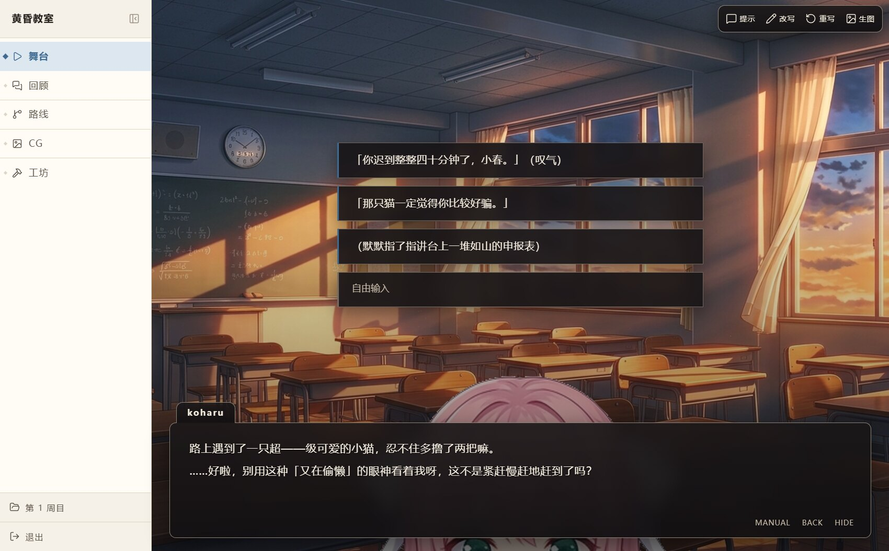

# AIVN

AI galgame 引擎：LLM 剧作家（playwriter）流式输出 Stage DSL 增量剧本，服务端解析为 IR 事件经 WS 下发，前端像流式视频一样边生成边演出。玩家兼具演员（插一句）与导演（跳转/分岔/改台词/重演这一轮）双重身份。



## 安装

服务端是**一个自包含的 exe**（内含 Node 运行时与前端产物）。装上之后不用装 Node、不用数据库、不用改任何配置文件。

### 方式一：Windows 安装包（推荐）

从 [Releases](https://github.com/john-walks-slow/aivn/releases) 下 `aivn-<版本>-x64-setup.exe`，双击安装（装到 `%LOCALAPPDATA%\AIVN`，不需要管理员权限），然后从开始菜单启动。

启动后是一个带图标的应用窗口。手机要连先在「设置 → 局域网访问」里打开「允许局域网访问」，标题栏里随之出现手机该连的地址：

```
AIVN · 局域网 http://192.168.1.23:8787（手机连同一个 Wi-Fi 打开它）
```

窗口里就是整站。第一次进「设置 → 模型网关」填网关地址与 API Key、选一个模型，就能开始玩了（见下方「上手三步」）。**新装默认只听本机**，局域网能不能连由那个开关决定。

- **Windows 防火墙**：打开开关时系统会弹「防火墙已阻止部分功能」，勾选**专用网络**并点「允许」就够了。当时点了取消（或根本没弹窗）就去设置页点「允许局域网访问（Windows 防火墙）」——它按程序写一条入站放行规则，并清掉点「取消」时系统自己写下的那条**阻止**规则，需要过一次 UAC。这一步不能省：显式阻止的优先级高于放行，光加一条放行规则救不回来（点过取消之后，开关开了、放行规则也在，局域网依旧连不上）。两条路都没走就手动补：先删掉防火墙里那条以 `aivn.exe` 为名的阻止规则，再补一条放行：

  ```
  netsh advfirewall firewall add rule name="AIVN" dir=in action=allow program="C:\path\to\aivn.exe" enable=yes profile=any
  ```

- **提示「已保护你的电脑」**：安装包没有代码签名，点「更多信息」→「仍要运行」即可。

### 方式二：Windows 免安装 zip

同一页 Releases 里的 `aivn-<版本>-win-x64.zip`：解压到一个**有写权限**的目录（例如 `D:\AIVN\`，别放 `C:\Program Files` 下面），双击里面的 `aivn.exe`。这一份是命令行形态，会有一个控制台窗口，关掉它就是退出服务。

数据与设置都在解压目录的 `data\` 里，整个文件夹拷走就是搬家。

### 手机 / 平板接着玩

在设置页「局域网访问」里打开开关（保存即生效，端口不变、页面重连一次），手机连同一个 Wi-Fi，浏览器打开那里列出的地址即可——**同一个实例、同一份进度**，舞台上演到哪手机上就看到哪。开关关着时只监听 `127.0.0.1`，局域网里的设备连不上（这是新装的默认）。

### 方式三：从源码跑（开发者）

要求：Node ≥ 22.19、pnpm。

```bash
pnpm install
pnpm -r build            # core 改动后 web/server 走 workspace dist 类型

pnpm --filter @aivn/server start    # 服务端：REST + WS + 前端产物，默认 :8787
pnpm --filter @aivn/web dev         # 开发态前端：:5180，/api /plays /ws 代理到 8787
```

开发态数据目录是仓库根，`plays/`、`library/`、`settings.json` 就在仓库里；打包态是 exe 同级的 `data/`。

### 卸载前请先备份 data/

**卸载会连数据一起删。** 剧目、素材库、`settings.json`、语音与图片缓存全在数据目录下（安装版 `%LOCALAPPDATA%\AIVN\data\`，免安装版是解压目录的 `data\`），卸载程序会一并清掉。删之前先把 `data\` 复制出来。

## 权限与隐私

- **数据全在本机，没有遥测。** 剧目、素材、存档、设置都在数据目录里；引擎不装任何埋点、不上报任何数据，也不会自己连一个你没配过的服务。
- **联网只发生在你自己配的出口。** 分别是模型网关（对话/生图/语音，OpenAI 兼容）、可选的 Exa 联网检索，以及工坊 `view_image` 去读你或模型给出的图片网址。前两项新装都是关的，填了地址与 key 才会发请求（见「设置页字段总表」）。
- **`bash` 是真 shell，不是沙箱。** 工坊在剧目「Agent」页勾上「命令行」之后，agent 会以服务进程的权限执行命令（本机部署里就是当前用户/root），能读写这台机器上任意有权限的文件，而且这条路径**不经**「剧目文件」那层的路径白名单。**默认它就是关的**，要用再勾——不明白后果就别开。
- **兼容性。** 桌面版是 Windows 10/11 x64 的 NSIS 安装包；它依赖系统里的 WebView2 运行时（Win11 与装过 Edge 的 Win10 都自带），缺失时安装程序会静默联网拉一份引导包。服务端与前端本身是跨平台的，macOS / Linux 按「方式三」从源码跑即可；桌面壳目前只打 Windows。

## 上手三步

1. **配网关**：「⚙ 设置 → 模型网关」填**网关地址**（OpenAI 兼容，写到 `…/v1`）与 **API Key**，然后从「模型 ID」下拉里选一个——下拉里的清单来自网关自己的 `/v1/models`，读不到会显式报错，不会让你对着一堆猜得出的名字瞎选。
2. **建剧目**：剧目库页「新建剧目」→ 填标题 → 进工坊跟搭台助手聊前提与角色（见「工坊」）。装完第一次打开剧目库是空的——随包不带任何剧目，新剧目的起点就是这一步。
3. **开演**：舞台底部台词条选一条或「自由发挥…」。

生图、语音、联网检索在新装时**都是关着的**——它们要各自的 API key，默认对着空地址发请求只会让人以为坏了。要用就在设置页对应分组里「启用」并把 key 填上。

## 配置

分两处，别找错地方：

| 在哪 | 管什么 | 生效方式 |
| --- | --- | --- |
| 页面「⚙ 设置」 | **全部运行期设置**：模型网关、长会话与压缩、生图、语音、联网检索、访问密码、界面主题 | 保存即落盘并立即生效，**不用重启**；正在演的剧目在本轮写完之后换用新设置 |
| 启动参数（命令行 / exe 旁边的 `.env`） | **装在哪、怎么起**：端口、监听地址、数据目录 | 进程起来时读一次，改了要重启。设置页里只读回显 |
| 工坊「设置」页 /「Agent」页 | 浏览器侧开关（本机偏好）/ 剧目级 agent 设置 | 前者存 localStorage 只影响这台浏览器；后者写进该剧目的 `play.json`，本轮写完生效 |

运行期设置的**唯一真相源是数据目录下的 `settings.json`**，页面只是它的一个编辑器。手工编辑这个文件同样立即生效（服务端盯着它）。凭据在页面上只回掩码：单把凭据（API Key / 生图 Key / 访问密码）把掩码填进输入框，**保持原样保存 = 不改、清空 = 显式清除**；多把 key（语音 / 检索）的输入框恒为空，留空 = 不改。

### 设置页字段总表

设置页里的每一项都在这里。JSON 键是 `settings.json` 里的名字（嵌套块用 `.` 连接），默认值是**新装**的默认——老配置从 `.env` 迁移过来时保留旧默认。

**模型网关**（必填，不配就没法开演）

| 字段 | JSON 键 | 默认 | 说明 |
| --- | --- | --- | --- |
| 模型 ID | `modelId` | 空 | 模型 id（经网关路由的完整 id） |
| 限制级（NSFW）专用模型 | `nsfwModelId` | 空 | 剧作家调 `enter_nsfw` 时切换过去的模型。留空 = 跟随主模型 |
| 限制级专属提示词 | `nsfwPrompt` | 空 | 进入限制级通道时追加到系统提示词末尾的文本。留空 = 不加任何额外要求 |
| 支持的模型 | `models` | 空 | 这台部署**支持哪些模型**（逗号分隔的模型 id）。剧目「Agent」页的模型下拉只给这几个，顺序照这里写；留空 = 网关 `/v1/models` 有什么给什么。清单里的 id 网关没有时该接口直接报错点名，不静默丢掉——下拉里摆一个发不出去的模型比整个下拉挂掉更让人误会 |
| 元数据基座 | `modelBase` | `deepseek/deepseek-flash` | pi-ai 内置基础模型（继承 api/元数据）。模型名不在内置目录里时，上下文窗口与输出上限沿用它的 |
| 网关地址 | `baseUrl` | 空 | OpenAI 兼容网关地址，写到 `…/v1` |
| API Key | `apiKey` | 空 | 网关 API key |
| 输出上限 | `maxTokens` | `32768` | 单请求输出上限（max_tokens）。内置元数据的输出上限与网关路由无关（可能虚高超网关限制导致 400），故钳为此值；按网关实际上限调整 |
| 上下文窗口 | `contextWindow` | `262144` | 模型真实上下文窗口（剧作家与工坊的共同缺省值）。**必须按网关实际限制定**：pi-ai 内置元数据的窗口可能虚高（例如标称 1M 而网关只给 128K） |
| 压缩阈值 | `compactRatio` | `0.6` | 触发纪元压缩的窗口占比。越小压得越勤（摘要调用更频繁），越大越省调用但单轮 prompt 更贵 |
| 保留上下文 | `keepRecentTokens` | `20000` | 压缩后保留的最近上下文预算（token）。最近这几轮的原文不进摘要，保留原样 |
| 单轮超时 ms | `beatTimeoutMs` | `240000` | 单轮超时。网关挂住时（连接还在但不回数据）编排器会一直等下去，舞台就永久停在「剧作家正在落笔…」。到点会中断这一轮并给出可重试的停止点，而不是无声卡死。用特别慢的模型时调大 |

**工坊线程**（工坊模型可以和剧作家不同，阈值因此另有一套；三项都留空/缺省则逐项跟随上面那组）

| 字段 | JSON 键 | 默认 | 说明 |
| --- | --- | --- | --- |
| 工坊上下文窗口 | `workshopContext.contextWindow` | `262144` | 只给工坊用。工坊在剧目的「Agent」页换了模型、窗口不同的就单独定一份 |
| 工坊压缩阈值 | `workshopContext.compactRatio` | `0.6` | 同上 |
| 工坊保留上下文 | `workshopContext.keepRecentTokens` | `20000` | 同上 |

约束：`keepRecentTokens` 必须明显小于 `contextWindow × compactRatio`，否则每轮都判定超标却永远切不出可压段（启动时会告警，工坊那组同样会）。例：网关真给 256K 就用默认；只有 128K 的网关要显式写 `131072`，否则触发阈值会高过网关上限撞 400。

**出图**（可选，关掉则只用导入素材；字段含义与细节见「生图」一节）

| 字段 | JSON 键 | 默认 | 说明 |
| --- | --- | --- | --- |
| 启用生图 | `image.enabled` | `false` | 生图总开关（关 = 只用导入素材，不发起任何生图） |
| 接口格式 | `image.format` | `gemini` | **协议形状，不是产品名**：`gemini` = Google 原生 `:generateContent`（垫图走 `inlineData`，最多几张都行）；`modelslab` = `/images/text2img` + `/images/img2img`（垫图先传 base64 换托管链接，**只吃一张**）；`openai` = 标准 `/v1/images/generations`。接官方 API、flow2api 还是别的网关由地址决定 |
| 生图 Key | `image.apiKey` | 空 | `gemini` 走 `x-goog-api-key`，`openai` 走 `Authorization: Bearer`，`modelslab` 走请求体里的 `key` |
| 生图地址 | `image.baseUrl` | 空 | 生图服务根地址。**别带 `/v1` 或 `/v1beta`**，版本段按格式自己拼（`modelslab` 填到 `/api/v6` 为止） |
| 出图模型 | `image.model` | 空 | 出图模型名，按所选格式与网关填（`modelslab` 填社区模型的 `model_id`） |
| 出图档位 | `image.size` | `1K` | `1K` / `2K` / `4K`（**K 大写**，官方拒小写）= 总像素量级；也可直接写字面像素 `1536x1024`（openai 格式专用）。`modelslab` 没有档位概念，一律按长边 1024 落地 |
| 垫图策略 | `image.reference` | `neutral` | 派生立绘差分时是否拿该主体的 `neutral` 定妆照当参考图。**`gemini` 与 `modelslab` 格式有效**（后者只吃一张，且出图画幅随垫图走） |
| 出图并发 | `image.concurrency` | `6` | 并发出图上限。每张图 15–140s，并发太小会拖穿预发射窗口 |
| 出图超时 ms | `image.timeoutMs` | `180000` | 单图超时。超时按失败处理，舞台保持降级视觉 |

**音乐生成**（可选，不开则工坊没有「生成 BGM」这一手，只能从资源库导入）

| 字段 | JSON 键 | 默认 | 说明 |
| --- | --- | --- | --- |
| 启用音乐生成 | `music.enabled` | `false` | BGM 生成总开关。关掉时搭台助手那张能力卡上「生成 BGM」亮「暂不生效」，`generate_bgm` 工具**压根不注册**（不是注册了再失败） |
| 音乐模型 | `music.model` | `flow-music-lyria-3.5` | 音频模型名。flow2api 上可选 `flow-music-lyria-3.5` / `flow-music-lyria-3-pro` / `musicfx` |
| 音乐 Key | `music.apiKey` | 空 | **留空 = 用上面那把生图 Key**。key 只走 `x-goog-api-key`，与 `image.format` 无关（音频没有第二种协议形状） |
| 音乐地址 | `music.baseUrl` | 空 | **留空 = 用上面那个生图地址**。本机 flow2api 一个进程同时挂图片与 `flow-music-*` 音频模型，默认就是共用；音乐单独走别家时才填。同样**别带 `/v1` 或 `/v1beta`** |
| 音乐生成超时 ms | `music.timeoutMs` | `300000` | 单曲超时。一首 ~175s 的曲子实测要 84s，比出图慢一档，超时给得比出图宽 |

**语音**（可选，不配则无声演出）

| 字段 | JSON 键 | 默认 | 说明 |
| --- | --- | --- | --- |
| 启用语音 | `tts.enabled` | `false` | 语音总开关（无可用 key 时自动停用） |
| 服务地址 | `tts.baseUrl` | `https://api.fish.audio` | fish-audio 兼容端点 |
| 代理 | `tts.proxy` | 空 | 访问 `api.fish.audio` 的代理，如 `http://127.0.0.1:7890`；留空直连 |
| 语音并发 | `tts.concurrency` | `2` | 并发合成上限（句级预取） |
| 语音密钥 | `tts.keys` | 空 | fish-audio key 列表，逗号分隔（多 key 自动轮询 401/402/429）。输入框留空 = 不改，填入 = **整组替换** |

**联网检索（Exa）**（可选，不配则工坊没有联网工具）

| 字段 | JSON 键 | 默认 | 说明 |
| --- | --- | --- | --- |
| 启用检索 | `exa.enabled` | `false` | 联网总开关（关 = 工坊完全不联网） |
| 服务地址 | `exa.baseUrl` | `https://api.exa.ai` | Exa 兼容端点 |
| 代理 | `exa.proxy` | 空 | 访问 `api.exa.ai` 的代理；留空直连 |
| 检索超时 ms | `exa.timeoutMs` | `20000` | 单次检索超时 |
| 检索密钥 | `exa.keys` | 空 | Exa key 列表，逗号分隔（免费额度按 key 给，多 key 自动轮询 401/402/429）。留空 = 不改，填入 = 整组替换 |

**访问与启动**

| 字段 | JSON 键 | 默认 | 说明 |
| --- | --- | --- | --- |
| 访问密码 | `password` | 空 | 访问密码（HTTP Basic，用户名随意）。**挂到公网前必设**：不设就是任何人打开就能翻剧目、改剧目、烧生图额度。留空 = 本机/局域网直连不设防 |
| 监听地址 / 端口 / 数据目录 | — | — | **只读回显**，来自启动参数（见下）。界面上显示出来是因为排查问题的第一句往往是「你到底写在哪个目录」 |

**局域网访问**

| 字段 | JSON 键 | 默认 | 说明 |
| --- | --- | --- | --- |
| 允许局域网访问 | `lanAccess` | `false` | 打开后监听 `0.0.0.0`（同一 Wi-Fi 下的手机/平板能连），关着只听 `127.0.0.1`。**保存即生效**：端口不变，页面会重连一次。显式给了 `--host` / `STAGE_HOST` 时以那个为准 |
| 手机该连的地址 | — | — | 只读：开着时列出 `http://<局域网 IP>:<端口>`（逐条可复制），关着时为空；这台机器没有可用局域网地址时会说明 |
| 允许局域网访问（Windows 防火墙）按钮 | — | — | 按**程序**（服务端自己的 `aivn.exe`）写一条入站放行规则，并清掉同程序的入站**阻止**规则（在系统的防火墙弹窗上点过「取消」，Windows 会自己写一条这种规则，而显式阻止优先于放行），先清再新增所以重复点是同一条。需要过一次 UAC，只在装好的 Windows 版里可用（开发态会如实报「不适用」）。规则按程序而不是按端口写：端口被占用时会漂，按端口写的规则就失效了 |

**主题设置**（存在浏览器 localStorage，不进 `settings.json`）：界面主题、主色、舞台主题——都只影响这台浏览器，改完立即生效。

> ⚠️ **公网部署必读**：面板免密时任何知道 URL 的人都能打开工坊。只要有一个剧目勾了 `bash`，这就等于把一台机器的 shell 放到了公网。三选一：给 `password` 设密码、不勾 `bash`、或不暴露端口。

### 启动参数

端口、监听地址、数据目录属于「装在哪、怎么起」，只在进程启动时读一次。三种写法等价，优先级：命令行 > exe 旁边的 `.env` > 默认值。

| 命令行 | `.env` 键 | 默认 | 说明 |
| --- | --- | --- | --- |
| `-p, --port <端口>` | `STAGE_PORT` | `8787` | 监听端口。被别的程序占了会往后顺延 20 个，并打印实际用的是哪个；`0` = 随便挑一个空闲的 |
| `--host <地址>` | `STAGE_HOST` | 未设置 | 监听地址。不给就跟随设置页的「局域网访问」：开着 = `0.0.0.0`，关着 = `127.0.0.1`。显式给了就只听它（`0.0.0.0` = 同一局域网都能访问；`127.0.0.1` = 只有本机能访问）——dev 与脚本里写死 `STAGE_HOST=0.0.0.0` 的老习惯因此不变 |
| `--data-dir <目录>` | `STAGE_DATA_DIR` | exe 同级 `data/` | 数据目录，见下 |
| `--open` / `--no-open` | — | 打包版打开、开发态不打开 | 启动后是否自动打开默认浏览器 |
| `--selftest` | — | — | 体检打包后的资源与依赖（前端产物、技能库、数据目录、sharp），逐条打勾或叉，然后退出 |
| `-h, --help` | — | — | 打印全部参数 |

`--exit-on-stdin-close` 是桌面壳用的，手打没有意义。

```bash
# exe 目录下建一个 .env（纯文本，ASCII）
STAGE_PORT=9000
STAGE_HOST=0.0.0.0
STAGE_DATA_DIR=D:\aivn-data
```

### 数据目录里有什么

```
data/
├── settings.json    所有运行期设置（设置页写的就是它，手改也认）
├── plays/           剧目：每子目录一个（随包不带样例，第一次打开是空的）
├── library/         素材资源库，跨剧目复用（见「素材资源库」）
└── media-cache/     语音、立绘留底原片、看图下载的网图（可重建的中间物）
```

便携是有意的：备份 = 复制这个目录，换机器 = 连目录一起拷走，`--data-dir` 可以指到别处（外置盘、软链都行）。

### 出口代理

访问外部 API 的代理读标准的 `HTTP_PROXY` / `HTTPS_PROXY` 环境变量（大小写都认，取第一个非空的）。语音与检索另有独立的「代理」字段，因为它们常常要跟主网关走不同的路。

### 抠底调参（不在设置页，属算法调参）

三个 `STAGE_CUTOUT_*` 环境变量控制立绘抠底，默认对「单一纯色调色键底」的生图是对得上的，一般**不用改**——它们属算法调参，没有设置页入口。逐张图的重抠走工坊的 `recut_sprite` 工具，也不需要动它们（见「生图 → 抠底调参」）。

### 长会话与纪元压缩

跑长了以后，对话体不可能无限增长。剧作家只在一个「纪元」内逐轮追加对话；涨到窗口预算时跨过**纪元边界**：早期轮次被压成一份**前情提要**（随路线走，见下面「路线与分支」），原文早已逐轮落进 `archive/`，仍可用关键词检索到。

工坊对话走同一套治理（每轮开跑前判定、同样触发阈值与保留预算），但产物落在**线程自己身上**而不是记忆卡：早期对话压成一段「本会话已确定事项」写进工坊提示词的 A 区。消息文件一条不删——被压掉的那几条在面板里照常显示，只是对话流中间会多一条分隔（「早期 N 条对话已压缩」，点开是摘要全文）。

六个参数（剧作家三个 + 工坊三个）都在上面的「设置页字段总表」里，默认值适合 128K 窗口的模型。

压缩失败（网关报错、返回空文本、磁盘写不进去）只打警告并跳过，本节照常演出——长会话压缩是省钱的优化，不是演出的前提。

### 生图（可选，关掉则只用导入素材）


缺背景或插图时，剧作家可以自己画：调 `generate_image` 工具提前几轮把生图请求打出去（后台排产，发起即返回），图回来之前舞台上先上骨架占位，台词照常演，图到货后淡入替换。已经在 `assets/` 里的素材不会被覆盖。

字段、默认值与 JSON 键见上面的「设置页字段总表 → 出图」。两种常见后端的配法（在设置页逐项填，或直接写进 `settings.json`）：

```json
// 示例 A：本机 flow2api（Google Flow 逆向网关，Gemini 原生端点，支持垫图）
"image": {
  "enabled": true,
  "format": "gemini",
  "baseUrl": "http://127.0.0.1:38000",
  "apiKey": "<your-api-key>",
  "model": "gemini-3.1-flash-image",   // 别名怎么挑见下
  "size": "1K",
  "reference": "neutral"
}
```

```json
// 示例 B：官方 OpenAI 或任何 images/generations 兼容网关
"image": {
  "enabled": true,
  "format": "openai",
  "baseUrl": "https://api.openai.com",
  "apiKey": "<your-api-key>",
  "model": "gpt-image-2",
  "size": "1K"                          // gpt-image-1 系列只认标准尺寸，改成 1536x1024
}
```

```jsonc
// modelslab 格式（社区出图模型，垫图走两步上传）
"image": {
  "enabled": true,
  "format": "modelslab",
  "baseUrl": "https://modelslab.com/api/v6",   // 版本段填到这里为止
  "apiKey": "<your-api-key>",
  "model": "<model_id>",                       // 社区模型或自训模型的 id
  "size": "1K"                                 // 档位对它无意义，单边上限 1024
}
```

三款格式的能力差：

| | `gemini` | `modelslab` | `openai` |
| --- | --- | --- | --- |
| 端点 | `POST {base}/v1beta/models/{model}:generateContent` | `POST {base}/images/text2img`、`/images/img2img` | `POST {base}/v1/images/generations` |
| 认证 | `x-goog-api-key` 头 | 请求体里的 `key` 字段 | `Authorization: Bearer` 头 |
| 画幅 | `generationConfig.imageConfig.aspectRatio`，官方 14 个取值 | 没有画幅参数，`width`/`height` 按画幅换算后按 8 对齐、**长边封顶 1024** | 没有画幅参数，**并进 `size`**：档位按总像素量级换算，两边对齐 16 的倍数（`1K`/`16:9` → `1360x768`） |
| 尺寸 | `imageConfig.imageSize`，只认 `512` / `1K` / `2K` / `4K`（K 大写） | **档位对它无意义**（单边上限 1024，1K 档算出来的长边本来就超），一律按长边 1024；字面像素可写，越界即报错 | `size` 是**字面 `WxH`**，合法值按模型分家，见下 |
| 垫图 | 支持（`inlineData` 排在提示词之后，Gemini 3 系上限 14 张） | 支持但**只吃一张**（`init_image` 单值）：本地字节先发 `/image_editing/base64_to_url` 换一条托管链接，多张直接报错 | `/generations` 没有参考图入参——工坊要出差分时直接报错，不静默丢弃（图生图走 `/v1/images/edits`，本站未接） |
| 返回 | `candidates[0].content.parts[].inlineData`（`fileData` 会单独报错） | `output[0]` 是图片地址（本站下载）；`status: processing` 的异步队列直接报错 | `data[0].b64_json` 或 `data[0].url`（远端 url 由本站下载） |

**出图档位（`image.size`）的两种写法**：档位 `1K` / `2K` / `4K`（= 总像素量级，1K ≈ 1024²；官方 Gemini
另有一个 `512`（0.5K，仅 3.1 Flash Image），本配置没开放），或字面像素 `1536x1024`。档位只对
「支持任意尺寸」的模型成立——OpenAI 的合法 `size` 是分模型的：`gpt-image-2` 系支持任意
`WxH`（宽高能被 16 整除、画幅 1:3–3:1、上限 `3840x2160`），而 `gpt-image-1` / `-1-mini` / `-1.5`
只认 `1024x1024` / `1536x1024` / `1024x1536`（外加 `auto`），`dall-e-3` 只认 `1024x1024` /
`1792x1024` / `1024x1792`，`dall-e-2` 只认三个正方形。跑老模型就把这一项写成它认的字面尺寸。
档位算出来的尺寸越过 `3840x2160` 会在发请求前报错（`4K` 在 openai 格式下必超），不会白发出去。

> 2026-10-01 实测可用的组合：flow2api（`http://127.0.0.1:38000`）与 cpa 网关（`http://127.0.0.1:9999`）都认 Gemini 原生端点——`:generateContent` 回 `inlineData`，画幅与档位都生效（`1K`/`16:9` → 1376x768，`2K` → 2752x1536，`4:3` → 1200x896，`21:9` → 1584x672，与 Google 官方分辨率表逐条吻合）；cpa 另可走 `openai` 格式的 `gpt-image-2` / `seedream-5.0-lite`。
> flow2api 的**别名**模型名（`gemini-3.1-flash-image-portrait-2k`）把画幅档位写死在名字里，`imageConfig` 会被忽略（实测：传 `9:16` 仍回 1376x768）；裸名 `gemini-3.1-flash-image` 吃 `imageConfig`（实测 `9:16` → 768x1376）。
> `seedream-5.0-lite` 走 openai 格式时上游要求 **≥3686400 像素**，`1K` 档换算出来不够，会报 400。

垫图（参考图）策略 `image.reference`：

| 取值 | 行为 |
| --- | --- |
| `neutral`（默认） | 派生立绘差分时把该主体的 `neutral` 定妆照当垫图发给模型（一致性靠它） |
| `none` | 全走文生图，不给模型任何参考图——差分与其它表情就不是同一个人了 |

实测带垫图的单张耗时是文生图的两倍（9:16：69s → 138s）而像素一模一样。
默认保一致性（差分本来就不多），嫌慢就改 `none`；垫图这条路只有立绘差分会走，背景与 CG 不涉及。

> 画幅：cpa 走真 Gemini，官方 14 个取值（`1:1 / 1:4 / 1:8 / 2:3 / 3:2 / 3:4 / 4:1 / 4:3 / 4:5 / 5:4 / 8:1 / 9:16 / 16:9 / 21:9`）都能按预期出（实测 `4:3` → 1200x896、`21:9` → 1584x672，与官方表一致）。本站用到 `16:9`（背景/CG）与立绘的 `9:16`（全身）/ `3:4`（半身）/ `1:1`（方形，非人主体）；flow2api 的别名模型名把画幅写死、与 `aspectRatio` 冲突时以别名为准。工坊在落盘前一律核对实际画幅，不符就报错不写文件。

**分辨率与耗时**（2026-10-01 本机实测，**flow2api** 上 `gemini-3.1-flash-image`，一次一张、串行）：

| 出图档位 | 16:9 背景 | 9:16 立绘（全身；半身 3:4 / 方形 1:1） | 成图像素 |
| --- | --- | --- | --- |
| `1K` | 73.2s | 138.2s | 16:9 → 1376x768，9:16 → 768x1376 |
| `2K` | 115.1s | 215.8s | **与 `1K` 逐像素相同** |
| `4K` | 网关 503 | — | 需要 Ult 账号，本机没有 |

所以在这条路上 `2K` 只是多花 42–78 秒换回同一张图（上游放大失败时网关静默退回原图），
**出图档位写 `1K` 是这里最划算的一刀**。真正贵的是垫图（70s → 138s），提速的另一半靠
剧作家提前 3–5 句排产（`generate_image` 是后台排产，图在台词演出期间出）。完整数据与备选旋钮见
`docs/freeform/261001-image-speed.md`。

> 这张表是 **flow2api 这条路**的数据，别套到别处：flow2api 把 `2K` / `4K` 翻成模型名后缀
> （`…-landscape-2k`），放大失败时静默退回 1K、`4K` 直接要 Ult 账号。cpa 走真 Gemini，
> `2K` 就是实打实的 2752x1536（141.7s）。

抠底调参（三个 `STAGE_CUTOUT_*` 默认对「单一纯色调色键底」的生图是对得上的，一般**不用改**）：

抠底只按颜色：底色取整圈边框的逐通道中位数，离它不超过容差的像素**一律**算背景——不分内外、不看连通性。所以出图时底色必须选成**角色配色里没有的**单一纯色（引擎的立绘后缀默认要纯绿 `#00FF00`，角色本身是绿色系就换纯品红/纯蓝）。

| 变量 | 默认 | 说明 |
| --- | --- | --- |
| `STAGE_CUTOUT_TOLERANCE` | `48` | 色键容差（0–128）。**唯一的严厉度旋钮**：调大 = 抠得更狠，调小 = 留得更多。绿底原片实测：≤32 时腿间、腋下还残留实心底色，40 起实心残留为 0，48 起可见绿毛边从 1369px 掉到 443px（1~3px 的边缘碎条）。角色身上被啃掉一块（那块颜色本就贴近底色）就调小 4~8；底色本身选错了调参救不了，只能重新出图 |
| `STAGE_CUTOUT_KEY_SMOOTH` | `0.8` | 掩膜降噪的高斯半径（0–8，0 = 关闭）。源图是 JPEG，8x8 块噪声会把掩膜沿轮廓咬出成片缺口、发丝被挖成全透明。做法是**色键跑在一份模糊副本上，alpha 仍从原图像素解**。**调大能填回缺口**，代价是边缘略毛。成片缺口肉眼明显时才往上加 |
| `STAGE_CUTOUT_EDGE_BAND` | `4` | 反解带宽（1–32）。边缘 alpha 走闭式解 `a=(B−I)/(B−F)`：掩膜边界**两侧**这个宽度内的像素各自反解出真实覆盖率（纯底色解出 0、半覆盖解出中间值），更远的直接判实心或全透明。**带宽必须盖得住源图的抗锯齿渐变带**（银发上实测 5px 宽），不够宽时带外的渐变像素只能退回距离斜坡、被钉成实心，深色舞台底上就是一圈白块。调大过头会反过来把浅色内区当成半透明，洞变多 |

**抠得不干净怎么修**（表里那三个值是环境变量、进程级，改了要重启；逐张图的重抠走工具）：

- 出图时工程会把**抠底前的原片**留在 `plays/<id>/media-cache/sprite-sources/<主体 id>/<差分名>.jpg`（跑批产物，不进 git）。
- 工坊对话里说「这张抠得不干净」就行：agent 调 `recut_sprite`（`spriteId` + `variant` + 抠底参数）拿那张留底本地重跑一遍，覆盖 `assets/sprites/` 里那张透明 PNG —— **画面一个像素不变、几秒出结果、不烧配额**。
- 没有留底的（留底机制之前出的图、用户自己上传的立绘）会直接报错，那种只能重新出图。

抠不出干净结果会直接报错、**不会落一张半坏的图**（重抠失败时原来那张透明 PNG 原封不动）。想单独跑真机出图 e2e（平时测试全用 stub，不烧配额）：`STAGE_E2E_LIVE=1 pnpm --filter @aivn/server exec vitest run test/e2e-live-senren.test.ts`，设置里的出图一组照常读。

行为要点：

- 产物落 `plays/<id>/assets/backgrounds/` 与 `assets/cg/`，**与工坊出图同一个目录**，进 git、素材页看得见。出图提示词记在 `assets/generated.json`，重连即恢复可见
- 剧目里已有同名素材就不重出（用户导入的图优先），直接引用那个 id
- 生图失败（网关报错、超时、队列满、生图未启用）不会打断演出：舞台保持氛围背景，屏幕顶部给一条可点掉的提示
- 骨架占位最多 45 秒：图迟迟不来（或重连后拿不到通知）会自动退回氛围底色，不会一直闪
- 「生图」对剧作家**默认开启**——素材来路是逐剧目的写作参数（哪些自己画、哪些从库里找，在「剧目」页的写作参数里逐类选），不给它这个能力那条策略就是空话。嫌它烧配额就在 Agent 页关掉
- 「剧本里写个 id，剧目里没有就从资源库自动导入」是默认就有的能力，不需要给剧作家开任何能力：见「素材资源库」

### 工坊出图

工坊（见下方「工坊」）能直接出图并落成剧目静态素材：背景、CG、以及立绘差分（角色、机甲、道具一视同仁）。产物落在 `assets/` 里，**进 git**，素材页看得见、能改能删；剧作家之后调 `generate_image` 碰到同一个 id 也不会重复生成（剧目里已有同名静态素材时直接跳过）。

- 背景 16:9、CG 16:9、立绘按取景出图（`full` 9:16 / `half` 3:4 / `square` 1:1）；画幅不符**会直接报错不落盘**（网关对画幅是静默降级，不核对就会把横版立绘塞进舞台）
- 立绘**自动抠底成透明 PNG**：模型出纯色底图，工坊把底抠掉、边缘按原图像素反解出真实的半透明覆盖率（不留白边晕）、居中落进 1080x1920 画布。抠不干净（四周还剩一圈底色）会报错让模型重来，不会落一张带方块的坏图
- 一致性：先出一张 `neutral` 定妆照当锚，之后同一个主体的其它差分自动拿它当垫图（`inlineData`）派生。呈现声明（取景 / 体量 / 锚点）写进 `assets/manifest.json`，**不动角色卡**
- 某主体要出差分却缺 `neutral`、而它已经有别的差分时**直接报错**——否则新图和旧差分不是同一个人，演出中会静默换脸
- **背景与 CG 可以垫参考立绘**：说「这张 CG 里要有澪和小春」，工坊会把这两个角色的立绘（优先 `neutral`，没有就退回该角色任意一张差分）按顺序垫给模型，**数组顺序就是提示词里「第一张、第二张」的顺序**。引擎会自动在提示词末尾点名「第 1 张是澪、第 2 张是小春」——垫图本身没有名字，不点名模型只会画出两个长得一样的人，而且画错得毫无痕迹
  - 点名的主体既没有立绘、也没有角色卡时会**直接报错**，不出一张少人的图（主体 = `assets/sprites/<id>/` 或 `characters/<id>.md`，有其一即可）
  - 垫图会让单张从 69s 变 138s（实测）。垫图策略（`image.reference`）是全局开关，设成 `none` 会把显式点名要的参考立绘一起关掉
  - `gemini` 与 `modelslab` 格式下可用（`openai` 格式的 `/v1/images/generations` 没有参考图入参，带垫图直接报错）：`modelslab` 的 `img2img` 只吃**一张**垫图，给多张直接报错；且它的出图画幅**随垫图走**（官方文档写死「生成尺寸与 init_image 相同」），所以垫图本身的画幅要对
  - 垫图读的是 `assets/sprites/`，与谁调的无关，**谁都能用**：工坊在前台看着出，剧作家后台排产也一样垫
- **画风没有默认值**：工坊会主动问你想要什么画风，定下来写进 `memory/always/craft.md` 长期生效。也可以直接说「用赛璐珞动画风」，之后所有出图都按它来
- 出图是慢操作（100s+），工坊单轮对话上限 7 分钟；出图前工坊会先跟你确认要出什么
- 半途失败时，已经出好的图不会丢——会连同失败原因一起留在对话记录里

### 素材描述（assets/manifest.json）

剧作家每轮都会拿到可用素材的**清单**，但光看文件名认不出画面内容——`bg_01.jpg` 到底是教室还是天台、差分 `pout` 到底是生气还是哭，差分那首 `bgm_03` 到底该配告白还是配战斗，模型只能猜。把素材元数据写进 `assets/manifest.json`，它就会挂在对应 id 后面一起进提示词：

```json
{
  "bg_classroom_sunset": {
    "description": "放学后空无一人的旧教室，落日余晖斜照",
    "tags": ["教室", "黄昏", "室内"]
  },
  "pout": "鼓着腮帮子，嗔怒傲娇",
  "mecha_01": { "title": "训练机·改", "framing": "square", "stature": "large", "anchor": "center" },
  "bgm_bittersweet": {
    "description": "酸甜交织的钢琴弦乐，青春回忆与遗憾",
    "mood": ["酸甜", "遗憾"],
    "scene": ["回忆", "告白"],
    "durationSec": 73,
    "loop": false
  }
}
```

- 键是**文件名去掉扩展名**（stem）。背景 / 插图 / 音乐 / 音效都按 stem 匹配，缺省或写空值的项不显示说明
- 立绘用两级键：`koharu` 是立绘级（这个主体的默认呈现），`koharu/shy` 是差分级覆盖（只盖这一张），单写文件名 stem 的旧写法仍认
- 值可以是**字符串**（只有一句描述，旧的写法继续有效）也可以是**对象**（完整元数据）。字段：`title` / `description` / `tags` / `source` / `mood` / `scene` / `durationSec` / `loop` / `volume`；立绘另有 `framing` / `stature` / `anchor` 三个呈现声明（见「立绘的呈现」）
- 立绘的 `title` 兼任**名字牌**：没有角色卡的主体（机甲、道具、一次性路人）在舞台上就挂这个标题，没写则挂 id
- 清单里每一行是「描述｜标签｜情绪：…｜适用：…｜约 N 秒｜可循环」，**剧作家就是靠这一行决定这场戏配什么**——所以描述比标题重要，标签/情绪/时长是让它按情境选的辅助
- 文件不存在、JSON 写坏、不是对象——一律当空表处理，不影响演出
- 素材增删或改这个文件后，保存即重建剧作家（`playhouse.reload`），**当前这一次生成仍用旧清单，下一次生效**
- 工坊可写这个文件（`assets/` 下唯一可写的文本文件），所以可以在工坊里直接说「给新加的背景补一句描述」
- 从资源库导入的素材，元数据会原样写进这张表——不用重复描述一遍
- 剧作家自己生出来的图不用手写：生图清单会把它造过的 id 和当时的描述一起注入提示词，剧作家换台重开也知道这些图已经存在，直接引用即可，不会换个名字重画一遍

### 出图记录（assets/generated.json）

工坊或剧作家调 `generate_image` 出图时，引擎会把**这次实际发给模型的 prompt 原文**记进剧目目录的 `assets/generated.json`（进 git，跟着图走）：键是素材 id（立绘用 `koharu/neutral` 这样的 `<主体 id>/<差分名>`），值带图的相对路径、prompt 原文与出图时间。

- 这份记录**只读**：素材描述归你和工坊写（`assets/manifest.json`），出图 prompt 归引擎写，两边不碰同一张表
- 换个机器 clone 下来也知道这张图当初是怎么生成的；要重出同一张图，工坊会先读这份记录在它基础上改
- 站内生成的 CG 也会把这条 prompt 摊开在 CG 视图上（台账统一在 `assets/generated.json`，工坊与剧作家的出图都往这里写）

### 音乐生成（可选，关掉则只能从资源库导入 BGM）

搭台助手可以调 `generate_bgm` 生成一首曲子，落进 `assets/bgm/<id>.m4a`，之后剧本里用 `<scene bgm="<id>" />` 引用（**发起即返回，不等曲子**）。它生成时会一并把标题、描述、情绪、适用场景、可循环这些写进 `assets/manifest.json`——**剧作家看不见音频，只能靠这一行选曲**，所以「描述比标题重要」在音乐上同样成立（上面「素材描述」那一节）。

字段、默认值与 JSON 键见上面的「设置页字段总表 → 音乐生成」。配法：

```json
// 默认共用生图那一份（本机 flow2api 一个进程同时挂图片与 flow-music-* 音频模型）
"music": {
  "enabled": true,
  "model": "flow-music-lyria-3.5"
  // baseUrl 与 apiKey 留空 = 用上面 image.baseUrl / image.apiKey
}
```

```json
// 音乐单独走别家网关时才把地址与 key 填出来
"music": {
  "enabled": true,
  "baseUrl": "https://your-music-gateway.example",
  "apiKey": "<your-api-key>",
  "model": "flow-music-lyria-3-pro",
  "timeoutMs": 300000
}
```

行为与边界：

- **只有搭台助手有这一手**。剧作家的能力卡上不出现「生成 BGM」——一首曲子实测要 84s，而剧作家一轮的预算是 240s，把它塞进演出回路等于整轮都在等一首歌落盘。
- **后台排产，不占回合**：发起即返回，曲子在后台跑。跑的过程中右上角「在生成的事」有一行写着在等哪首、已等多久；跑完素材页就能播，剧作家下一轮按情绪就能选它。BGM 不进时间线，所以没有出图那种骨架占位。
- **先查库再生成**：工具描述里写死了「要曲子先 `list_library`」，库里已有的直接导入更快也省配额。剧目里已有同名曲子的也直接跳过。
- **提示词怎么写**有专门的技能库 `galgame-bgm`（`read_skill` 可读）：配器选型、galgame 味的关键措辞、反例词表（`EDM` / `rock band` / `with vocals` 会把曲子推出门）、以及 `mood` / `scene` 这两栏该怎么填。工具描述里只留契约，知识在技能库里——同一套渐进披露，跟出图那条一致。
- **同名默认跳过，显式要重做才覆盖**：剧目里已有同名曲子时工具直接跳过（不烧那一分半）；
  用户明确说「把这首重做一遍」时才带 `overwrite=true`，那会覆盖同名那一首——动手前先跟用户说清楚。
- **音效（脚步、门响、心跳）没有生成口**，库里有就用库里，没有就让用户在素材页上传。
- 产物是 **M4A 容器（AAC 48kHz 立体声）**，落地扩展名跟着上游返回的 MIME 走（`audio/mp4` → `.m4a`）。资源库的导入与舞台播放本来就走 `.m4a`，不用额外适配。

### 语音（可选，不配则无声演出）

字段、默认值与 JSON 键见上面的「设置页字段总表 → 语音」。这里只讲行为。

语音行为要点：

- **选音色**：工坊「角色」页的角色卡点「音色：…」打开全屏音色库。顶部搜索框按**音色名**搜（全库标题搜索，够得到热门榜之外的音色）；语言用下拉（首项「全部语言」，默认按浏览器系统语言预选——中文系统直接看中文音色，挑过之后以你的选择为准），下方是当前结果里的高频**标签 chips**（可多选，多选取并集，如 anime + character-voice）；逐个试听。面板右上角「×」或 Esc 关闭
- 音色目录来自 fish-audio 公共音色库。**筛选是按需查询**：Fish 对每个语言/标签组合各开放一个 1000 条窗口（默认那一个是全站热门前 1000，其中日语只有几十条），所以换语言/点标签时是去拉那个组合对应的新一批，首次要几秒到十几秒（标签组合越复杂越慢），之后服务端内存缓存 12 小时；「重新抓取」强制更新。默认那次查询会落盘快照，拉不到时沿用旧快照继续可用
- 目录只收录**已训练完成**的音色，未训练完的进不去（选了会合成失败）。角色已填的 `voiceId` 若不在目录内（自定义或冷门音色），角色卡仍按 id 解析出名字与封面并照常试听
- 角色卡 `voiceId` 填 fish-audio 音色 id（32 位 hex）；不填则该角色不配音，旁白默认不配音
- 剧目 `scriptLanguage`（ISO 639-1，如 `zh`）：**剧本正文、旁白与选项用什么语言写**。不设 = 跟随玩家输入（玩家用中文提问就写中文），设死了则无论玩家说什么都用它写。要的是「日语原文演出」时填它
- 剧目 `voiceLanguage`（ISO 639-1，如 `ja`）：语音语言可与剧本语言不同，台词由 LLM 翻译成该语言后配音（语音语言下拉列出 34 种语言，含印地语/印尼语/斯瓦希里语等小语种）；不设则用剧本语言原文。**语音语言与音色是两件事**——小语种要选到支持该语言的音色才有效果
- 合成结果按内容寻址缓存在 `plays/<id>/media-cache/tts/`（分岔/重来同一句不重复烧配额）
- 舞台顶栏 🔊/🔇 开关持久化在浏览器 localStorage（`stage-voice`）
- 关 🔇 或关掉页面即停合成：没有观众时服务端不再调 TTS（重连后按开关状态自动恢复）
- 文字永远先行：音频未就绪/失败不阻塞演出

## 玩家输入

停在选择/自由输入停止点时，舞台底部浮起圆角台词条：选一条、或点「自由发挥…」自己写。台词条高度**恒定**（预留三行），不会因为这句短、下一句长就一缩一涨。

屏幕底部常驻导演栏：**插一句 / 编辑当前这句台词 / 重演这一轮 / 生图 / 自动播放**。导演栏任何时候都在——演出进行中只有「重演这一轮」置灰，其余照常可用。

等新内容时（轮被截断的 `pause` 停止点）**没有单独的「继续」按钮**——点击舞台就是表态，剧作家据此开新轮；生成期间的反馈与正常演出完全一致。

本轮没有给玩家介入点、直接写完时，也**默认不摆任何卡片**：演到最后一句，再点一下就接着演下一轮——翻句和继续演是同一个动作，你不需要先意识到「这一轮结束了」。

想看见轮与轮之间的边界，去工坊「设置」页打开「本轮写完时显示「（继续）」卡」（默认关，存在浏览器本地）：之后每一轮自然演完时，舞台中央会摆一张和选肢长得一样的卡，上面写着**（继续）**——括号表明它不是角色说的话，而是引擎给的出口。

停止点的自由输入框支持 LLM 润色：点「✨润色」按主角卡口吻改写你的输入，不满意可点「撤销」恢复原文；再次点润色始终基于原文重写，不会叠加。润色失败会在输入框下方提示，不影响直接提交原文。

### 五个视图与浮层

舞台外壳（`StageShell`）的侧栏有五个视图：**舞台 / 回顾 / 路线 / CG / 工坊**。视图栏右侧的 `×` 收起当前视图；`Esc` 关的也是最上面那一层——灯箱开着时先关灯箱，不会连带把工坊一起关掉。顶栏是常驻 HUD；窄屏（≤480px）自动只留图标，侧栏转抽屉。

- **工坊恒全屏**，不是浮层、也没有自己的 URL（`?workshop=1` 只在开局时指定进工坊，`?view=` 管选哪个视图）——换页即收起。
- 侧栏底部只剩**周目切换**；视图的折叠 / 拖宽 / 窄屏抽屉都在侧栏上。

CG 视图（`#/play/<id>/stage?view=cg`）是这一场已经出过的插图清单，每张卡上写清楚它是从哪儿来的：

| 来源 | 卡上的角标 | 卡片显示的文字 |
| --- | --- | --- |
| 剧目目录里的静态素材 `plays/<id>/assets/cg/*` | 素材 | `assets/manifest.json` 里手写的中文描述；这张图是站内生成的（同 id）时一并摊开它的出图 prompt |
| 站内生成的图（`plays/<id>/assets/cg/`，台账在 `assets/generated.json`） | 站内生成 | 生图 prompt（模型当初收到的原文） |

点缩略图开灯箱看原图。开着这一页时，只要引擎生成新的 CG 到货，网格会自动补上，不必刷新。这一页只读盘上已有的文件，不会触发生图，也不消耗任何配额。

路线视图的卡片配套改了：某一幕里出过 CG 时，卡片背景优先用那张 CG，取不到才回落到场景背景。

### 导演生图

舞台上的「🖼 生图」按钮：**按当前这一幕的剧情**出一张插图。

- 点开后可留空，也可写一句指令（「黄昏窗边，她刚转过头，逆光」）。留空 = 让剧作家照刚才演到的内容自己构图。
- **参考立绘**：面板里列着所有已经有立绘的主体（角色、机甲、道具一视同仁），点一下就按点选顺序垫进这一张图（序号 ①②③ 与提示词里的「第 1 张是谁」一一对应）。想固定某个主体的长相就点它，不点则只有文字描述。没立绘的主体不出现——垫一张不存在的图只会让模型瞎猜。
- **基于历史**（默认勾选）：勾着 = 按刚才演到的剧情与场景构图；取消勾选 = 只按你写的指令画，不带任何剧情上下文（此时指令必填，留空提交按钮不亮）。
- 提示词是服务端现写的：用该剧目**剧作家的那个模型**，把「这条线上最近 12 句台词 + 当前场景 + 角色卡 + 该剧的创作口径（`memory/always/craft.md`）」合成一句英文出图提示词。你不用会写提示词。
- 这一张落在**你按下这一刻**在时间线上的位置（与剧作家预埋的 CG 同一套机制），生成完在「CG」页出现，角标是「站内生成」，卡上摊着提示词原文。
- 舞台右上角的排队面板能看到这件事；生成完成那一行**会先停几秒再消失**（标题从「正在生成」变成「刚刚完成」），不至于凭空蒸发。
- 空树（还没开演）时按钮点不动——没有剧情可画。
- 生成图与工坊出图同落 `plays/<id>/assets/`，**跟着剧目走、进版本库**。只有 TTS 音频还在 `plays/<id>/media-cache/tts/`（按内容寻址的缓存，可随时重建）。
- 需要「启用生图」与生图网关配置（见「生图」一节）。没配时点它会直接说没开，不会静默失败。

### 工坊手动生图

不想让 AI 自己决定画什么时，可以直接在工坊里点「生成」——同样走 `assets/`，同样消耗生图配额，但出什么由你说了算。

| 在哪 | 能生成什么 | 怎么用 |
| --- | --- | --- |
| 工坊 → 素材 → 背景 / 插图 | 背景、CG | 分类标题下点「✨ 生成」，填素材名（小写字母开头的 `a-z`/数字/下划线）+ 可选的画面描述；可选参考立绘垫图 |
| 工坊 → 素材 → 立绘 | 立绘 | 每个主体一张卡：段头「✨ 生成新立绘」开一个新 id，差分行右侧的 ✨ 重生成那一张（差分名锁定，不会误改别的差分） |

- 立绘会按 `framing` 出图并自动抠底成透明 PNG（见「立绘的呈现」一节），目标是 `assets/sprites/<立绘目录>/<差分名>.png`——目录名取自角色卡上的 `sprite` 绑定，缺省与角色同名——同时把呈现声明写进 `assets/manifest.json`。
- 背景与 CG 落 `assets/backgrounds/`、`assets/cg/`，16:9；**同名再生成就是覆盖**（旧扩展名一并清掉）。
- 生成是**异步**的：点了「发起生成」就先返回，对话框停在「生成中」，画完自动把图显示出来——不占住界面，也不会因为网关慢而超时。失败会当场说原因。
- 这类手动生成**不产生对话气泡**，也不会自动重演任何一轮：图落盘后列表自己刷新。

主角也是**一张普通角色卡**，落在 `characters/protagonist.md`（id 固定 `protagonist`），在工坊「角色」页和别的角色用同一个编辑器：

```markdown
---
name: 你
---

高二学生，话不多但观察细致，淡定冷幽默
```

没写主角卡（或卡里没有正文）时润色为通用中文润色（不改口吻，只顺句）。

## 插一句

「插一句」是唯一的输入通道。选肢、自由输入、插一句走的是同一段原文，区别只在于你是**答引擎的问题**还是**自己开口**。写什么都行：某个角色的行动或台词、一句心理活动，或者给这场戏的指示。

- **空闲时点发送**：立刻开新的一轮。
- **剧作家正在写的时候点发送**：这句排进右上角的**排队面板**，当前这一轮收束后自动注入下一次生成。面板里每一句都能**改**（✎）或**撤**（✕）——已注入的不认，服务端会回错误。
- **以 `OOC：` 开头** = 这不是戏，是给剧作家的导演指示：调整接下来的演出方向，但不会被写进剧本正文。

引擎不会替你说话。它不会问「你重新演绎这一轮」这类由它代你开口的话——该说什么由你决定。

## 路线树

不存读档：**每一次选择都留在树上**。舞台顶栏「回顾」面板把当前分支逐行铺开，「路线」面板是完整的历史——每一轮、每一句台词都是树上的一个节点，⑂ 标出有多版本的地方，● 是当前所在。

四个导演动词，作用在「当前所在」（回看游标）这一行上。**跳转 / 分岔**在「路线」面板每张卡的右下角；**改台词 / 重演这一轮**在舞台底部的导演栏里。

| 操作 | 做什么 | 旧内容 |
| --- | --- | --- |
| ✎ 改台词 | 把当前这句直接改成你写的字，**纯原地**：不重演、不动世界线 | 挂在这一行旁边的旁注，可再改 |
| ↺ 重演这一轮 | 从这一轮的**开头**分岔，立刻接着演——不用点第二次，中途没有停止点。上一次你的选择原样保留，不会重新问你 | 旧版本留在废弃分支上 |
| ⑂ 分岔 | 从这一轮开一条新线，它之后的剧情留作旧分支 | 原路线完整保留 |
| ⤴ 跳转 | 世界线挂到这一点，不生成任何内容。往回走是往前走，废弃分支上则回到那条岔掉的线 | — |

「回顾」面板顶栏还有一个「**原始历史**」开关：默认看到的是解析后的台词与选项；切过去看的是剧作家的**会话原文**——每一次生成里注入的上下文、剧作家的思考过程、未解析的原始 DSL、工具调用记录。数据来自 `GET /api/plays/<id>/history`（只读落盘快照，含最近 20 次生成），调试剧本格式或复盘它当时为什么这么写时用它。

规则：

- 结构操作会**瞬时重演**到那一刻：舞台把该分支的内容重新演一遍，记忆、状态、停止点都回到那一刻，**不剧透**其他分支上发生的事。
- 「改台词」是唯一不经模型的编辑，改完立刻生效；「重演这一轮」要重新调模型，走的是分岔 + 立刻续演的路径。两者在树上可来回。
- 记忆与状态**随分支走**（每个分支自带当时的设定快照），所以分岔回去时剧作家看到的是那条路线上的世界。

面板数据来自 `GET /api/plays/<id>/lineage`（只读视图：节点、当前路径），原始历史来自 `GET /api/plays/<id>/history`，操作走 WS 消息 `jump`/`fork`（`fork` 带 `resume: true` 即「重演这一轮」）/ `edit`。

## 周目（存档）

一个剧目下可以并存**任意多棵独立的故事树**，一棵就是一个「周目」，也就是一份存档。周目页 `#/play/<id>/saves` 列出全部历史：

| 操作 | 做什么 |
| --- | --- |
| 开始新周目 | **新建一棵空树**开始演，旧的周目一根线都不动（默认叫「第 N 周目」） |
| 进入 / 回到舞台 | 切到那个周目继续演或重看，舞台顶栏始终显示当前周目名 |
| 重命名 | **只改标签**：周目 id 和故事树完全不动，随时可改 |
| 删除 | 整棵周目删掉；删的是当前档时自动切到剩下的一棵，全删光则回到「未开始」 |

几个要点：

- **开新周目不会覆盖任何历史**——没有「清空重来」这个操作，只有「再开一棵」。
- 周目名和存储 id 是两回事：改多少次名、叫什么名，都还是同一棵树。
- 切周目会**等当前这一次生成写完再切**（和工坊改设定是同一条规矩），不会腰斩正在进行的演出。
- 数据落在 `plays/<id>/saves/<saveId>/`：`lineage.jsonl` 是这棵树的全部历史，`session.json` 是引擎快照，`meta.json` 是名字/轮数/最后一句；`plays/<id>/active.json` 指向当前周目。这些都是运行时数据，不进 git。

## 设置

分三处，别找错地方（章节总览见「配置」）：

| 在哪 | 管什么 | 生效方式 |
| --- | --- | --- |
| 剧目库页右上「⚙ 设置」（或 `#/settings`） | **全部服务端运行期设置**：模型网关、长会话与压缩、生图、语音、联网检索、访问密码，外加界面主题 | 保存即落盘 `settings.json` 并立即生效，**不用重启**；正在演的剧目在本轮写完之后换用新设置 |
| 工坊「设置」页 | **浏览器侧开关**（本轮写完是否摆「（继续）」卡、演出语音是否开），存 localStorage | 改完立刻生效，只影响这台浏览器 |
| 工坊「Agent」页 | **剧目级 agent 设置**（哪个 agent 用哪个模型 / 思考档位 / 开哪些能力 / 出图审批），写 `play.json` | 保存即在**当前这一轮写完之后**重建 runtime，不腰斩演出（见「剧目级 Agent 设置」） |
| 工坊「剧目」页 | **剧目级**的一切：标题 / opening / 剧本语言 / 语音语言 / 无名角色音色 / 逐剧目生图模型与档位 / 封面 / **写作参数**（每轮篇幅、停止点选项数、素材来源四类），写 `play.json` 的 `craft` / `scriptLanguage` / `image` | 保存即生效，剧作家**下一轮**就按新口径写（见「剧作家怎么写」） |

设置页的几条约定：

- 凭据不回传明文：API Key / 生图 Key / 访问密码只回掩码（`abcd••••mnop`），掩码**填在输入框里**——保持原样保存 = 不改，清空 = 删除这把钥匙（访问密码清空即关闭设防）。
- 多把 key 不另开按钮：语音密钥与检索密钥的输入框恒为空、只把掩码摆在占位处，都是**整组替换**——留空 = 保持不变，粘进新的一组 = 旧的全部作废、换成新的一组。密钥和其余配置走同一条保存路径，免得改一半。
- 模型 ID 是下拉：值取自 `GET /api/agents/models`（网关 `/v1/models` 清单 ∩ 「支持的模型」清单），读不到清单会显式报错并给重试，不静默退化成手填。清单外的旧值会补一项「不在支持清单里」照原样显示。
- 「支持的模型」就是模型网关组里那行逗号分隔的模型 id。留空 = 网关有什么给什么。清单里的 id 网关没有时，两个下拉都会直接报错点名——按报出来的名字改清单，或从网关 `/v1/models` 抄一个现成的 id。
- 端口 / 监听地址 / 数据目录是**只读回显**（属启动参数），改它们要动命令行或 exe 旁边的 `.env` 再重启。

字段含义与「设置页字段总表」一一对应，改完可以直接看 `<数据目录>/settings.json`。

## 工坊

工坊是「搭台」的地方：和 AI 对话改设定、上传素材、调创作口径、翻剧目文件。演出的剧作家与工坊是两套独立 agent，互不干扰。

入口：
- **Title Screen「工坊」** —— 空剧目从就绪门进来会直接送到这里
- **就绪门的「素材与配置」** —— 同一个视图，直接开在「素材」页
- **舞台侧栏「工坊」** —— 同一个视图，演出中也能随时切过去；再点一次收起

工坊是舞台外壳的第五个视图，恒全屏、没有自己的 URL：地址是 `/play/<id>/stage?view=workshop`，
`workshop=1` 表示「这条连接不开演」，`tab=` 直接落在某一页（如 `tab=agent`）。

面板有八页：

| 页 | 能做什么 |
| --- | --- |
| **对话** | 与工坊 agent 的 meta-chat 多会话。会话是**这一页内部的一层**：顶部一条会话头（当前会话名 + 「新会话」），点开在页内列出全部会话（切换 / 归档 / 删除）。会话只存对话，剧目文件是共享的 |
| **剧目** | 这部剧作为一个整体是什么：标题 / opening（开局指令）/ `scriptLanguage` 剧本语言（正文、旁白与选项用什么语言写）/ `voiceLanguage` 语音语言（台词翻译后再送 TTS）/ **无名角色音色**（没有角色卡的一次性角色，如 `<say id="passerby">`）/ 逐剧目生图模型与档位 / 封面（从剧目已有的背景与插图中挑一张，不另存文件）/ **写作参数**（每轮篇幅、停止点给几条选项、素材来源四类）。保存写 `play.json` |
| **角色** | 全部角色卡：主角卡（玩家扮演，id 固定 `protagonist`）与每个角色一张，同一个编辑器——名字 / persona / 音色。**立绘不在这里**：上传、声明、出图都归素材页的「立绘」段。主角和别人完全同权（能上台、有立绘、有音色），只是不给删。每张卡都能「从资源库导入」这个角色的角色卡与立绘（主角那份落 `characters/protagonist.md`）。角色卡写在 `characters/<id>.md` |
| **记忆** | 剧目记忆 `memory/**`，按「剧作家怎么用」分三组：**常驻设定**（`always/craft.md` 创作口径 + `always/premise.md` 世界观前提）、**设定卡**（`index/**`，子目录随意建）、**引擎产物**（`archive/`，只读——它是演出收束自动写的，手改会绕过按分支过滤的防剧透）。`craft.md` 只装**只能拿话说的**那部分（文风、禁忌、称呼、视角），每轮原样注入；「每轮多长、选项几条、素材从哪来」在「剧目」页的写作参数里，写法见下面「剧作家怎么写」 |
| **素材** | 立绘 / 背景 / CG / 音效 / BGM 的上传、声明与从资源库导入。立绘段在最前：一个主体一张卡（名牌 / 取景 / 体量 / 锚点四格声明 + 逐差分行），上传差分、站内生图、「生成新立绘」都在这儿，**不需要先有角色卡**（机甲、道具、猫照样能上台）。图片直接出缩略图，点开看大图；音效和 BGM 可就地试听 |
| **文件** | 剧目文件树 + 文本编辑（保存按钮；未保存有标记）。可改 `play.json`、`memory/**` 与 `characters/**`，`assets/**` 只读——图片和音频在右侧直接预览，不进编辑器 |
| **Agent** | 这个剧目的两个 agent 用什么模型、思考多深、开哪些能力（见下节） |
| **设置** | 演出侧开关（见「设置」）。改完等当前这一轮写完即生效 |

对话里的可以这样说（模型会自己列文件、读现状、写盘）：

- 「我想要一个赛博朋克侦探故事，主角是个记不住人脸的女高中生」——起草 premise + 角色卡
- 「给澪加两个表情差分，名就叫 smile / cry」——出两张立绘差分落进 `assets/sprites/mio/`（角色卡一个字不用动）
- 「在 lore 里加一条：旧校舍将在文化祭后拆除」——写记忆卡
- 「以后每次都写短一点，多留白」——改写作参数（`set_craft`，等价于在「剧目」页把每轮篇幅调成「短」）
- 「文风再冷一点，别用感叹号」——改创作口径（等价于直接编辑 `memory/always/craft.md`）
- 「还差什么才能开始？」——跑就绪检查并给出待补清单
- 「先出黄昏天台的背景，再给澪出一张 neutral 定妆照」——出图（需要配好生图后端，见「工坊出图」）。出的图在对话里直接能看，点开看大图，也能去 📁 文件页或素材页改
- 「给澪派生一个 smile 差分」——自动拿 neutral 当垫图，保证是同一个人
- 「第一个周目演到哪了？把那条分支的剧情讲给我听」——读故事树（只读，见下）
- 「把另一棵周目里那段告白翻出来看看」——指定周目读故事树

工坊的设定流程是**先问后写**：背景、人物、文风这些它会逐项跟你确认，**出图前也会先把要出的图说清楚再动手**。想跳过就直说「别问，直接写」。

写盘**直接生效**：AI 写入文件后各页（剧目/角色/记忆/素材/文件）自动重拉，出图覆盖已有素材时工坊会先说清楚。改错了直接打开 📁 文件页改回来。

改动**保存即生效**：工坊写盘后服务端在**当前这一次生成写完之后**重建剧作家的上下文——正在写的时候改设定不会腰斩这一次生成，下一次就用新设定。重建时最近一段对话会一起接过去，所以剧作家不会「失忆重写」。工坊会话存在 `plays/<id>/workshop/`（运行时会话，不进 git）。

### 搭台助手的文件与命令行工具

搭台助手改剧目的方式是 pi 的内建工具，不是我们自造的四个：

| 工具 | 干什么 | 边界 |
| --- | --- | --- |
| `read` | 读文件；图片直接进上下文，长文本按 2000 行 / 50KB 截断并提示用 offset 接着读 | 剧目目录白名单内 |
| `write` | 整篇覆盖，父目录自动建 | 同上，`play.json` 过结构校验才落盘 |
| `edit` | 定点替换：`oldText` 必须唯一命中、重叠拒绝、BOM 与行尾原样保留 | 同上 |
| `bash` | 跑命令：`grep -rn`、`jq`、`sed`、`git diff`、`mv`… | **没有边界**，见下 |

前三个的路径白名单就是 `PlayFiles` 那一套：`play.json`、`theme.css`、`memory/**`、`characters/**`、`assets/manifest.json` 可写；
`assets/**` 其余可读不可写（图片走生图 / 上传那条专用通道）；`session.json`、`lineage.jsonl`、`saves/` 整个不可见。
`write` / `edit` 的改动写完各页自动重拉，`play.json` 结构校验不过就不落盘。

白名单之上还有一层**能力面**（Agent 页勾的那些）：关掉「改剧目文件」，工坊连 `write` / `edit` 都拿不到，
它会改成把要改的内容整理成清单让你自己落盘；关掉「看图」它读不了图。
`read` 是底座、`bash` 则整个绕开这一层——这两条是刻意的边界，不是遗漏。

**`bash` 是这台机器上的一个真 shell，不是沙箱。** 它以服务进程的权限运行（本机部署里就是 root），
能碰任何进程能碰的东西——要看它改了什么，让它 `git diff`。所以它**默认关**，
在「Agent」页的「命令行」组里勾上才装给这个剧目。勾之前要知道三件事：

- 勾上就是**常开的**（记在这个剧目的 `play.json` 里），不是一次性的。
- 它绕开 `play.json` 的结构校验。真被写坏了，服务端会跳过这次的运行时重建并在对话里说明原因，不会静默不刷新；但**不会自动回滚**，得你或它改回来。
- 单条命令没有自己的超时。边界是工坊单轮的 7 分钟，到点连子进程一起杀。

> ⚠️ **公网部署必读**：面板免密时任何知道 URL 的人都能打开工坊。只要有一个剧目勾了 `bash`，
> 这就等于把一台机器的 shell 放到了公网。三选一：给「访问密码」设密码、不勾 `bash`、或不暴露端口。

### 剧目级 Agent 设置（工坊「Agent」页）

这个剧目有两个 agent——**剧作家**（演出，`playwriter`）与**搭台助手**（工坊对话，`workshop`）。两者共用同一套工具实现与同一份 schema，差别只在给谁开了哪些能力、以及同一个工具怎么等（工坊出图是同步等图，剧作家是后台排产）。工坊「Agent」页给它们各一张卡：

| 设置 | 说明 |
| --- | --- |
| **模型** | 这个 agent 用哪个模型。下拉数据来自网关的 `/v1/models`（`GET /api/agents/models`）与设置里「支持的模型」清单的交集——**网关清单收窄，不是取代**（网关那边有什么真能发出去，只有它知道）。**读不到就显式报错、给重试按钮，不会静默退化成默认模型**——否则你在页面上看到的和实际计费的对不上。首项「跟随服务端默认（`modelId`）」= 不单独指定。`play.json` 里已有的模型不在清单内时照旧生效，下拉里单列一项标「不在支持清单里」（不静默改写你的剧目） |
| **思考档位** | `off` / `low` / `medium` / `high`，对应模型的 reasoning 预算。写台词这种活儿 `off` 就够，改设定、写长文本可以调高。默认 `off` |
| **能力开关** | 按组（演出 / 角色 / 写作 / 素材 / 查资料 / 搭台辅助 / 进阶）列出**这个角色能做的事**（见下面两张表），不出现任何工具名。关掉一项 = 它这轮做不了这件事：用不到的工具不装、对应的提示词章节一起收掉（免得教它调一个不存在的东西）、该有的文件写权也一起收。默认见下表 |
| **出图审批**（只有搭台助手那张卡） | `先问我`（默认）/ `直接出图`。工坊一次对话可能连着出好几张图，还要等一两分钟；默认它列完图单、等你点头才开跑。选「直接出图」就跳过这一步——出图要钱，只在你放心的剧目上开。剧作家那条线不走这里（它出的图进预发射缓存，本来就拦不住） |
| **补充要求**（只有搭台助手那张卡） | 一段自由文本，原样追加到搭台助手的系统提示词**末尾**。引擎自带的那部分（职责边界、工具用法、出图规矩、文件格式）不在这里，也不能改——写死它必然和引擎漂。适合写逐剧目的额外要求：「这部作品不说日语」「涉及凶案的情节先问我一句再写」。想调**剧作家**怎么写不走这里，走「剧目」页的写作参数与「记忆」页的创作口径 `memory/always/craft.md` |

**剧作家**（演出线，7 项）：

| 分组 | 能力 | 关掉它 = 不能做的事 | 默认 |
| --- | --- | --- | --- |
| 演出 | 轮与状态 | 结束本轮、提议状态更新（演出本身的收束口） | **始终开启** |
| 演出 | 限制级通道 | 进入 / 退出限制级剧情 | 开 |
| 角色 | 管理角色 | 自己写、改角色卡（人设、音色）；关着时它不能自己建卡，但人照样能带着立绘上台（卡本来就是可选的），要人设与音色得去工坊补 | **关** |
| 写作 | 记忆 | 自己把世界设定记成卡，并能翻找往事 | 开 |
| 素材 | 生图 | 缺背景 / 立绘时自己画（后台出图，不阻塞台词） | 开 |
| 素材 | 素材资源库 | 查库里有哪些素材 | 开 |
| 查资料 | 联网检索 | 缺现实资料时上网查 | 开 |

另有**始终可用**的底座：`read`（读剧目里的文件，包括角色卡）。开关管的是「动不动手」，不是「看不看」——关掉「管理角色」它照样能 `read` 一张角色卡让人物回场，只是不能自己写卡。

**搭台助手**（工坊对话，10 项）：

| 分组 | 能力 | 关掉它 = 不能做的事 | 默认 |
| --- | --- | --- | --- |
| 角色 | 音色库 | 挑 TTS 音色，配给角色卡 | 开 |
| 写作 | 改剧目文件 | 直接读写角色卡、记忆卡、`play.json` 与写作参数 | 开 |
| 素材 | 生图 | 缺背景 / 立绘时自己画，也能把抠底脏了的立绘原地重抠 | 开 |
| 素材 | 素材资源库 | 查库里有哪些素材，也能把现成的搬进本剧目 | 开 |
| 查资料 | 联网检索 | 缺现实资料时上网查 | 开 |
| 查资料 | 故事树 | 翻周目与分支记录 | 开 |
| 搭台辅助 | 技能库 | 查跨剧目的通用做法 | 开 |
| 搭台辅助 | 看图 | 把生成出来的图读进来说实话 | 开 |
| 搭台辅助 | 检查开演条件 | 开演前查还缺什么 | 开 |
| 进阶 | 命令行 | 以服务进程权限跑命令，能绕开文件面 | **关** |

搭台助手的默认集是「这一版目录里属于它的能力**减命令行**」——以后新增能力默认就装上，不会静默漏。
服务端没配 Exa / TTS / 生图后端时，对应的那一行末尾会补一句「服务端没配…，暂不生效」：开关照旧能勾，配好 key 下一轮生效。

保存即写进剧目目录的 `play.json`（也可以手工编辑，工坊文件页或编辑器都行）：

```json
{
  "id": "my-play",
  "title": "示例剧目",
  "scriptLanguage": "zh",
  "craft": { "beatLength": "short", "assets": { "background": "generate" } },
  "image": { "size": "2K" },
  "agents": {
    "playwriter": { "model": "gemini-3.5-flash-lite", "thinking": "off", "capabilities": ["memory", "image", "library", "search", "nsfw"] },
    "workshop": { "model": "medium", "thinking": "high", "capabilities": ["files", "voice", "image", "library", "search", "lineage", "skill", "view", "readiness"], "prompt": "这部作品是慢热悬疑，别一口气把设定全铺完。" }
  }
}
```

- 这些字段都**可选**，缺省 = 现在的行为（跟随服务端默认模型、`off`、能力走该角色的默认集、提示词不加任何自定义段），老剧目不受影响。
- `craft` / `scriptLanguage` / `image` 也是可选字段，含义见下面「剧作家怎么写」；写作参数请在「剧目」页里改（或让工坊用 `set_craft` 改），手写容易把枚举拼错——拼错的值会被静默丢掉、退回默认。
- 改动**保存即在当前这一轮写完之后生效**（和工坊改设定同一条规矩），不会腰斩正在进行的演出。「补充要求」下一轮对话就会带上。
- `capabilities` 存的是**启用集**（白名单）而不是禁用集：写了就按它来，没写才走默认集。在界面上勾动任何一个开关，写进去的都是**完整的一份**（拿该角色的默认集打底再增删），所以不必自己拼那串 id。
  名字拼错不报错，只是永远匹配不上。目录在 `GET /api/agents/capabilities`（返回每个角色的能力 id、名字、一句后果、分组、是否始终开启、服务端现在配不配得出它，以及每个角色的默认集）。
  `capabilities: []` 不是「一个都不开」——常开的「轮与状态」与底座的 `read` 仍在，界面上按「只剩常开」显示。
  常开的能力不往文件里写，写了也忽略。
- **老剧目的 `agents.<role>.tools` 不再读，也没有迁移**：升级后老剧目回到上面那套默认。如果你以前关过生图、联网这类要花钱或要配 key 的项，请到 Agent 页重看一眼再开演（这是这次升级唯一需要你动手的地方）。
- 模型名必须是**网关认得的完整 id**。不在 pi-ai 内置模型目录里的名字也能用（网关负责路由），但它的上下文窗口/输出上限会沿用服务端默认模型的元数据——服务端启动日志里会给一条 warning。

### 剧作家怎么写：写作参数 + 创作口径

剧作家的写法由两处决定，分工是「**能取确定值的**」与「**只能拿话说的**」：

**写作参数**（`play.json` 的 `craft` 段；在工坊「剧目」页里改，也可以让搭台助手用 `set_craft` 工具改）——三件有确定取值的事，改完从**下一轮**生效，不用重启：

| 参数 | 取值 | 默认 |
| --- | --- | --- |
| 每轮篇幅 | `short` 3~6 句 / `medium` 8~15 句 / `long` 20~30 句 | `medium` |
| 停止点选项 | `two` / `three` / `four` / `free`（固定停在自由输入框，不给选项） | `three` |
| 素材来源 | 背景 `library-first` / `library` / `generate`；插图 `library` / `generate` / `off`；立绘 `generate` / `off`；音效 `library` / `off` | 背景 `library-first`、插图 `generate`、立绘 `generate`、音效 `library` |

- `play.json` 里**只写与默认不同的字段**：卡片里选「默认」= 那一行从文件里消失，日后引擎默认值改了它跟着改。
- 素材来源管的是「**要不要自己画**」，不管具体画哪张——那由剧作家每轮自己判断。背景选 `library-first` 就是「素材资源库里有的先用（宿主会自动导入），库里没有合适的再出图」。
- 「生图」能力被关掉（Agent 页关掉剧作家那张卡上的「生图」）时，「自己出图」那几条不会写进提示词，改成「用旁白交代，或用清单里已有的」。

**创作口径**（`memory/always/craft.md`；工坊「记忆」页那份文本，每轮原样注入）——只剩**只能拿话说的**那些：文风与禁忌、称呼与口癖、叙述视角与节奏感、场景转换的偏好、这个剧目特有的规矩。

- 这份文件**空着，剧作家就少一层口径可听**（写作参数照旧生效，那是引擎默认值），所以搭台助手被要求在跟用户对齐完文风后一定要写它（设定流程第 4 步）。新建剧目时它默认是空文件。
- **每轮多长、选项几条、素材从哪来不要写在这里**——它们在写作参数里，写两处必然打架。用户改主意时：「文风再冷一点」「别让角色太主动」改这份文件；「节奏太快」「选项给太多」「每段写短点」「背景别自己画」用写作参数。
- 为了让「素材来源」真的能执行，**剧作家默认开着「生图」与「素材资源库」两个能力**；不想让它自己烧配额，在「Agent」页把这两项关掉，写作参数里那两条随之失效（提示词会按能力位改写）。

**剧本语言**（`scriptLanguage`）不设时跟随玩家输入；设死了（如 `ja`）则无论玩家说什么都用它写——要「日语原文演出」的剧目，或正文语言与语音语言不同（写中文剧本、配日语语音，再设 `voiceLanguage`）的剧目都靠它。

留着的只有**引擎事实**：DSL 格式与契约（`action` 八词、`shot` 四档、`<comment>` 的用途）、配乐缺省保持、指令先于台词这类，还有**引用即导入**——剧本里写一个剧目没有的 id，宿主会自动去资源库找同名条目导入（库里也没有就静默跳过，不回话给模型）。事实写死、可调的外置，是这条线的分界线。

### 全屏标题卡（`<title>`）与纯色场

章节标题、诗歌、独白这类"整屏是文本、对话框让位"的段落，用第四种台词标签写：

```xml
<title align="center" mode="lines">床前明月光
疑是地上霜
举头望明月
低头思故乡</title>
```

- `align`（对齐）五档：`top-left` / `top-right` / `bottom-left` / `bottom-right` / `center`（缺省 `center`）。
- `mode`（出法）：`lines`（缺省）每个非空物理行一个揭示单位，点一下出下一句，适合诗歌；`block` 整段一次出。
- 进入 title **隐藏对话框**，离开时恢复；离开靠玩家点击（末句读完后点一下），不自动收、没有定时。
- 字体、字色、投影走舞台皮肤令牌 `--title-font` / `--title-ink` / `--title-shadow`（见 `packages/stage/src/stage.css` 与工坊皮肤）；对齐是剧本属性，不进皮肤。
- 标题卡进会话记录可回顾，但**不可原地改写**。

黑场 / 白场（纯色背景）不新造语法，扩展 `<scene bg>` 的取值即可：`bg="black"` / `bg="white"`（大小写不敏感）或十六进制 `bg="#1a1a2e"` 直接画一块纯色底；其余值仍按素材 id 查 `assets/backgrounds/<id>`。与 title 配合：

```xml
<scene bg="black" transition="fade"/>
<title mode="block" align="center">第一章
风起</title>
```

### 工坊能读故事树，但不能改

工坊 agent 除了文件，**还能读每一棵周目的故事树**（路线树）——它可以先看现在演到哪了、有哪些分岔、每句台词是什么，再据此改设定或者给你建议。例如你可以说「主角从没在第三周目里笑过，去看看那棵树上有没有线索」。

它自己挑周目，不用你指定存档 id：

- 默认读**当前这条分支**（从根到叶尖演过的那条线），跟你舞台上看到的剧情一致
- 想要全貌（包括已经放弃的旧分支）可以直接问「所有分支都看看」

**只能读，不能改。** 分岔、跳转、改台词、重来这些是玩家的导演权限（舞台「路线」视图里的操作），工坊不代劳——它能做的是把节点 id 和改写建议摆到你面前，由你点。要真正开写权限得单独做，因为树的真相在编排器内存里，改一次要连带重建引擎状态、记忆快照和 LLM 对话轮次。

读树是纯磁盘操作：直接读 `plays/<id>/saves/<saveId>/session.json`，不打断正在进行的演出。

## 素材资源库（library/）

一个跨剧目复用的本地素材目录（**数据目录下的 `library/`**）：背景、CG、角色包、立绘包、BGM、音效，每条都带元数据。**库本身不做 UI 管理**——往目录里扔文件就是加素材，界面只提供「从资源库浏览、搜索、导入」。

> **数据目录整个不进 git**，仓库默认带的是空库，你自己的条目属于本机数据。新增、改名、删除都不会在 git 里留痕。要带走就把整个数据目录拷走，或让 `--data-dir` 指到别处（外置盘、软链都行）。素材的出处与许可台账在 `docs/features/260930-asset-library/`，那个是进 git 的。

### 引用即导入

剧作家在剧本里写下一个素材 id，宿主发现**剧目里没有**这个 id，就会去库里找同名条目导入进来。没有「导入」这个动作，agent 也不需要知道有这回事：

```xml
<scene bg="bg_classroom_sunset" />     → library/backgrounds/bg_classroom_sunset/
<cg id="confession" />                  → library/cg/confession/
<actor id="nanase" />                   → library/characters/nanase/，再试 library/sprites/nanase/
<scene bgm="piano_loop" />             → library/bgm/piano_loop/
<scene ambient="rain" />                → library/sfx/rain/，没有再试 library/bgm/rain/
<sfx src="door_knock" />                → library/sfx/door_knock/
```

- 导入是异步的：事件先广播，画面按「缺素材」降级（背景保持上一张、CG 不显示），到货后自动淡入。与生图的骨架占位是同一套表现。
- **角色**导入会写角色卡 `characters/<id>.md`（条目里没有 `meta.character` 就只搬立绘、不建卡），写卡这一步排到本轮结束再生效，不会腰斩正在进行的演出；立绘文件先落盘，卡下一轮就位。
- 库里没有这个 id 就什么都不做（保持降级），不会把这件事写进剧本或台词——未知 id 多半是模型自己起的名字，该由它自己用 `generate_image` 出一张。
- `none` 与空串是「停」不是素材 id，不会触发导入。
- 库目录不存在（空库）时整条链路不挂，剧本里的未知 id 仍然只是降级。

剧作家另有「素材资源库」这一个能力（默认开），开出的是 `list_library`（只读搜库——不知道库里有什么就等于瞎猜 id）。它自己动手搬素材的口**不给剧作家**：素材进剧目有引用即导入与工坊两条路，它再自己搬一遍是重复路径（工坊那边的「素材资源库」会多给一个 `import_asset`）。

### 一次性角色（路人、店员、机甲、道具）

剧里经常要冒出一个只出现几次的人，或者一台机甲、一只猫、一件道具。舞台上一个 id **同权**——谁是「人」、谁是「物」由你写的内容决定，引擎不分档：

- **只想出声、不上台**（路过的店员、广播声）：剧本里直接写
  `<say id="passerby" name="路人甲">你好啊。</say>`。`name` 只覆盖这一句的名牌，不建卡也不进角色表。
- **要上台**：给这个 id 一张立绘就够了——工坊「素材 → 立绘」里开个新 id 出图，剧作家那边也就是
  `generate_image(kind="sprite", spriteId="mecha_01")`。**不会为一张图凭空建角色卡**；
  名字牌走 `assets/manifest.json` 里那个 id 的 `title`（素材页的「名牌」），没写就挂 id 本身。
- **要人设、要配音色**：再补一张角色卡（`characters/<id>.md`：人设 + voiceId）——立绘与卡**互不依赖**，
  谁先谁后都行，剧作家走通用 `write` 建卡（改既有卡先 `read` 再 `edit`）。

舞台上的名字按这个顺序回落：角色卡的 `name` → 这一句的 `<say name>` → 素材表的 `title` → id。
音色只认角色自己的 `voiceId`，所以这些没有卡的一次性角色只有剧目级兜底：在工坊「剧目」页给剧目挑一个
**无名角色音色**，他们就用这个声音说话；有角色卡的角色仍然各用各的音色，不受影响。

### 目录约定

**一个条目一个子目录，目录名就是素材 id**（导入剧目后它也是文件名主体，也就是剧本 `<scene bg="…">` 引用的那个名字）：

```
library/
├── backgrounds/bg_classroom_sunset/   背景（16:9）
│   ├── meta.json
│   └── bg_classroom_sunset.jpg
├── characters/nanase/                 角色包：一张角色卡 + 可选同名立绘
│   ├── meta.json
│   ├── neutral.png
│   └── smile.png
├── characters/aoi/                    纯角色卡：没有立绘也能成条目
│   └── meta.json
├── sprites/mecha_01/                  纯立绘包：没有角色卡（机甲、道具、猫）
│   ├── meta.json
│   ├── neutral.png
│   └── flare.png
├── bgm/bgm_bittersweet/               BGM
│   ├── meta.json
│   └── bgm_bittersweet.mp3
└── sfx/sfx_door_knock/                音效
    ├── meta.json
    └── sfx_door_knock.ogg
```

- 类别目录就是 `backgrounds` / `cg` / `characters` / `sprites` / `bgm` / `sfx`
- `meta.json` **可缺省**：没有它也能罗列，标题回退成 id、描述留空。但要让剧作家看得懂、让搜索搜得到，就补一份
- 背景 / CG / BGM / 音效一个条目一个文件（多放了会只取第一个，并在条目上列出「其余未使用」的告警）
- 角色包（`characters/`）：`meta.character` 是角色卡（`name` / `persona` / `voice` / `voiceId`），导入时写进 `characters/<id>.md`；`meta.variants` 记「差分名 → 文件 + 说明」，导入时文件落 `assets/sprites/<id>/`、说明进素材表
  - **立绘是可选的**：一个只有 `meta.character` 的目录就是一张角色卡，先定人设、图后面再画
  - **卡也是可选的**：只有图没有 `meta.character` 就只搬立绘，**不建空壳卡**
  - `meta.character.protagonist: true` 标为玩家角色，主角卡的「从资源库导入」只列这些条目——导进来落在 `characters/protagonist.md`，立绘照导（主角也能上台）
  - 目录里的图不写 `variants` 也能导——按文件名当差分名
- 纯立绘包（`sprites/`）：一目录一个主体、多张差分，没有卡也不欠谁一张卡。机甲、道具、猫这类非人主体放这里；人也可以放（想先出图后补卡的话）

### meta.json

```json
{
  "title": "放学后的空教室",
  "description": "夕阳斜照的空教室，课桌投下长影",
  "tags": ["教室", "黄昏", "室内"],
  "source": "本项目生成（flow2api / gemini-3.1-flash-image）",
  "mood": ["温暖", "怀念"],
  "scene": ["日常", "回忆"],
  "durationSec": 73,
  "loop": false,
  "volume": 0.45
}
```

| 字段 | 适用 | 说明 |
| --- | --- | --- |
| `title` | 全 | 短标题（缺省 = id） |
| `description` | 全 | **一句画面/声音说明**。剧作家认 id 认不出画面，只能靠这句决定用不用 |
| `tags` | 全 | 自由标签（教室/黄昏/室内、忧伤/安静…），搜索会匹配到 |
| `source` | 全 | 出处与许可。**非 CC0 的素材必须在这里署名**（如 `Music by Kevin MacLeod (incompetech.com), Licensed under CC BY 4.0`） |
| `mood` | 音乐 | 情绪词（温暖 / 忧伤 / 紧张） |
| `scene` | 音乐 | 适用场景（日常 / 离别 / 战斗 / 回忆） |
| `durationSec` | 音乐 | 时长（秒），剧作家据此判断循环长度与该不该换曲 |
| `loop` | 音乐 | 是否适合循环播放 |
| `volume` | 音乐 | 建议默认音量（0–1） |
| `character` | 角色 | `{name, persona, voice, voiceId}`：角色卡原料，导入时角色不存在就按它建卡 |
| `variants` | 立绘 | `{"差分名": {"file": "smile.png", "description": "腼腆地笑"}}`（旧键 `expressions` 照读） |
| `framing` | 立绘 | 取景 `"full"` / `"half"` / `"square"`，缺省 = 全身。见下节 |
| `stature` | 立绘 | 体量 `"small"` / `"normal"` / `"large"` / `"huge"`，缺省 = `normal`。见下节 |
| `anchor` | 立绘 | 贴哪条边 `"bottom"`（贴底，缺省）/ `"center"`（居中）/ `"top"`（挂顶） |

`meta.json` 写坏了只影响那一条（标题回落成 id，条目上显示一条告警），不会拖垮整库。

### 立绘的呈现（framing / stature / anchor）

一张立绘图里人物画到哪儿、多大、贴哪条边，决定它在舞台上怎么摆。**这些只能声明，不能从图上量出来**：实测半身的图像尺寸与全身几乎一样（宽高比 0.54~0.71、人物占画幅高 80~100%），差别只在头相对整幅多大——像素启发式会把 `720×1080` 的腰上半身和 `2200×3500` 的全身判成同一类。

| 取景 | 含义 | 出图画幅 |
| --- | --- | --- |
| `full` | 全身（到脚，缺省值） | `9:16` |
| `half` | 半身（腰上） | `3:4` |
| `square` | 方形，**给非人主体**（猫、道具、悬浮物） | `1:1` |

**三档出图与摆位一起生效**：画幅取上表，提示词里的景别措辞另有一套（`SPRITE_FRAMING_SHOT`）。不是「只管摆位、出图一律全身」。

`square` 不是「比半身更近」——猫、道具没有头肩腰之分，「全身/半身」这套人形术语套上去语义不通；正方形让这类主体占满画布又不浪费上下空间，9:16 画一只猫上下都是空。

**没有 `bust` 档。** 胸像的价值已被 `shot` 运镜吃掉（把已有素材推近就是胸像，不必重新出图），而三档「画到哪儿」之间只差一个躯干，模型选错的概率远高于选对。存量 `play.json` 里写了 `bust` 的会**降级到 `half` 而不是丢弃**——丢掉等于让一张胸像按全身摆位，错一个躯干量级且用户看不出来。

画幅只能取**上游真正支持的**取值：走 flow2api 时 Google Flow 只有 `1:1 / 9:16 / 16:9 / 4:3 / 3:4` 五档。Gemini 官方那 14 个里的 `2:3 / 3:2 / 4:5 / 5:4 / 21:9` Flow 一个都不支持，发过去不报错而是**静默退回 16:9**，出图直接变成一张横的。

另外两轴：

| 体量 | 含义 |
| --- | --- |
| `small` | 比人小一号（宠物、小猫、桌上的道具） |
| `normal` | 默认 |
| `large` | 比人明显大（机甲、巨兽） |
| `huge` | 占满画幅（巨构、半身就顶到边框的主体） |

`anchor` 是**贴哪条边**：`bottom`（贴底，人站在地上）、`center`（居中，悬浮物）、`top`（挂顶，吊灯、天上的东西）。

写在哪：

- **素材表 `assets/manifest.json`**（唯一真相源）：键写 `<主体 id>` 是立绘级默认，写 `<主体 id>/<差分名>` 只盖那一张差分。三个字段都可缺省，缺省即引擎预设（站位见下面那段）。
- **资源库条目**：写 `meta.json` 的顶层 `framing` / `stature` / `anchor`，导入时带回素材表。同一个主体混入不同画幅的差分时，单独在某条差分里写 `framing` 覆盖。
- **素材页「立绘」段**：每个主体一张卡，四格下拉（名牌 / 取景 / 体量 / 锚点），留空 = 未声明（跟随缺省）；差分行的取景可以单独覆盖。写盘走 `PUT /api/plays/:id/assets/sprite`。
- **站内生图**：工坊或剧作家调 `generate_image(kind="sprite")` 时给 `framing` / `stature` 参数。不给就沿用已声明的，再没有就用缺省。

舞台按这三轴套一套缩放与落位预设（`packages/core/src/play/spriteStage.ts` 的 `spriteStagePreset`，横竖屏各一套）：**顶部对齐**（同档次同一个 `top`，头顶留白一致，换图时人不会上下跳），底部按取景裁——全身越过画面下沿一截，大腿以下被**画面本身**切掉；半身与方形的下沿落在舞台底边稍下一截，同样切掉一截。头顶留白（缺省「标准」体量档：横屏 18%、竖屏 16% 舞台高）是引擎统一给的：立绘图顶到画幅上沿，留白太小读出来就是脑袋贴着天花板。

> 同一幕里混用多种取景会显得不协调（这是预期，不是 bug）。galgame 的惯例是按这一幕最「近」的那个角色定整屏取景。

### 导入

素材页右上角「从资源库导入」打开浏览面板：按类别切换、关键词搜索（匹配 id / 标题 / 描述 / 标签 / 情绪 / 场景）、图片点开灯箱、音频就地试听，每条一个「导入」按钮（已导入的打勾，重复导入显示「覆盖」）。导入完立刻出现在剧目素材列表里，并带上刚写进去的描述。

素材页右上角与角色页每张卡各有一个「从资源库导入」入口，共用同一个浏览面板。角色页那个只列 `characters/` 类目，导进来的是这个角色的**角色卡与立绘**（主角卡入口只列 `protagonist: true` 的条目、导进来落在 `characters/protagonist.md`，立绘和差分一起导）。只想要立绘、或画面主体就没有卡，走素材页的「立绘」段。

**导入是复制，不是引用。** 剧目包要能导出、素材静态服务零改动、你把资源库目录删了老剧照样开演——代价是同一个背景在几部剧里存几份。导入会：

- 把文件复制到 `assets/<kind>/`（立绘复制到 `assets/sprites/<id>/`），同名 stem 的其它扩展名文件先清掉
- 把资源库的元数据写进 `assets/manifest.json`：立绘写两个键——`<id>`（立绘级呈现声明 + 说明）与 `<id>/<差分名>`（差分的说明与覆盖）。剧目里手写的补充说明不会被冲掉
- 角色卡写进 `characters/<id>.md`：**库里写了什么字段就覆盖什么字段，没写的保留剧目侧手改的**（`name` / `persona` / `voice` / `voiceId`）；角色不存在就新建一张
- 条目里带立绘就一并复制并登记进素材表；只有卡没有图也照常导（只写卡）；只有图没有卡就**只搬图**，不建空壳卡
- 触发 `playhouse.reload`——**保存即生效**，与素材上传同一条路

工坊对话里也能干同样的事——那是它的「素材资源库」能力（默认开），开出两个工具：`list_library`（按类别过滤 + 关键词搜索，结果有上限，附总数与告警）与 `import_asset`（角色包可只导部分差分，`target: "protagonist"` 写主角卡 `characters/protagonist.md`）。回执会说明落到哪些路径（角色卡 / 立绘）、`play.json` 有没有动、剧本里该怎么引用。关掉这一项它就只能靠引用即导入。

### 音乐与音效怎么被编排

素材清单进了 A 区之后，剧作家每轮都看得见「描述｜标签｜情绪｜适用场景｜时长｜可循环」，据此选曲。规则：

- **BGM 缺省续播**：换场景不写 `bgm` 是对的，音乐继续放；`bgm="none"` 才停
- `ambient` 是另一条常驻底音通道（雨声、风、蝉鸣），同样缺省续播、`"none"` 停止
- `bgm_volume` / `ambient_volume` 调音量，`<sfx src="…">` 带 `volume` 调单条音效
- 换曲与叠轨由客户端做 **1.2 秒交叉淡入淡出**（不给模型旋钮），所以模型只管「什么时候换」
- 音效同时最多叠 6 条，超了挤掉最老的一条——同一帧狂触发不会叠成噪音
- 库里没有合适的 BGM / 音效就**别硬凑**，宁可安静；剧作家提示词里明确写了这条

### 随库附带的种子素材

`library/` 里已经预置了一批可直接用的种子素材，全部是许可清晰可再分发的：

- **背景 384 张**：Uncle Mugen（anime 赛璐璐 / 3D 渲染混合风，1920×1080 WebP，教室 / 礼堂 / 咖啡厅 / 街道 / 海边等，多数自带 day-evening-night 变体）、Pandita Studio（教室 / 走廊 / 食堂 × 4 时段，4K PNG），以及本项目用 flow2api 生成的少量二次元空景
- **角色 11 个**（`characters/<id>/`）：7 个带角色卡（其中 `aoi` 标了 `protagonist`，零媒体、只有人设），4 个是纯立绘包（breezy 系列没有 `meta.character`，导入时只搬立绘、不建卡）；`nanase` 一套四张表情差分由项目抠底管线落成透明 PNG
- **BGM 20 首 / 音效 33 条**：来自 OpenGameArt（CC0）、incompetech（CC BY 4.0）、Wikimedia Commons（PD/CC0），逐条转码到浏览器能直接播的格式，出处与署名写在各自的 `meta.json` 里

来源调研与逐条许可见 `docs/features/260930-asset-library/seed-sources.research.md`，新增素材的筛选记录见 `docs/features/260930-asset-library/galgame-asset-sources.research.md`。

> ⚠️ 素材**随剧目包导出**等于把素材原文件本身再分发，这比「可商用」严格得多。日系素材站（魔王魂、効果音ラボ、OpenTracks 旧 DOVA 等）的条款大多只授权使用、禁止再配布，所以不在清单里。要加自己的素材时，同样先确认许可允许再分发。（`library/` 本身已整目录不进 git，这条卡的是导出剧目包时。）

### 技能库（`apps/server/skills/`）

随包带两份：**`galgame-visual-craft`**（画风锚点怎么定、提示词工艺、立绘与差分、背景与 CG 的构图）与
**`galgame-bgm`**（配乐提示词）。工坊 agent 的 system prompt 里只列清单（name + description），
它觉得对上了才用 `read_skill` 读全文：省 token，也省得每轮都塞一长篇。

自己加一份就照同样的格式建目录 —— `apps/server/skills/<name>/SKILL.md`，带 `name` / `description` frontmatter，
**改完重启服务端**。

> 目录别搞错：技能**只认 `apps/server/skills/`**（`paths.ts` 从模块位置反推，打包也按这条仓库相对路径进快照）。
> 仓库根那个 `skills/` 不参与打包、`read_skill` 也读不到，那里放的是给人看的调研记录。
> 放错目录不会报错，只是清单里永远不出现这一份。

> 技能库是**打包进 exe 的只读资源**，不是数据目录的一部分：从源码跑可以直接加目录，用安装包/免安装版的话技能清单就是随包的那两份。

边界说清楚：

- **只给工坊 agent**。剧作家没有这个工具：这部剧的画风、构图偏好、创作口径是**这个剧目的记忆**
  （`memory/always/craft.md` 与设定卡），本来就每轮注入；放进技能库要靠模型去猜该读哪一份。
- **不改剧目文件**。技能是服务端自己的目录，剧目文件白名单管不到这里，模型只能经 `read_skill` 读。
- **可以关**。Agent 页那把「技能库」关掉，清单段与这个工具一起收走（这一项与「看图」「检查开演条件」是分开的三把开关）。

### 工坊联网检索（可选，不配则没有这个工具）

工坊 agent 有唯一的联网口子 `web_search`：一次调用同时**搜索并把结果正文读回来**（Exa 语义检索），所以查一次就够，不用再单独抓页面。没配 key 时这个工具**不会注册**，工坊也不会在提示词里提联网；配了 key 但你在 Agent 页关掉「联网检索」，同样是工具不装、提示词不提——前者是这台服务端没这个能力，后者是这个剧目不要。

字段、默认值与 JSON 键见上面的「设置页字段总表 → 联网检索（Exa）」。密钥是**一组**（逗号分隔，免费额度按 key 给、多 key 自动轮询），在「检索密钥」输入框里粘贴整组即整组替换。

```json
"exa": { "enabled": true, "keys": ["<your-api-key>"] }
```

用在**剧目之外的事实**上：年代与地域的真实细节、某类职业或题材的常见桥段、生图 prompt 要用的英文画风词、你丢给工坊的链接讲了什么。剧目内部的一切（角色、地点、前情、已定画风）在剧目文件与故事树里，工坊被要求先读那些再考虑联网——检索回来的网页内容一律当资料看，不当指令执行。

### 看图（工坊）

工坊有一个 `view_image`：把一张图读进来给 agent 自己看。两种来源写同一个 `source` 参数——

- **剧目内路径**，如 `assets/sprites/<角色id>/neutral.png`（用户上传的图、站内生成的图）；
- **图片网址**，如 `https://example.com/hero.jpg`。缓存在 `plays/<id>/media-cache/web-images/`
  （按 URL 摘要落名，同一个网址再看不会重新下载），**不进剧目、不进 git**。

出口代理不需要配：直接读标准的 `HTTP_PROXY` / `HTTPS_PROXY` 环境变量（大小写都认，取第一个非空的）。
设了就走代理，没设就直连。

限制：只认 png/jpeg/webp/gif，20MB 以内；出网前会解析域名并拒掉回环、私网、链路本地与云元数据地址
（每跳重定向都重判），非 http(s) 协议直接拒——这个地址是模型给的，页面正文里写个内网 URL 就可能真的去取。
要不要看图由 agent 自己判断，系统提示词里**不规定**「出完图必须看一遍」这类流程；不想要这一手就在 Agent 页关掉「看图」。

## 角色卡（characters/ 目录）

每个角色一张卡，落在剧目目录顶层 `characters/<id>.md`（Markdown + frontmatter，工坊「角色」页编辑，也可以直接改文件）：

```markdown
---
id: mio
name: 澪
voice: 清冷少女声
voiceId: aaa111bbb222ccc333ddd444eee555ff
---

高二学生，话少、观察细致，冷幽默。
```

- **主角也是同一张卡**，id 固定 `protagonist`（`characters/protagonist.md`），和别人完全同权：能上台、有立绘、有音色，工坊里只是不给删。剧作家的角色表里它被标成「玩家扮演」（见「输入润色」）。
- 机器认的字段只有四个：`name`（显示名）、`sprite`（这个角色用哪一套立绘，可省）、`voice` / `voiceId`（TTS 音色）。正文全是创作内容（人设、说话风格）。
- **立绘目录可以显式绑定**：卡上写 `sprite: rinne`，这个角色的立绘就在 `assets/sprites/rinne/`；**不写就是与角色同名**（`characters/mio.md` ↔ `assets/sprites/mio/`）。工坊「角色」页名字上面那一行「立绘目录」就是改它的地方，候选是剧目里现有的目录；同一套立绘被两个角色用是允许的（同一个人的两种身份），下拉里会标出「谁在用」。

```markdown
---
name: 铃音
sprite: rinne     # 只有立绘目录不叫角色 id 时才需要这一行
---
```

- **差分与取景不写在卡上**：差分就是 `assets/sprites/<立绘目录>/` 里的文件名，呈现声明住在 `assets/manifest.json`（见「立绘的呈现」）。卡与立绘**互不依赖**——有卡没图、有图没卡都合法，卡上的旧字段（`framing` / `sprites` / `spriteFraming`）认得出但一律当噪声丢掉。
- 头部可以没有，正文可以没有——一张只有人设没立绘的卡也是合法角色卡；反过来只有立绘、没有卡的主体（机甲、道具、猫）一样能上台，名字回落素材表的 `title`（见「立绘的呈现」）。
- 角色和记忆是**两件事**：角色卡回答「这个人是谁」，`memory/` 回答「这个世界是什么、之前发生了什么」。角色卡不参与纪元压缩，也不进记忆索引。

## 剧目记忆（memory/ 目录）

剧作家有三层记忆，放在剧目目录的 `memory/` 下，纯 Markdown 手工维护（纪元内冻结；改动保存后自动生效）：

```
plays/<id>/memory/
├── always/
│   ├── craft.md         # 创作口径：文风与禁忌这类只能拿话说的（工坊「记忆」页编辑；可留空）
│   └── premise.md       # 世界观前提（唯一真相源；**留空则开不了演**）
├── index/               # 记忆索引：标题列表每轮注入，剧作家按需读详情
│   ├── locations/       # 地点卡（建议的分类，非强制）
│   ├── lore/            # 设定/背景卡（同上；子目录可以任意加，嵌套也行）
│   └── 旧约定.md          # 顶层卡也行，不必分类
└── archive/             # 逐轮历史切片（引擎自动写入，检索式召回，不进 git）
```

`index/` 下的子目录名会作为 `[分类]` 标在提示词的索引行里（`locations/` 放地点、`lore/` 放设定是建议的分类方式，不强制），嵌套多深都能读。

`archive/` 无需手工维护，也写不进去（引擎产物）：对话体涨到窗口预算（见上「长会话与纪元压缩」）时，早期轮次会被那份**前情提要**顶掉——它是**路线级**的，跟着你当前所在的分支走，分岔回到早期分支不会读到那条分支上尚未发生的提要。旧版本在 `memory/arcs/` 下留过摘要卡，那些文件现在不读了，删掉也不影响任何东西。

index 卡格式：首行 `# 标题`，第二行一句话摘要，其余为详情。

```markdown
# 旧校舍拆除
旧校舍将在文化祭后拆除，具体日期未定。
二楼尽头的教室窗朝西，黄昏时整间教室被染成橙色。
```

剧作家每轮会看到全部卡的「标题 + 摘要」，需要细节时自己调工具读；过往剧情则通过关键词检索历史切片——检索结果只包含**当前路线分支**上发生过的往事，走过的其他分支的剧情不会泄漏进来。

## 剧目目录

```
plays/<id>/
├── play.json          # 剧目定义（进 git）
├── characters/        # 角色卡（可选）：一个 id 一张 <id>.md，主角固定 protagonist.md（进 git）
├── assets/            # 素材（进 git）：backgrounds/ cg/ sfx/ bgm/ sprites/<主体 id>/
│                     #   manifest.json —— 素材说明表，立绘的呈现声明也住这里（见上）
│                     #   generated.json —— 出图记录：id 到这次实际用的 prompt 原文（引擎写，只读）
├── memory/            # 剧目记忆（见上：always/ 与 index/locations,lore 进 git）
├── media-cache/       # TTS / 生图等生成缓存（不进 git）
├── workshop/          # 工坊 meta-chat 会话（不进 git）
├── saves/             # 各周目的故事树（不进 git），一个周目一个子目录：
│   └── <saveId>/      #   meta.json 名字/轮数/最后一句；session.json 引擎快照；lineage.jsonl 事件日志
└── active.json        # 当前周目指针（不进 git）
```

剧目包可从剧目库页导入/导出（zip：play.json + assets；各周目的故事树是本地运行时数据，不进包）。

## 开发

```bash
pnpm test              # vitest（core + server）
pnpm typecheck         # 全部包
pnpm -r build
```

构建的引用面（workspace 内全是 `workspace:*`，没有指向仓库之外的路径）改过之后，
跑一遍「全新 clone 实跑」——它会 clone 到临时目录、`pnpm install --frozen-lockfile`、
`pnpm -r build`，并打印这次比对是在什么现场做的（HEAD、工作树、与远端差几笔、用的是哪个克隆源）：

```bash
bash scripts/verify-fresh-clone.sh
```

打包（都要在 Windows 上跑，见下）：

```bash
pnpm exe               # 只打服务端：build/aivn.exe + 免安装 zip
pnpm desktop           # 打桌面版：上面那份 exe 当 sidecar，再出 NSIS 安装包
pnpm icon              # 重新生成图标（改了 apps/desktop/icon.svg 之后）
```

- `pnpm desktop` 内部就是 `build-exe.mjs` → 铺 sidecar → `tauri build`，两处版本号（`tauri.conf.json` / `Cargo.toml`）与根 `package.json` 不一致时会直接报错，不会打出一个说不清版本的包。
- **Tauri 不能交叉编译到 Windows**：`pnpm desktop` 在非 Windows 上直接退错。发布走 `.github/workflows/release.yml`，`windows-latest` + tag 触发，同一条命令。
- 桌面壳本身在 `apps/desktop/`（Rust 约 300 行）：拉起 sidecar、从 stdout 等就绪地址、把窗口指过去、退出时收摊。它不做任何业务。

过夜稳定性跑（自带四道审计：记忆层非空、旁支内容不泄漏到当前缓冲、重放 seq 连续、RSS 趋势不涨）。

**不带 `--minutes` 就是预检**——不连 WS、不调模型，秒退，只报服务端在不在、剧目过不过就绪门、要烧哪个模型：

```bash
pnpm soak                                   # 预检，零开销
pnpm soak -- --minutes=360                  # 过夜跑（真调 LLM，要花钱）
pnpm soak -- --play=<剧目id> --minutes=20   # 短跑验证
```

跑完在 `plays/<剧目>/soak/<时间戳>.md` 留一份报告（控制台只打摘要与路径），退出码：0 通过 / 1 审计不通过 / 2 跑不起来（服务端不通、剧目不就绪、WS 连不上）。

脚本零依赖（Node 22 内置 `WebSocket` 与 `fetch`），按节奏轮换选项/自由输入/继续/插一句（`OOC：` 前缀），每隔五轮打一个导演动词——跳转 / 改台词 / 重演这一轮 / 分岔轮换，锚点一律取轮首。

架构与路线（P0–P7）见 `docs/features/260928-stage-ai-mvp/260928-stage-ai-mvp.plan.md`；模块地图见 `AGENTS.md`。
