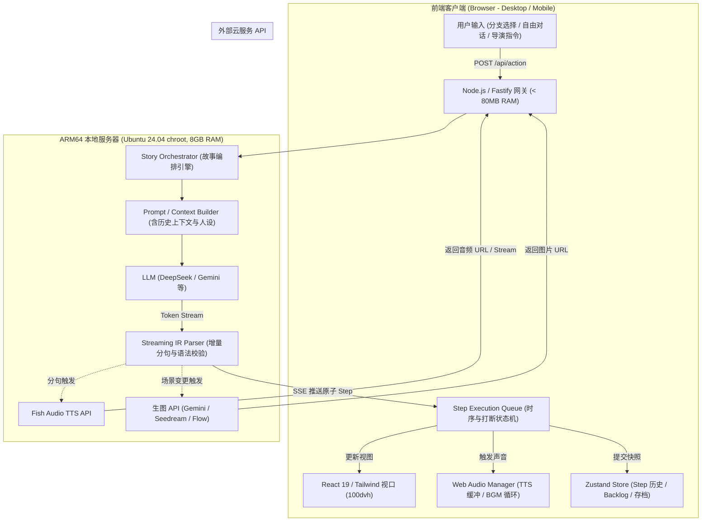

# AI Galgame 引擎生态调研与 Web 渲染层选型评估报告

> **⚠️ 勘误（260928 crosscheck 实测）**：§2.5 与 §6.2 路径二所称"官方发布 `@webgal/base`、`@webgal/parser` npm 包"**不存在**（npm 实测仅有第三方 `webgal-parser`）。WebGAL 备选路径实际需从源码 vendor 整个引擎（MIT 可行），成本显著高于本文估计。首选结论（自研渲染层）不受影响。


**文档标识**：`260928-gal-engine.research`  
**调研日期**：2026-09-28  
**作者**：Deep Researcher (Stage-AI)  
**目标输出文件**：`./docs/features/260928-stage-ai-mvp/260928-gal-engine.research.md`

---

## 1. 调研背景与约束分析

### 1.1 业务场景
我们正在构建一个 **AI 驱动的现代视觉小说（Galgame）引擎 Stage-AI**：
1. **实时增量剧本生成**：大语言模型（LLM）根据故事脉络、玩家选择或导演指令，实时生成结构化剧本（场景切换、多角色对话、立绘与表情差分编排、CG 插画、背景音乐与音效）。
2. **流式边收边演（Streaming & Incremental Playback）**：剧本内容不是离线静态写死的，而是服务端生成一段、前端立即消费演播一段，玩家无需等待整段或整章生成完毕即可看到画面并阅读台词。
3. **高自由度交互点**：不仅包含传统的预置分支选项（Choice Branch），还支持自由文本输入（Free Text Input），甚至允许玩家以“导演/策划（Director Mode）”身份对后续故事走向、演出风格下达高阶指令。
4. **多模态外部服务异步串联**：
   - 角色语音：外部 TTS 服务（Fish Audio 等），生成时延约 0.5s ~ 2s。
   - 视觉资产：外部生图 API（Google Flow / Gemini Flash Image / Doubao Seedream 等），生成时延约 2s ~ 8s。

### 1.2 部署环境与软硬件约束
- **服务端运行环境**：ARM64 移动端设备（8GB RAM），运行 Android + Linux 容器。无图形桌面环境（Headless），进程由 `进程托管` 托管。
  - *资源铁律*：宿主 Android 系统常驻占用约 3.5GB ~ 4GB RAM，chroot 容器内所有服务（Node.js 网关、代理等）的安全内存预算上限建议控制在 2GB 以内；CPU 算力需优先供给核心网络 I/O 与并发请求编排，严禁在服务端运行重型图形渲染（如无头 Chrome/Puppeteer/Xvfb）或重型本地推理模型。
- **客户端环境**：玩家通过桌面浏览器或移动端浏览器（iOS Safari、Android Chrome/Edge 等）访问，网络经由局域网直连或穿透隧道。
- **团队技术栈**：全栈以 **TypeScript / Node.js** 为绝对技术基石。

---

## 2. 现有视觉小说（Galgame）引擎生态全景调研

本节系统调研国内外主流视觉小说引擎的底层架构、脚本模型、Web 移植现状以及对流式动态注入的适应性。

### 2.1 Ren'Py（及其 Web 方案 RenpyWeb）
- **官方与项目资料**：
  - [Ren'Py 官方主页与文档](https://www.renpy.org/doc/html/)
  - [RenpyWeb (GitHub 源码库)](https://github.com/renpy/renpyweb)
  - [Ren'Py Web / HTML5 平台文档](https://www.renpy.org/doc/html/web.html)
  - [Ren'Py 核心架构与解析执行机制解析](https://github.com/renpy/renpy/blob/master/renpy/parser.py)
- **底层架构**：
  - 核心由 Python（早期 2.7，现迁移至 Python 3）配合 Cython、Pygame_SDL2 以及 OpenGL/DirectX 图形接口构建。
  - 编译管道：在启动时扫描工程内所有 `.rpy` 文件，通过 `renpy.parser.parse()` 递归下降解析生成抽象语法树（AST，见 `renpy.ast` 中的 `Say`, `Show`, `Scene`, `Jump` 等节点），并序列化为 `.rpyc`（pickle 二进制字节码缓存）。引擎启动时将所有 AST 节点挂载到全局唯一的 `namemap` 路由表中。
  - 运行时：由单线程主循环 `renpy.execution.run_context()` 步进遍历 AST 链表，驱动屏幕刷新与事件分发。
- **RenpyWeb 机制**：
  - 基于 Emscripten 工具链，将 CPython 静态解释器、SDL2 库、Pygame 绑定以及整个 Ren'Py 运行时打包编译为一个巨大的 WebAssembly（WASM）单体模块。
  - 运行在浏览器单个主线程内（不支持 Web Worker 多线程）。
  - 文件系统：完全依赖 Emscripten 虚拟文件系统（`MEMFS` / `IDBFS`）。所有资产与游戏脚本在首次加载时以 `.data` / `.zip` 包形式整体下载并挂载到虚拟路径。
- **动态脚本注入与流式支持**：
  - **核心限制**：Ren'Py 创始人 Tom Rothamel（PyTom）在开源社区 issue 中明确说明：*“Ren'Py is really meant to be used as a complete system, as opposed to a library... There isn't a state machine that keeps track of sprite objects. What the lexer+parser does is to create an AST, and then that AST executes to set up Python data structures describing objects”*。
  - 静态强绑定：Ren'Py 内部的执行指针、调用栈、标签跳转完全依赖启动时构建的静态 AST 节点引用。如果试图在运行时流式注入外部剧本，必须在 Python 运行时内部调用 `exec()` 或动态通过 `renpy.ast` 拼接节点并篡改 `Context` 上下文。这种做法极不稳定，会彻底瘫痪 Ren'Py 的代码预测（Predict Screen/Image）系统。
- **关键短板与坑点**：
  1. **首屏包体巨大**：RenpyWeb 的 WASM 运行时 + Python 运行库基础开销通常在 **25MB ~ 50MB+**，移动端 4G/Wi-Fi 冷启动加载需要 10~30 秒，极易导致手机端浏览器内存崩溃（OOM）。
  2. **多线程缺失**：由于 WebAssembly 单线程限制，Ren'Py 在桌面端的“后台静默预加载图片”（Background Image Preloading）在 Web 端全部失效，导致动态切换立绘时存在掉帧卡顿。
  3. **网络与 I/O 阻塞**：网络交互受限于 Emscripten 的 `FS` 虚拟文件系统，通过 JS 调用的网络数据通常必须以临时文件写入 `/tmp` 再由 Python 轮询读取，无法支持原生高效的 WebSocket/SSE 管道。
  4. **移动端交互水土不服**：RenpyWeb 输出为一个整块 Canvas，浏览器原生的虚拟键盘、输入法（IME）、手势缩放等体验极难调优，自由输入对话框的定制体验非常糟糕。
  5. **服务端无头难度**：Ren'Py 高度耦合 SDL2 窗口环境，在 ARM64 无桌面的 Ubuntu 容器内无法原生跑 Headless，若用 Xvfb 虚拟屏幕会有不可承受的性能损耗。

---

### 2.2 TyranoScript（ティラノスクリプト）
- **官方与项目资料**：
  - [TyranoScript 官方网站与标签参考](https://tyranoscript.com/tag/)
  - [TyranoSyntax 扩展架构与数据模型](https://deepwiki.com/orukRed/tyranosyntax/2.3-parser-and-data-models)
  - [TyranoScript 源码与插件运行机制教程](https://ssshooter.com/en/tyrano-tutorial-7/)
- **底层架构**：
  - 基于 HTML5 / JavaScript，继承了日本经典的吉里吉里/KAG（Kirikiri Adventure Game）脚本规范。
  - 核心解析器：将 `.ks` 文件内容解析成指令对象数组 `array_s`。引擎主循环 `TYRANO.kag.ftag.nextOrder()` 逐项消费标签（如 `[bg]`, `[chara_show]`, `[font]`, `[l]` 等）。
  - 视图呈现：基于 DOM（`<div>`, ``）与 CSS3 动画，支持通过插件扩展 Canvas/Pixi.js。
- **动态脚本注入与流式支持**：
  - 纯 JS 体系，支持通过 `TYRANO.kag.ftag.startTag(tagName, pm)` 在外部直接触发某个特定 Tag 的执行。
  - 理论上可以向 `TYRANO.kag.ftag.array_s` 数组尾部动态推入新标签。
- **关键短板与坑点**：
  1. **历史技术债务沉重**：代码体系源自早期 jQuery / ES5 时代，缺乏现代模块化（ESM）、TypeScript 类型推导与响应式状态设计。
  2. **存读档机制强绑定行号**：TyranoScript 的存档（Save/Load）与文本回滚（Backlog）高度依赖物理 `.ks` 文件的文件名与标签数组的行索引（`kag.stat.current_scenario` + 语句下标）。流式动态下发的无物理文件标签会导致原生 Save/Load 系统状态混乱、变量越界。
  3. **异步控制流脆弱**：KAG 规范的 `[l]`（等待点击）、`[wait]`、`[p]`（翻页）等异步等待由内部复杂的嵌套回调驱动，注入外部异步生成的 TTS 或图片加载极其容易发生时序错位或永久卡死（Lock-up）。

---

### 2.3 Monogatari（物语）
- **官方与项目资料**：
  - [Monogatari 官网文档](https://monogatari.io/v2)
  - [Monogatari GitHub 仓库](https://github.com/monogatari/monogatari)
  - [Monogatari Action 生命周期设计](https://monogatari.io/v2/building-blocks/actions/life-cycle)
- **底层架构**：
  - 使用 TypeScript 编写，基于现代 Web Components（自定义元素）、CSS3 与原生 DOM 构建。
  - 脚本模型：通过 JS 对象声明剧本，如 `monogatari.script({'Start': ['y Hello world', 'show scene room', 'end']})`。
  - 核心解耦模式——**Action 生命周期体系**：
    - 每个语句被解析为一个 Action 实例（如 `Dialog`, `Choice`, `Show`, `Play`, `Preload`）。
    - 严格遵循三大执行周期：
      1. **Mounting（装载）**：`setup()` / `bind()` / `init()`
      2. **Application（执行）**：`willApply()` → `apply()` → `didApply({ advance })`
      3. **Revert（回滚）**：`willRevert()` → `revert()` → `didRevert({ advance, step })`
    - 单向状态与历史管理：`this.engine.state()` 与 `this.engine.history('action_name')` 使得游戏天然具备正向播放与逆向回滚能力。
- **动态脚本注入与流式支持**：
  - 提供了 Placeholder 机制（`monogatari.$('_actionName', () => ...)`），允许在运行时动态求值并返回要执行的动作。
  - 能够以 npm 包 `@monogatari/core` 形式模块化引入。
- **关键短板与坑点**：
  1. **假定静态全量剧本**：其指针模型（Pointer Index）默认剧本在游戏初始化时已在内存数组中固化。如果要在长篇流式场景中无止境地生成后续剧情，必须侵入其内部 label 数组管理逻辑。
  2. **UI 定制存在封装壁垒**：其界面深度依赖自带的一整套 Web Components 模版，要在对话框中深度嵌入如“导演指令下达窗口”、“自由提问富文本输入卡片”等业务组件时，需要对抗其自带的 Shadow DOM 与内置 CSS。

---

### 2.4 Route Engine（RouteVN）
- **官方与项目资料**：
  - [Route Engine 架构与核心设计演进](https://routevn.com/en/blog/building-a-visual-novel-engine-route-engine/)
  - [Route Engine Concepts 架构规范](https://github.com/RouteVN/route-engine/blob/master/docs/Concepts.md)
  - [route-engine-js (npm)](https://www.npmjs.com/package/route-engine-js)
- **底层架构**：
  - 完全拥抱现代前端的**单向数据流（Unidirectional Data Flow）与单一状态树（Single State Store）**。
  - 彻底解耦 **Content（纯 JSON/YAML 数据）** 与 **Runtime（纯 JS 运行时执行器）**。
  - 经典三层派生机制：
    1. **System State（全局状态）**：包含当前游标（sectionId, lineId）、已读历史、自定义变量值。
    2. **Presentation State（展示状态）**：通过纯函数 Selectors，从第 1 行纯计算演算至当前行，计算出当前屏幕“应当存在什么背景、哪些立绘处于什么表情与位置”。
    3. **Render State（渲染指令）**：由展示状态派生，直接发送给底层绘图库（Route Graphics / Pixi.js）。
  - 副作用管理：通过纯 Action 返回带副作用的 `pendingEffects` 队列（如音频播放、定时器、渲染刷新），由专门的 `sideEffectsHandler` 处理。
- **对流式与 AI 生成的适配性**：
  - 架构设计极其纯粹，天然支持将 LLM 生成的 JSON 节点作为增量 Line/Action 追加到当前 Section。
  - 纯函数状态机使得 Save/Load、Rollback 极其健壮。
- **关键短板**：
  - 生态极为小众（主要是其商业无代码工具 RouteVN Creator 的配套底层），第三方开箱即用的演出特效与社区扩展相对匮乏。

---

### 2.5 WebGAL（OpenWebGAL）
- **官方与项目资料**：
  - [WebGAL 官方技术架构文档](https://docs.openwebgal.com/en/tech/)
  - [WebGAL GitHub 仓库 (4k+ Stars)](https://github.com/OpenWebGAL/WebGAL)
  - [WebGAL 脚本规范与多模式演示](https://github.com/OpenWebGAL/script-specification)
  - [WebGAL 演出与状态解耦设计规范](https://docsearch.algolia.com/mcp/docs/repo/openwebgal/webgal)
- **底层架构**：
  - 目前国内活跃度最高、综合视效表现最现代的开源 Web Galgame 引擎。
  - **技术栈**：全量 **TypeScript**，核心视图层结合 **React + DOM + Pixi.js**，硬件加速渲染支持粒子（雨雪、樱花）、着色器滤镜（Bloom、模糊）、动态 Transform（立绘震颤、缩放呼吸）、Live2D 等。
  - **核心解耦哲学**：明确区分 **Calculation Stage State（权威恢复状态）** 与 **Runtime Performance（运行时瞬态演出）**：
    - `Command Function`：解析参数并修改权威状态，用于存档恢复、快进与条件判断。
    - `IPerform`：负责帧循环渲染（PIXI.Ticker、Web Audio 音效），并必须附带 `unload()` 函数，当用户提前点击屏幕时立即卸载演出并将画面直接落定到最终态。
  - **脚本语法特征**：采用简洁的行式命令协议：
    ```text
    say:今天的天气真好呢。 -speaker=美咲 -vocal=misaki_01.mp3;
    changeBg:classroom.png -next;
    changeFigure:misaki_happy.png -pos=center;
    ```
    支持原生控制修饰符：`-next`（下一句并行立即触发）、`-notend` 与 `-concat`（台词中间插入表情差分切换）、`-when`（动态条件判断）。
- **对流式与 AI 生成的适配性**：
  - 核心逻辑全部在 TypeScript 闭环，已有官方发布的 `@webgal/base`、`@webgal/parser` 模块。
  - 视效表现力处于 Web VN 顶级水平，开箱即支持 ADV/NVL 双形态、文字 Backlog、响应式视口适配。
- **改造点与挑战**：
  - 原生流程以场景文件（`start.txt`）读取和全量资源预加载为中心。若要在 AI 流式场景落地，需绕过文件加载器，基于其 `scriptExecutor` 封装一个 `StreamSceneDriver`，将后端 SSE 增量指令直接适配进它的调度队列。

---

### 2.6 其他相关引擎与框架横向扫描

| 引擎/库 | 核心技术栈 | 架构形态 | 对流式增量生成与 AI 场景的评估 | 资料链接 |
| :--- | :--- | :--- | :--- | :--- |
| **Narrat** | TypeScript + Vue 3 + Pinia | 叙事 RPG / VN 引擎，内置 VM、Pinia 模块化状态、YAML 配置 | 现代化程度极高，支持视口按钮与状态 HUD。但强依赖打包期的 `.narrat` 编译，不易直接做流式指令下发。 | [Narrat Docs](https://docs.narrat.dev/) |
| **Inkle / inkjs** | TypeScript / JS (Port of C# Ink) | 专业互动叙事逻辑状态机（Headless，无自带渲染器） | 逻辑/变量/分支控制能力登峰造极。但需要编译成 JSON 字节码，且缺乏视觉/音频渲染层，适合做纯逻辑编排而非视觉层。 | [inkjs GitHub](https://github.com/inkle/inkjs) |
| **Pixi'VN** | TypeScript + PixiJS | 2D 画布驱动，UI 由 React/Vue 外挂实现 | 现代解耦设计，但仍处于初期，开箱即用的 Galgame 标配组件较少。 | [pixi-vn GitHub](https://github.com/drincs-productions/pixi-vn) |
| **@vnengine/core** | TypeScript + Immer | Headless 状态机，纯事件总线（EventBus）模式 | 架构轻量，以事件驱动渲染器，但缺乏配套完备的 Web 渲染外壳。 | [@vnengine/core (JSR)](https://jsr.io/@vnengine/core) |
| **Tuesday JS** | 原生 JS (Vanilla DOM) | 极简 DOM 驱动，纯 JSON 场景 | 极度轻量，但表现力和工程体系不足以支撑高质量 Galgame 演出。 | [Tuesday JS](https://kirilllive.github.io/tuesday-js/) |

---

## 3. “用 LLM 动态驱动视觉小说”的已有实践与开源参考

通过检索与深度代码抓取，提炼国内外 AI Galgame 及 LLM 交互叙事项目的实战经验与踩坑记录：

### 3.1 典型参考项目分析

#### 案例 1：`novel2galgame`（All Novel Can Be Galgame，2026）
- **项目定位**：将长篇小说全自动转化为可玩 Galgame 的本地工作台。
- **架构亮点——VN Script IR（中间表示）**：
  - 确立核心设计原则：**IR 是唯一中间表示（Single Source of Truth）**，LLM 与所有上游 Agent 只输出严格遵守 Zod Schema 的 VN Script IR，不直接生成任何特定引擎的专有代码。
  - **IR 冻结为 8 种原子 Step**：
    ```typescript
    type VNStep =
      | { type: "bg"; backgroundId: string; backgroundLabel?: string }
      | { type: "show"; characterId: string; expression?: string; position?: "left" | "center" | "right" }
      | { type: "hide"; characterId: string }
      | { type: "say"; characterId: string; displayName: string; text: string }
      | { type: "thought"; characterId: string; displayName: string; text: string }
      | { type: "narration"; text: string }
      | { type: "pause"; durationMs: number }
      | { type: "transition"; name: "fade" | "cut" | "dissolve" }
    ```
  - **双运行时（Dual Runtime）同源**：Web Preview（浏览器内置轻量播放器）与 Ren'Py Export 共享同一种 IR 数据源。实践证明：**在浏览器内直接播放 IR 比导出并启动外部游戏引擎轻量百倍**。
  - **来源**：[lin1753/novel2galgame](https://github.com/lin1753/novel2galgame)

#### 案例 2：`AIVN`（AI Visual Novel Generator，Gemini Challenge 2026）
- **项目定位**：实时流式生成立绘、多角色配音与分支剧本的互动视觉小说。
- **架构与经验**：
  - 架构：FastAPI 后端 + Headless VN Engine + React/Vite 前端通过 WebSocket 进行 frame-by-frame 状态推送。
  - **核心痛点——多模态时延失衡（Multimodal Latency Gap）**：
    - 文本生成仅需 200~400ms，而 TTS 生成需要 1~2s，高质量生图（Gemini 3.1 Flash Image / Imagen）需要 3~8s。
    - 若采用同步阻塞机制，玩家体验是断崖式的。必须在后端构建并发的 **Producer-Consumer Pipeline**，前端采用骨架屏（Skeleton）与占位缓冲，待图文音对齐后再触发动画淡入。
  - **来源**：[arthiondaena/AIVN](https://github.com/arthiondaena/AIVN)

#### 案例 3：`Dream-E`（Open-World AI Visual Novel Engine）
- **项目定位**：全浏览器端运行的开放世界 AI 视觉小说引擎。
- **技术要点**：
  - 前端采用 React 18 + Zustand + Immer + TailwindCSS，全动态场景由 LLM 生成。
  - 内存与资产治理：对外部实时生成的 AI 资产使用 Blob URL 统一管理并在跳出场景时调用 `URL.revokeObjectURL()` 回收；针对音频采用 Howler.js 与 Web Audio API 实现无缝交叉淡入淡出（Crossfade）。
  - **来源**：[LAION-AI/Dream-E](https://github.com/LAION-AI/Dream-E)

#### 案例 4：`soma-17th-ai1`（Kernel Girlfriend）
- **架构实践**：
  - 前端复用了经典引擎 **Monogatari**，后端为 FastAPI + LangGraph。
  - 前后端通过 **SSE（Server-Sent Events）** 建立长连接，后端将 LLM 生成的台词与好感度规则转换为 Monogatari 认识的 Action 指令动态注入前端。
  - **结论**：验证了利用成熟 Web VN 引擎作为纯受控渲染器的可行性，但在深度定制自由文本输入与流式打字机手感时遇到了引擎内置组件的掣肘。
  - **来源**：[soma-17th-ai1](https://github.laiyagushi.com/soma-17th-ai1)

---

## 4. 关键评估维度对比分析

根据系统约束，对候选方案进行全景量化对比：

### 4.1 对比矩阵表

| 评估维度 | 方案 A：复用 Ren'Py (RenpyWeb) | 方案 B：复用 TyranoScript | 方案 C：复用 Monogatari | 方案 D：改造 WebGAL | 方案 E：自建现代 Web 渲染层 (React/Svelte/Pixi) |
| :--- | :--- | :--- | :--- | :--- | :--- |
| **流式增量执行能力** | ❌ 极难（AST 在启动时静态封闭，动态注入破坏回滚机制） | ⚠️ 较差（可调用 startTag，但易破坏行号和内部回调） | 🟡 中等（可扩展 Action，但需重构底层 script 指针） | 🟢 良好（可将增量 IR 注入 performController 调度） | 🌟 **卓越（原生基于事件总线/队列流式消费）** |
| **动态内容/Blob 热加载** | ❌ 极差（受限 Emscripten 虚拟 FS，需转写 `/tmp` 文件，易掉帧） | 🟡 中等（标准 DOM `` 切换） | 🟢 良好（原生 Web 资源加载） | 🟢 良好（Pixi Assets 异步加载器） | 🌟 **卓越（原生 Blob URL / Object URL，零转换成本）** |
| **Web 性能与移动端加载** | ❌ 极差（WASM+Python 达 30~50MB，手机冷启动 15s+，易 OOM） | 🟢 良好（静态体积小，轻量 DOM） | 🟢 良好（打包仅数百 KB，启动极快） | 🟢 良好（开箱 2~3MB，Pixi WebGL 硬件加速流畅） | 🌟 **卓越（极致代码分割，首屏 < 1MB，瞬时冷启动）** |
| **移动端交互适配（键盘/触摸）**| ❌ 极差（整块 SDL Canvas，原生软键盘呼出与布局适配极度痛苦）| 🟡 中等（支持移动手势，但样式老旧） | 🟢 良好（响应式 DOM 布局） | 🟢 良好（自带精美响应式 UI 与移动端手势适配） | 🌟 **卓越（完全自主掌控 dvh 视口、安全区域、虚拟键盘监听）** |
| **自由输入与导演模式** | ❌ 极难（需在 Pygame GUI 内部重造复杂交互控件） | 🟡 中等（需通过 iframe 或 DOM 遮罩层实现） | 🟢 良好（可在 Web Components 中扩展表单） | 🟢 良好（已有内置 Input 支持，可扩展弹窗） | 🌟 **卓越（标准 Web 表单，可无缝嵌入任何 UI 控件与面板）** |
| **二次开发与团队匹配度** | ❌ 极差（Python/Cython/C，技术栈与 TS/Node 完全割裂） | ❌ 较差（历史代码混乱，缺乏 TS 支持） | 🟢 良好（全 TypeScript，但生态偏小） | 🟢 良好（全 TypeScript，架构清晰，中文社区活跃） | 🌟 **卓越（100% 团队技术栈同构，完全无阻抗）** |
| **ARM64 (8G) 服务端开销** | ❌ 极高（若服务端跑需 Xvfb 虚拟屏幕，内存 CPU 暴涨） | 🟢 极低（纯静态文件分发） | 🟢 极低（纯静态文件分发） | 🟢 极低（纯静态文件分发） | 🟢 **极低（Node.js 服务端仅作轻量 I/O 网关，内存 < 100MB）** |
| **存读档/回滚（Rollback）** | ⚠️ 原生强但流式下失效（pickle 快照依赖 AST 物理节点） | ❌ 容易越界损坏（强依赖 `.ks` 行号） | 🟢 良好（Action 原生支持 Revert） | 🟢 良好（权威状态与演出分离） | 🌟 **卓越（基于不可变 IR Event 历史的天然无损快照）** |

---

## 5. “LLM 驱动视觉小说”的核心技术陷阱与避坑指南

### 5.1 协议设计：流式解析的“语法闭合”陷阱
- **陷阱**：直接让 LLM 输出庞大的嵌套 JSON 结构。
  - *原因*：在流式生成中，LLM 输出是一个字符一个 token 出来的。在几千字符的 JSON 未完整闭合前，客户端 `JSON.parse` 无法解析。如果使用流式 JSON 修复库（如 `partial-json`），在网络断包或 LLM 吐出未闭合的字符串转义时，解析器极易崩溃或频繁触发不必要的全量重新渲染。
- **最佳实践**：**采用“行协议 / JSONL / Tag DSL”作为生成载体**。
  - **方案 1（轻量 Tag 行语法，类似 WebGAL / Tyrano）**：
    ```text
    [scene: school_gate.png]
    [show: misaki, mood=smile, pos=center]
    [say: misaki] 早上好，今天的天气真不错呢！
    [choice: "回应问候" -> label_1 | "默默走过" -> label_2]
    ```
    每一行为一个独立的执行单元。服务端或前端只需简单的正则/按行分块（Line Buffer）即可实现单句即时落定。
  - **方案 2（基于 Server-Sent Events 的 IR Event 流）**：
    LLM 在服务端输出时由 Node.js 流式缓冲区解析出完整指令，再以标准 SSE 推送到前端：
    ```http
    event: step
    data: {"type":"say","speaker":"美咲","text":"早上好！","vocalUrl":"/api/audio/123.mp3"}
    ```

### 5.2 多模态流水线：异步时延掩盖策略
- **陷阱**：强行“串行等待”导致游戏节奏严重割裂。
  - 串行模式下，玩家点击后：LLM 思考 (1s) + 文本输出 (1s) + 发起生图 (5s) + 发起 TTS (1s) = 玩家在纯黑屏前枯等 8 秒！
- **最佳实践：阶梯式流水线预加载（Staged Pipeline Prefetching）**：
  1. **资产与对话解耦展示**：
     - 若当前台词发生在已有背景下，**立即开始打字机渲染文本并播放 TTS**；
     - 若当前句子触发了新场景（Scene Change）或新 CG，前端立绘层先施加暗角/模糊过渡（Skeleton 占位），文本先出（“我推开沉重的木门……”），在文本播放的 2~3 秒内，生图 API 已经在后台拉取完毕并以 `opacity: 0 -> 1` 平滑交叉淡入（Crossfade）。
  2. **TTS 分句流式合成**：
     - LLM 输出遇到第一个句号/叹号/问号时，服务端立即截取第一句话投递给 Fish Audio TTS；
     - 当玩家阅读第一句话时，第二句话的 TTS 已经生成并在前端缓冲区就绪。

### 5.3 交互状态机：打字机动效、语音与跳过的冲突
- **陷阱**：打字机（Typewriter）、TTS 播放与玩家点击操作三者时序混乱。
  - 玩家常有快速点击跳过或只想听一半语音的习惯。如果不做状态机防卫，会导致多个音频在 AudioContext 中重叠并发、打字机定时器未清理导致文字穿插乱码。
- **最佳实践：严格的二段式点击状态机（Two-Phase Click State Machine）**：
  ```mermaid
  stateDiagram-v2
      [*] --> Playing: 收到新台词 Step
      Playing --> Completed: (A) 打字机与音频播放完毕
      Playing --> FastForwarded: (B) 玩家在播放中点击屏幕
      FastForwarded --> Completed: 瞬时补齐全文 + 停止/淡出当前语音
      Completed --> Playing: (C) 玩家在完成态点击屏幕 (推进下一句)
  ```
  - **点击第 1 次**：若处于 `Playing` 态，立即中断打字机 RAF 定时器，瞬间渲染完整文本，平滑淡出（Fade Out 100ms）当前语音节点，状态切换到 `Completed`。
  - **点击第 2 次**：处于 `Completed` 态时，才真正触发向后端请求或消费队列中的下一条 Step。

### 5.4 移动端 Web 浏览器的核心兼容性坑
1. **AudioContext 自动播放拦截（Autoplay Policy）**：
   - 现代移动端浏览器（Safari/Chrome）严格禁止未经用户主动触摸就播放音频。
   - **对策**：游戏启动时必须强制设立一个“点击开始游戏（Touch to Start）”遮罩。在该用户手势的回调函数中执行全局 `audioContext.resume()`。后续所有的 TTS 音频切片与背景音乐必须复用该统一初始化的 `AudioContext`，严禁在后台回调中新建 `new AudioContext()`。
2. **手机端软键盘弹出与视口塌陷（100vh vs 100dvh）**：
   - 当玩家在自由对话或导演模式下呼出手机软键盘时，传统的 `height: 100vh` 会被推挤或导致立绘被压缩变形。
   - **对策**：视口外层统一使用 `100dvh`，对话框与游戏主画布使用等比缩放容器（Aspect Ratio Container，如锁定 16:9），通过 CSS `object-fit: contain` 或统一的 Matrix 缩放，避免输入法弹出破坏立绘比例。

---

## 6. 选型建议与落地路径方案

结合 ARM64 本地服务器资源约束、流式边收边演的业务本质、以及团队的 TypeScript 技术栈，提出以下选型评估结论与落地建议：

### 6.1 方案取舍结论
1. **彻底放弃复用 Ren'Py（包括 RenpyWeb）**：
   - 其静态 AST 编译架构、CPython WASM 巨大包体（30~50MB+）、虚拟文件系统 I/O 阻塞与单线程限制，从根本上违背了现代“流式生成、响应式演播”的设计初衷。强行魔改 Ren'Py 属于典型的“背道而驰”，维护与调试成本极高。
2. **不建议采用 TyranoScript**：
   - 历史债务重，代码风格过时，缺乏 TypeScript 生态支持，存读档机制难以与无物理文件的流式剧本挂钩。
3. **最终推荐方案：采用“自研轻量 Web 渲染内核（以 VN Script IR 为中心）+ 深度借鉴 WebGAL 演出模型”**。

---

### 6.2 推荐方案落地路径：两步走路线

#### 路径一（核心推荐）：自建现代轻量 Web 渲染层（Custom Headless IR + Web Runtime）
- **理由**：
  1. 视觉小说核心界面的视觉要素（背景层、立绘层、文字对话框、分支选项、历史 Log 抽屉）在现代前端中结构非常清晰，纯手写核心代码仅需约 800~1500 行高质量 TypeScript。
  2. **100% 掌握数据契约与控制流**：无需妥协于任何第三方引擎的预设死循环，流式 SSE 接入、Fish Audio 语音调度、打字机打断、导演指令输入框均可直接作为原生组件无缝集成。
  3. **极致的包体与加载速度**：首屏 JS 打包后通常小于 300KB，在手机浏览器中实现“秒开（< 500ms）”，内存占用极低。
- **推荐技术栈**：
  - **视图层**：React 19 / Svelte 5 + TailwindCSS + Lucide Icons。
  - **复杂视效层**：常规立绘与转场使用纯 CSS3 硬件加速动画（`transform`, `opacity`）；若后续需要粒子（樱花、雨雪）或高级着色器滤镜，挂载一个轻量透明的 Pixi.js Canvas 即可。
  - **状态管理**：Zustand + Immer（天然单向数据流，精准记录 Step 历史数组，零成本实现 Backlog、Save/Load 和快照回退）。
  - **音频引擎**：基于原生 Web Audio API 构建的 `StreamAudioPipeline`，负责多音轨混音（BGM 循环、SE 音效、TTS 语音排队解码）。

#### 路径二（备选/快速验证）：基于 WebGAL 架构进行轻量适配
- **适用场景**：若 MVP 阶段极度渴望立绘表情差分过渡、高级摄像机推拉等复杂演出，且希望在 3~5 天内快速上线。
- **实施方法**：
  - 直接引入 `@webgal/base`。
  - 编写一个 `StreamSceneAdapter`，绕过其从静态文件加载场景的逻辑，直接向 WebGAL 的内部执行队列 `scriptExecutor` 喂入由服务端 SSE 转换而来的 `ISentence` 对象。

---

### 6.3 推荐的端到端系统架构设计（MVP 实施蓝图）



#### 权威中间表示（VN Script IR v1.0 推荐定义）
```typescript
/**
 * Stage-AI 统一视觉小说中间指令契约
 */
export type StageAIStep =
  // 场景与环境
  | { id: string; type: 'scene'; backgroundUrl: string; transition?: 'fade' | 'dissolve' | 'instant' }
  // 立绘控制
  | { id: string; type: 'figure'; action: 'show' | 'hide' | 'update'; characterId: string; imageUrl?: string; position: 'left' | 'center' | 'right'; emotion?: string }
  // 对话与台词（核心）
  | { id: string; type: 'say'; characterId: string; displayName: string; text: string; audioUrl?: string; durationMs?: number }
  // 旁白
  | { id: string; type: 'narration'; text: string }
  // 心理活动
  | { id: string; type: 'thought'; characterId: string; displayName: string; text: string }
  // 音乐与音效
  | { id: string; type: 'audio'; track: 'bgm' | 'se'; action: 'play' | 'stop' | 'crossfade'; url: string; loop?: boolean }
  // 交互停顿点（等待玩家选择）
  | { id: string; type: 'choice'; prompt?: string; options: Array<{ label: string; value: string; payload?: unknown }> }
  // 交互停顿点（自由输入 / 导演指令下达）
  | { id: string; type: 'director_prompt'; placeholder: string; mode: 'character_reply' | 'director_command' };
```

---

## 7. 结论摘要

1. **选型定论**：坚决**不采用** Ren'Py/RenpyWeb；**推荐自研基于 TypeScript + React/Svelte 的轻量级 Web 渲染层**，并深度吸纳 WebGAL 的“状态与演出解耦”理念。
2. **核心抓手**：以严格 typed 的 **VN Script IR** 作为前后端通信的唯一数据契约，彻底将 LLM 创作管线与前端渲染机制解耦。
3. **架构安全性**：服务端仅作为极轻量的 Node.js I/O 网关（内存开销 < 80MB），所有重型图音解码完全交由玩家设备浏览器，确保在ARM64 手机环境下长期稳健运转。
