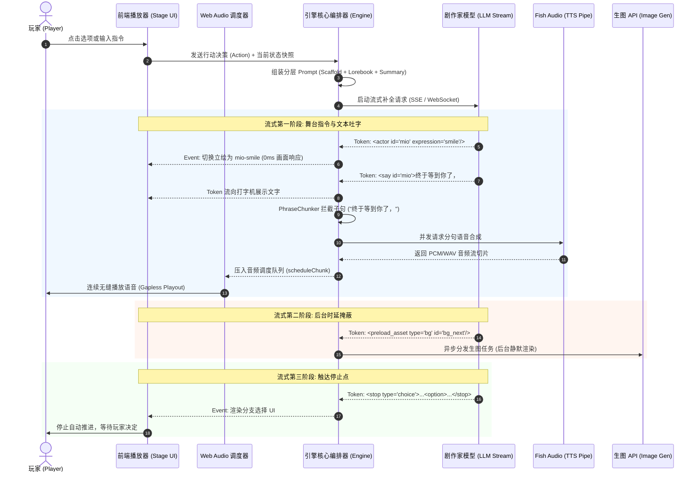

# LLM 驱动的互动叙事与 AI Galgame 引擎架构与交互设计调研报告

> **目标任务**：为 Stage-AI（LLM 驱动的流式增量剧本编排、多角色演出、TTS/生图媒体管线、导演/演员双模式、支持数十小时连续剧情的长篇角色扮演 AI Galgame 引擎）提供详尽、扎实、客观的已有实践调研与架构参考。  
> **报告版本**：2026-09-28-v1.0  
> **输出路径**：`docs/features/260928-stage-ai-mvp/260928-llm-vn-prior-art.research.md`

---

## 目录

1. [执行摘要与核心洞察](#1-执行摘要与核心洞察)
2. [已有产品与开源实践全景调研](#2-已有产品与开源实践全景调研)
   - 2.1 商业与先锋互动叙事系统（AI Dungeon, NovelAI, Decalove, RoleCall Studios, OMEA.ai）
   - 2.2 开源视觉小说与互动剧项目（novel2galgame, SillyTavern VN, Dream-E, GinkgoEngine, AIVN, VNForge）
   - 2.3 学术界前沿多智能体戏剧架构（IBSEN, CoDi, Alt-Mirage, StoryVerse）
3. [LLM 流式输出到前端演出层的协议与增量解析模式](#3-llm-流式输出到前端演出层的协议与增量解析模式)
   - 3.1 结构化输出协议选型对比（Partial JSON Streaming vs XML/Tag DSL vs 线性脚本）
   - 3.2 增量流式解析工程实践与状态机设计
   - 3.3 媒体管线与缓冲节奏控制（Jitter Buffer & Gapless Playout）
   - 3.4 停止点机制与演员/导演双重交互设计
4. [长篇角色扮演的上下文与长程记忆管理架构](#4-长篇角色扮演的上下文与长程记忆管理架构)
   - 4.1 上下文分层装配脚手架（Context Stacking & Scaffold）
   - 4.2 Lorebook / World Info 工业级设计细节
   - 4.3 动态记忆演进与分级检索（Mem0, Letta, 滚动摘要, 时序防穿透）
5. [多角色对话与“角色自主性”（多 Agent 协同体系）](#5-多角色对话与角色自主性多-agent-协同体系)
   - 5.1 架构权衡：单剧作家 vs 多智能体 Swarm vs 混合导演-演员架构
   - 5.2 角色心智建模（Theory of Mind, BDI, 内心独白 Scratchpad）
   - 5.3 角色反抗编剧与戏剧张力产生机制
   - 5.4 动静混合模式（Dynamic Switching）
6. [常见陷阱、反模式与规避策略](#6-常见陷阱反模式与规避策略)
7. [对 Stage-AI MVP 的推荐技术方案](#7-对-stage-ai-mvp-的推荐技术方案)
   - 7.1 Stage-AI 舞台中间表示（Stage IR / DSL）规范草案
   - 7.2 流式媒体管线端到端时序图
   - 7.3 上下文 Token 预算分配表
   - 7.4 MVP 实施与高阶特性演化路线图

---

## 1. 执行摘要与核心洞察

构建一个支持数十小时连续剧情、流式多模态演出并兼具玩家“演员/导演”双重身份的 AI Galgame 引擎，本质上面临四大工程与设计挑战：

1. **协议层与流式解析**：常规完整生成 JSON 无法实现端到端低延迟演出；逐 token 刷新全量 JSON re-parse 存在 $O(N^2)$ 计算瓶颈与结构断裂风险；基于标记行（Tagged Lines / Lightweight XML-like DSL）的分块流式状态机被证明是演出层最稳健、Token 消耗最低的表达协议。
2. **多模态播放缓冲与节奏控制**：文本生成速率与语音/图像消耗速率存在根本性失衡。文本输出速度远超语音发音速度（时间膨胀比 $\rho > 1$），但图像生成速度（3~10秒）又远慢于文本。工业界成熟解法是建立**基于标点符号边界的 Phrase/Sentence Chunker + 客户端自适应音频抖动缓冲（Adaptive Playout Buffer / Gapless Web Audio Scheduling）**，配合**场景级背景与立绘预发射（Pre-generation / Latency Hiding）**。
3. **长程上下文与状态外置原则**：模型不应持有游戏真实状态（“Engine owns the state, not the model”）。在处理数十小时长篇叙事时，单靠增大 Context Window 必然遭遇注意力衰减、幻觉和成本暴增。工业最佳范式为“**三轨分层记忆**”：静态/半静态世界规则（Lorebook / World Info 结合 KV Cache 步进对齐） + 宏观情节摘要（Auto Summarization 递归滚动压缩） + 微观事件向量召回（Episodic Memory Bank 带时序约束）。
4. **角色自主性与剧作家控制的张力调和**：纯多 Agent 自发涌现（如 Stanford Generative Agents）在剧情长线演进中极易陷入“群猫无首”（Herding Cats）的无聊闲聊与剧情失控；纯单模型剧作家又会导致角色沦为提线木偶。前沿最佳实践是**分层混合架构（Director-Actor Architecture）**：剧作家（Director）负责场景节奏、张力与阶段目标，角色智能体（Actor）在内心独白（Scratchpad）与内在动机（BDI / Utility Functions）驱动下对剧作家指令做出忠于自身人设的反应甚至阻抗。

---

## 2. 已有产品与开源实践全景调研

### 2.1 商业与先锋互动叙事系统

| 产品/项目 | 核心架构特征 | 交互与生成机制 | 记忆/上下文管理 | 媒体与演出支持 | 来源/参考链接 |
| :--- | :--- | :--- | :--- | :--- | :--- |
| **AI Dungeon** (Latitude) | 经典的纯文本叙事引擎；近年升级为多模块混合架构 | 用户指令分为 Do / Say / Story / See；脚本支持 Context / Input / Output Hook | **三轨制**：Plot Essentials（置顶记忆） + Story Cards（关键词触发） + Auto Summarization（每15步滚动压缩） + Memory Bank（每6步Embedding向量召回） | 外部生成插图（根据场景提示词生成静态插图） | [AI Dungeon Docs](https://help.aidungeon.com/faq/the-memory-system) |
| **NovelAI** (Anlatan) | 面向小说创作的 Storyteller 引擎（Clio / Kayra / GLM 系列模型） | 连续生成与行内补全；精确的 Token 级 Repetition Penalty 与 Phrase Bias | **Lorebook 脚手架体系**：支持 Key-Relative 插入、Reserved Tokens 独占配额、级联递归激活；GLM 版本采用 8K Token 阶梯滚动窗口（KV Cache 友好） | 深度绑定基于 Stable Diffusion 的二次元文生图与角色风格化 | [NovelAI Docs](https://docs.novelai.net/en/text/lorebook/) |
| **Decalove** (2026 先锋项目) | 现代多 Agent 驱动的 Ren'Py 本地+云端恋爱 VN | 玩家既可点击固定选项，也可自由输入（Free-text Input）；由 Director Agent 分类玩家意图 | 严格贯彻“Engine owns state”：好感度等数值由后端校验截断（±5 delta）；AI 严禁代写玩家行为 | 客户端为标准 Ren'Py 运行时；后端 Gemini 3.7 Flash 结构化 JSON 生成 | [Decalove Devpost](https://devpost.com/software/decalove) |
| **RoleCall Studios** | 全功能 Web 端 AI Visual Novel 系统 | 专用 `/play` 舞台视图；AI 自动编排角色站位、表情、立绘切换与转场 | 角色卡、地点卡、世界书、即时目标与背包系统联动 | 舞台指令系统（Stage Directions）：`Set Background`, `Set Expression`, `Move Sprite`，TTS 语音分角色朗读 | [RoleCall Docs](https://rolecallstudios.com/docs/features/visual-novel) |
| **OMEA.ai** | Steam 商业级 AI 驱动互动叙事桌面游戏 | 彻底抛弃传统对话轮盘（Dialogue Wheel），玩家全自由自然语言输入，AI 充当导演实时编排 | 长线因果追踪（Long-term Cause-and-Effect）；检定骰（Dice Roll Checks）与分支收束 | 实时生成全彩立绘、场景插画、动态背景音乐、多角色 TTS 语音 | [OMEA.ai Preview](https://gaming-corners.co.uk/omea-ai-pc-preview-the-death-of-the-dialogue-wheel/) |

### 2.2 开源视觉小说与互动剧项目

| 项目名称 | 技术栈与底层引擎 | 核心特色与数据流 | 协议与 DSL 设计 | 借鉴价值与局限 | 来源/参考链接 |
| :--- | :--- | :--- | :--- | :--- | :--- |
| **novel2galgame** (lin1753) | TypeScript, React 19, LangGraph, ChromaDB, Ren'Py | 百万字中文小说转可玩 Galgame；7-Agent 管线（章节识别→叙事分类→说话人归因→场景切分→VN Mapping→提示词提取→保真审计） | **VN Script IR v1.0**：冻结 8 种原子 Step（`bg`, `show`, `hide`, `narration`, `say`, `thought`, `pause`, `transition`） | **极高借鉴价值**：双运行时同源（Web 预览与 Ren'Py 共享同一 IR）、RAG v2 增量入库防时序泄露；局限是主要针对离线小说转换而非在线流式互动 | [GitHub](https://github.com/lin1753/novel2galgame) |
| **SillyTavern & Prome VN** | Node.js, Express, 浏览器端 DOM 渲染 | 经典开源 RP 前端；Prome VN 扩展将聊天窗口变为 Galgame 舞台（单台词展出、立绘明暗焦点、震颤动画模拟说话） | 纯文本/Markdown 解析 + 正则提取；Character Expressions 基于轻量情感分类器自动将台词映射到 28 种情绪立绘 | **UI/UX 宝库**：情绪映射体系、Sprite Emulation、聚焦高亮、打字机效果成熟；局限是协议未高度结构化，主要依赖客户端后处理猜表情 | [Prome VN Repo](https://github.com/Bronya-Rand/Prome-VN-Extension) |
| **Dream-E** (LAION-AI) | React, Vite, Express, IndexedDB | 开源世界级 AI-VN 生成引擎，支持 Open World 动态冒险模式与节点可视化编辑 | 节点式图结构（Scene, Choice, Modifier, Comment）+ 动态变量插值（`{{var}}`） | 完善的资产解耦架构（Blob URL 内存优化、FLUX 2 生图 + Gemini TTS），离线优先数据持久化 | [GitHub](https://github.com/LAION-AI/Dream-E) |
| **GinkgoEngine** | 原生 Vanilla JS (零框架依赖), WebGL Live2D | Web 端轻量 Galgame 引擎，集成 DeepSeek 剧作生成与赛后自由对话模式（Epilogue Mode） | 纯 JSON 场景描述（`scenes` 数组：`speaker`, `text`, `bg`, `sprites`, `bgm`, `effects`, `choices`） | 原生集成 Live2D Cubism 5 与表情/视线追踪，CSS 动画滤镜丰富（Sepia, Vignette, Shake, Flash） | [GitHub](https://github.com/1366sll/GinkgoEngine) |
| **AIVN** | Python FastAPI, React, WebSocket | Google GenAI 竞赛先锋项目；后端运行 Headless VN 引擎，通过 WebSocket 逐帧推送状态 | 严格 Pydantic Schema 约束；Gemini 2.5 Flash 生成剧情大纲与分支，Gemini 3.x 生成立绘/背景，Gemini TTS 合成语音 | **前后端解耦范式**：无头引擎驱动播放，双 API 路由平衡预算（Vertex AI 信用额度跑文本+TTS，Gemini 原生跑高频生图） | [GitHub](https://github.com/arthiondaena/AIVN) |
| **ai-galgame** (jade0707) | React 19, Vite, Zustand, Dify.ai | Dify 作为智能编剧工作流后端，驱动前端 Galgame 演出 | 采用显式 XML 标记协议（`<dialogue>` 与 `<command>` JSON） | 证明了 XML 标记包裹与指令块比裸 JSON 具有更高的 LLM 生成容错率 | [GitHub](https://github.com/jade0707/ai-galgame) |

### 2.3 学术界前沿多智能体戏剧架构

1. **IBSEN: Director-Actor-Player Framework (ACL 2024 / arXiv 2407.01093)**
   - **架构设计**：由中央 Director Agent 监控全局剧情目标（Plot Objective $G$），生成高层大纲 $S_G$ 与剧情节拍；指导各个 Actor Agent 扮演角色。
   - **交互机制**：引入 Player Agent（由真实玩家接管）。当玩家发生偏离既定剧本的行为时，Director 动态重构剧情分支，生成全新大纲并下发给 Actor 调整应对，实现玩家介入下的剧情保舵。
   - **核心启示**：Director 不直接写全所有台词，而是生成“指导意图（Instruction）”给 Actor；Actor 拥有自身人设记忆，确保了角色声线一致性与自主反应。
2. **CoDi: Director-Actor for Goal-Driven Interactive Storytelling (AIIDE 2025)**
   - **分层角色**：Planner Agent（初始化世界观与全局效用） $\to$ Director Agent（生成高阶推进指令） $\to$ Character Agent（执行台词与微动作） $\to$ Editor Agent（剧本格式修饰）。
   - **深层心智与自主性（Deep Theory of Mind）**：每个 Character Agent 拥有独立于全局目标的私有效用函数（Utility Function）。当 Director 的指令违背角色人设时，**显式指示角色优先保卫自己的人设和动机**。
   - **响应三要素规范**：Character 每次反应必须包含 `[Inner Thought]`（私有内心独白，其他角色不可见） + `*Action/Emotion*`（动作描写） + `"Speech"`（角色台词）。
3. **Alt-Mirage: AI Director for Unscripted Storytelling (2025/2026)**
   - **软控制与硬控制结合（Soft vs Hard Control）**：
     - *Hard Control*：剧作家操纵环境（断电、天气突变、第三者闯入、广播触发）；
     - *Soft Control*：剧作家不直接篡改角色思维，而是通过调整角色外层的“超我（SuperEgo）特征向量”来调节其情绪激化度、怀疑度和表达风格，底层自我的认知推理链（Ego）依然由角色基于私有记忆自主演绎。
   - **叙事张力度量（Critic Sub-agent）**：通过信息论量化冲突熵（Conflict Entropy）与事件惊奇度（Event Surprisal），据此决定何时介入干预。

---

## 3. LLM 流式输出到前端演出层的协议与增量解析模式

### 3.1 结构化输出协议选型对比

在流式生成视觉小说剧本时，传输协议的选择直接决定了流式解析的稳定性、首字延迟（TTFT）以及 Token 成本：

| 方案模式 | 典型结构形态 | 解析实现原理 | 优势 | 劣势与踩坑点 | 适用阶段 |
| :--- | :--- | :--- | :--- | :--- | :--- |
| **方案 A：Streaming JSON** | `{"events": [{"type": "say", "char": "alice", "text": "你好"}]}` | `@cacheplane/partial-json`, `streamparse`, `partial-zod`（合成闭合机制） | 严格类型定义，便于前后端直接绑定 TypeScript 接口与 Zod 校验 | 1. 引号、转义字符（`\n`, `\"`）造成 15%~25% Token 膨胀；<br>2. 嵌套数组在中途容易发生解析抖动；<br>3. 逐 token re-parse 呈 $O(N^2)$ 计算复杂度 | 适合批量请求或离线数据管道，**不推荐**作为高频单字流式演出主协议 |
| **方案 B：XML-like / 自定义 Tag 块 DSL** | `<scene bg="park" bgm="quiet"/>`<br>`<say char="mio" mood="smile">终于等到你了！</say>`<br>`<choice id="wait">我也刚到</choice>` | 栈式流式状态机（Streaming XML/Tag Parser），遇到闭合标签或属性结束即触发事件 | 1. 结构直观，极其符合 LLM 的戏剧剧本预训练先验；<br>2. 台词部分为原生纯文本，零转义，Token 利用率最高；<br>3. 前端可实现标签到即解析，台词即刻流式字效输出 | 需要手写轻量状态机词法分析器（但代码量通常 `< 200` 行） | **强烈推荐（Stage-AI 首选方案）** |
| **方案 C：扁平行语法 DSL (Ren'Py / Tsuzuru 风格)** | `@bg classroom`<br>`@show mio happy at center`<br>`mio: 遅いよ。`<br>`? 怎么回答 -> A | B` | 基于换行符 `\n` 的行缓冲区（Line-based Buffer） | 语法最简洁，单行解析极其迅速，天然防跨行损坏 | 属性参数扩展受限（例如携带复杂音效衰减参数时行语法容易变脆弱） | 适合极简脚本或老引擎无缝兼容 |

### 3.2 增量流式解析工程实践与状态机设计

采用方案 B 时，前端或 BFF 网关的增量流式解析器（Incremental Streaming Parser）应设计为一个**非阻塞词法状态机**：

```
[文本 Token 流注入]
       │
       ▼
 ┌────────────┐     检测到 '<'     ┌──────────────┐     检测到 '>'     ┌──────────────┐
 │ TEXT_CHUNK ├───────────────────►│ TAG_SCANNING ├──────────────────►│ TAG_RESOLVED │
 └─────┬──────┘                    └──────────────┘                    └──────┬───────┘
       │                                                                      │
       ▼                                                                      ▼
【触发打字机字符渲染】                                            【提取指令/属性参数】
【送入 PhraseChunker 进行 TTS 切分】                              【发射场景演出事件: 背景/立绘/音乐】
```

**关键状态流转逻辑：**
1. **指令先行原则**：LLM 必须在台词文本前输出场景或状态指令（例如 `<action sprite="alice" mood="blush" pos="center"/>` 紧跟 `<say speaker="alice">`）。这确保了当台词第一个字开始在前端打字机渲染时，角色立绘与表情已经切换到位。
2. **标签逃逸与自动闭合保护**：当流在网络抖动或模型截断时中断，解析器需具备未闭合标签回滚机制（Tolerant Fallback），若流结束时仍停留在 `TAG_SCANNING`，丢弃损坏的末尾碎片，保证界面不产生裸露出源码的崩溃。

### 3.3 媒体管线与缓冲节奏控制（Jitter Buffer & Gapless Playout）

#### 3.3.1 速率失衡与时间膨胀比（$\rho > 1$）

文本与多模态合成存在天然的物理时间差：
- **LLM 生成速率**：现代商业模型流式输出通常为 $30 \sim 80 \text{ tokens/s}$（中文约 40~100 字符/秒）。
- **人类阅读/语音消耗速率**：常规正常语速为 $4 \sim 6 \text{ 字符/s}$。
- **时间膨胀比（Expansion Ratio $\rho$）**：
  $$\rho = \frac{T_{\text{audio}}}{T_{\text{generation}}} \approx 5 \sim 10$$
这意味着在正常播放下，**剧本生成的推进速度天然快于演出消耗速度**。只要系统越过最初的冷启动缓冲阈值，后续台词的 TTS 与甚至局部生图完全可以在后台充沛的时间窗内静默完成。

#### 3.3.2 语音切分策略（Commitment Policy）与 PhraseChunker

不能对 LLM 输出的每个 Token 裸发 TTS。语音生成是**不可逆（No Undo）**的：文字在屏幕上可以被覆盖重刷，已发音的音节无法撤回。例如当前文本缓冲出现 `"2026"`，若下一个 token 是 `"年"`，发音是“二零二六年”；若下一个 token 是 `"元"`，发音是“两千零二十六元”。

工业界成熟的句子切分器（如 vLLM-Omni RFC 与 ElizaOS `PhraseChunker`）的核心规范：
1. **边界标点触发**：以强终止标点（`。`、`！`、`？`、`……`、`\n`）作为绝对切分点；对长句子辅以次级标点（`，`、`；`、`、`）并在累积字符达到安全长度（例如 25~35 汉字）时切分。
2. **超时强制冲刷（Time-Budget Force Flush）**：若 LLM 在非终止标点后发生网络或生成停顿超过 **700ms**，强制封口并派发当前分块至 TTS，防止因大模型卡顿导致玩家耳机陷入死寂。
3. **文本正则化（Text Normalization）**：在交给 Fish Audio 等 TTS 引擎前，进行前置拼音/数字转换（如百分比、金额、缩写）。

#### 3.3.3 Web Audio Gapless Playout 与自适应抖动缓冲（Jitter Buffer）

前端音频引擎切忌使用粗暴的单次 `new Audio().play()`，会导致切片间产生明显的爆音（Click/Pop）和静音缝隙。必须基于 **Web Audio API** 建立**连续无缝调度队列**：

```javascript
// Web Audio API 无缝拼接模型
class GaplessAudioScheduler {
  private ctx: AudioContext;
  private nextPlayTime: number = 0;
  private readonly JITTER_CUSHION = 0.25; // 250ms 自适应缓冲垫

  public scheduleChunk(audioBuffer: AudioBuffer) {
    const now = this.ctx.currentTime;
    if (this.nextPlayTime < now) {
      // 发生 Underrun（欠载），重新建立起步缓冲
      this.nextPlayTime = now + this.JITTER_CUSHION;
    }
    const source = this.ctx.createBufferSource();
    source.buffer = audioBuffer;
    source.connect(this.ctx.destination);
    source.start(this.nextPlayTime);
    this.nextPlayTime += audioBuffer.duration;
  }
}
```

#### 3.3.4 玩家阅读节奏的自适应适配状态机

系统需针对玩家的三种典型节奏实现状态自适应：

```
                ┌────────────────────────────────────────────────────────┐
                │                     【演出播放状态机】                   │
                └──────────────────────────┬─────────────────────────────┘
                                           │
          ┌────────────────────────────────┼────────────────────────────────┐
          ▼                                ▼                                ▼
  【慢读者 / Auto 模式】            【正常跟读模式】                 【快读者 / 点击跳过】
  (Playback > Gen)                (Pacing Balanced)                (User Click Ahead)
  ┌──────────────────────┐        ┌──────────────────────┐         ┌──────────────────────┐
  │ 缓冲区逐渐充满        │        │ 边生成、边合成、边播放 │         │ 播放追赶上未生成内容  │
  │ 后续台词与音频全就绪 │        │ 维持 1~2 句平稳缓冲   │         │ 显示微型加载指示器    │
  │ 实现 0ms 缝隙丝滑换行 │        │ 体验类似实时追剧     │         │ (Loading/等待首字)    │
  └──────────────────────┘        └──────────────────────┘         └──────────────────────┘
```

- **快读者（Fast Clicker）**：用户快速点击鼠标。如果目标台词的文本已流出但 TTS 尚在合成，提供“跳过当前语音、静音先上文字”的选项；若连文本均未生成，对话框展示打字脉冲等待（Loading indicator），并在生成的第一瞬间开始吐字。
- **生图 API 延迟掩蔽（Latency Hiding）**：
  生图耗时通常为 3~8 秒。解法为**前置预发射**：剧作家在场景前置 3~5 句对话阶段，即输出 `<prepare_bg prompt="sunset beach" id="bg_102"/>`；媒体管线立即在后台并发调用生图 API；当剧情推进到真正的 `<switch_bg id="bg_102"/>` 时，图片通常已在浏览器缓存就绪；若尚未完成，前端采用电影式过渡：**文字框与立绘正常更新，背景先应用高斯模糊骨架占位（Blurhash / Progressive Loading），完成后平滑淡入（Crossfade）**。

### 3.4 停止点机制与演员/导演双重交互设计

#### 3.4.1 停止点（Stop Points）与选项生成协议

剧作家流式输出不能无休止进行。在 Galgame 语法中，通常以特定的结构标签标识剧本阶段的结束与交互交接：
- `<stop type="choice">`：提供 2~4 个分支选项；
- `<stop type="free_input" placeholder="输入你想做的事或说的话...">`：等待玩家自由行动；
- `<stop type="auto_pause"/>`：单纯的剧情幕间（点击屏幕继续推进下一幕）。

#### 3.4.2 严防“替玩家代写台词”（Anti-User-Hijacking 铁律）

在所有 LLM 互动故事中，最致命的沉浸感杀手是**模型越俎代庖，直接替玩家把动作、反应甚至心里话说完**（例如：“你感到非常生气，冷笑着回答道……然后转身离去”）。
**工业级后处理防护机制**：
1. **Prompt 强约束**：在 System Prompt 明确铁律：“你控制除主角（Player）之外的所有角色与世界环境。严禁生成主角的台词、心理活动与决定性动作。在涉及主角必须表态或反应的瞬间，必须立即使用 `<stop>` 终止生成。”
2. **BFF 校验拦截器（Validation Filter）**：实时监测流式输出，一旦检测到以第二人称代词开头的动作行为动词（如“你决定”、“你笑了笑”、“你说道”），流式切断器立刻原地截断，强制丢弃后续违规内容并转入等待输入模式。

#### 3.4.3 自由输入的意图分类与“戏剧性软着陆”

当玩家自由输入自然语言时（例如玩家在第 3 回合输入：“直接拔剑刺向公主”），系统决不能直接执行成荒诞的“逻辑崩溃”，也不能机械回复“系统不支持该指令”。
参考 `Decalove` 的最佳实践：
- **Intent Classification**：先通过一个轻量级意图分类器，将玩家输入映射为“动作类型”（如攻击、调情、询问秘密、离谱恶搞）。
- **Affection & Stance Gating**：比对当前角色的关系值（好感度、信任度）与场景物理限制。
- **戏剧性软着陆（Say Yes, but Create Plausible Drama）**：编剧永远顺从玩家输入的大方向，但根据合理性安排结果——例如好感度不足时告白，女主角会感到受惊并戒备；拔剑刺向公主，骑士侍卫会拔刀将其格挡在半空，转化为紧张的对峙剧情。

#### 3.4.4 演员（Actor）与导演（Director）的双通道控制

为了兼顾玩家既想作为“戏中人”互动，又想作为“导演”操纵剧本风格的需求，Stage-AI 应当在交互界面提供**明确的双通道输入分流**：
- **演员通道（In-Character Chat / Action）**：作为主角本人说话或做动作。该内容被包装在 `<player_turn>` 中，直接成为剧本上下文中的一行角色台词。
- **导演通道（Director Instruction / Metaprompting）**：向剧作家下达超现实的场外指导（例如：“下一幕让气氛变得惊悚起来”、“让艾莉丝表现出傲娇吃醋的神态”、“加速推进到游乐园场景”）。该内容被送入当前 Context 的 **Author's Note / Metaprompt** 槽位，直接对后续生成施加强烈风格牵引，而不会被NPC角色当作现实话语来回应。

---

## 4. 长篇角色扮演的上下文与长程记忆管理架构

要支撑 20~50 小时以上的连续剧情交互，必须彻底摆脱单一依赖大上下文窗口的“大杂烩 Prompt”方案，建立多层次、确定性的上下文装配与外置记忆流水线。

### 4.1 上下文分层装配脚手架（Context Stacking & Scaffold）

借鉴 AI Dungeon、NovelAI 及 LangGraph 生产系统的装配经验，向 LLM 组装 Prompt 的上下文结构应采用严格的**空间槽位分层（Slot Allocation）**：

```
┌───────────────────────────────────────────────────────────┐
│ [Slot 0] System Core & Directives (固定系统指令与格式契约)     │
├───────────────────────────────────────────────────────────┤
│ [Slot 1] Plot Essentials (主线永续设定: 世界核心法则、主角背景)  │
├───────────────────────────────────────────────────────────┤
│ [Slot 2] Active Lorebook Entries (当前关键词唤醒的世界书条目) │
├───────────────────────────────────────────────────────────┤
│ [Slot 3] Rolling Story Summary (自适应滚动剧情大纲, 宏观脉络)  │
├───────────────────────────────────────────────────────────┤
│ [Slot 4] Episodic Memory (向量检索召回的历史事件切片)         │
├───────────────────────────────────────────────────────────┤
│ [Slot 5] Stage State Block (当前场景状态: 地点、好感度、存活)  │
├───────────────────────────────────────────────────────────┤
│ [Slot 6] Recent History (最近 10~20 轮原始剧本台词与交互)    │
├───────────────────────────────────────────────────────────┤
│ [Slot 7] Director's Note / Author's Note (导演即时风格指令)  │
├───────────────────────────────────────────────────────────┤
│ [Slot 8] Last Player Action / Trigger (当前玩家输入/唤醒触发)  │
└───────────────────────────────────────────────────────────┘
```

**槽位影响权重分布**：LLM 在处理长文本时天然存在“首尾注意力高、中间注意力低”的 Lost-in-the-Middle 现象。
- 静态规则置于 **Top（Slot 0~1）**；
- 动态事实与过往历史置于 **Middle（Slot 2~5）**；
- 最具时效性、必须严丝合缝执行的导演指令与玩家动作置于 **Bottom（Slot 7~8）**，确保即时反应强度达到峰值。

### 4.2 Lorebook / World Info 工业级设计细节

根据 SillyTavern 与 NovelAI 的实战教训，世界书机制必须包含以下硬性控制逻辑，否则极易发生 Token 炸裂或激活震荡：

```
                ┌─────────────────────────────────┐
                │ 扫描近 N 轮文本 (Scan Depth = 3) │
                └────────────────┬────────────────┘
                                 │
                   【主关键词与次级逻辑匹配】
             (AND_ANY / AND_ALL / NOT / Regex)
                                 │
                                 ▼
                     ┌───────────────────────┐
                     │ 是否开启递归扫描?     │
                     └───────────┬───────────┘
                                 │
                 ┌───────────────┴───────────────┐
             Yes │                               │ No
                 ▼                               ▼
       ┌──────────────────┐            ┌───────────────────┐
       │ 提取已激活条目文本 │            │ 收集直接命中条目   │
       │ 送入 RecurseBuffer│            └─────────┬─────────┘
       └─────────┬────────┘                      │
                 │                               │
                 ▼                               │
     【限制 Max Recursion Steps ≤ 2】            │
     【过滤 Non-recursable 条目】                │
                 │                               │
                 └───────────────┬───────────────┘
                                 │
                                 ▼
                    ┌─────────────────────────┐
                    │ Token 预算与裁切器       │
                    │ (Budget Cap & Trimming) │
                    └────────────┬────────────┘
                                 │
       ┌─────────────────────────┴─────────────────────────┐
       ▼                                                   ▼
【保留独占 (Reserved Tokens)】               【超额裁切梯度 (Trim Ladder)】
优先满足核心角色核心档案                      No Trim ──► By Newline ──► Drop Entry
```

1. **扫描深度（Scan Depth）**：默认仅扫描最后 2~4 条交互。避免扫描过早历史导致全局实体无休止常驻。
2. **递归连锁防爆（Recursive Loop Protection）**：
   - 必须设立 `Max Recursion Steps`（推荐设为 2）：条目 A 唤醒条目 B，条目 B 唤醒条目 C，之后必须强制切断，严禁无限蔓延；
   - 支持标记 `Non-recursable`（只许被对话唤醒，不许被其他词条唤醒）与 `Prevent further recursion`（自身激活后禁止引出其他条目）。
3. **KV Cache 友好的步进滚动（Rollover Window）**：
   NovelAI 的最新实践指出：长上下文模型频繁变动顶层 Prompt 会导致 GPU 端的 Prefix KV Cache 完全失效，极大增加推理成本和首字时延。
   **建议**：静态世界书和宏观大纲的组装，以固定块（如 4K 或 8K Tokens）为单位进行阶梯式更新，而非每轮对话微调一次，最大化命中 Prefix Cache。

### 4.3 动态记忆演进与分级检索（Mem0, Letta, 滚动摘要, 时序防穿透）

在长达数十小时的旅程中，玩家与角色的互动会产生数万行剧本。需要借鉴 **Mem0** 与 **Letta (MemGPT)** 的分级记忆体系：

```
       【实时交互剧本流】
               │
               ▼
┌───────────────────────────────┐
│     Working Context (RAM)     │  ◄── 维持当前场景最近 15 轮高保真对话与局部状态
└──────────────┬────────────────┘
               │  每 15 轮触发增量提炼
               ▼
┌───────────────────────────────┐
│    Rolling Summary Engine     │  ◄── 递归式提炼宏观大纲（事件发展、关系变动、阶段目标）
└──────────────┬────────────────┘
               │  超长时启动两级压缩（Episode Summary ──► Chapter Summary）
               ▼
┌───────────────────────────────┐
│ Episodic Memory Store (Disk)  │  ◄── 细粒度事件切片（带时间戳、地点、参与角色元数据）
│ (Hybrid: ChromaDB + BM25)     │
└───────────────────────────────┘
```

**关键避坑规范：**
- **防止标签时序穿越（Temporal Leakage Prevention）**：在 RAG 检索时，很多系统直接无脑对全库做相似度召回。结果是玩家在第一章调查凶杀案时，向量库召回了“第三章死者其实是假死”的剧透切片。
  **铁律**：所有存入的事件切片必须打上递增的时序索引（Turn Index / Timestamp）。当前轮次检索时，**强制施加元数据过滤条件**：
  $$\text{filter} = \{ \text{turn\_id}: \{ \$lte: \text{current\_turn} \} \}$$
- **多路召回与融合（Hybrid Retrieval）**：
  纯向量召回对专有名词（人名、道具名、魔法咒文）表现糟糕；纯 BM25 对语义模糊表达表现糟糕。参考 `novel2galgame` 的 RAG v2 最佳实践：
  $$\text{Score} = \text{RRF}(\text{Dense HNSW}, \text{Sparse BM25}, \text{Metadata Exact Match})$$
  仅取 Top-3~5 最相关事件切片注入 Context。

---

## 5. 多角色对话与“角色自主性”（多 Agent 协同体系）

### 5.1 架构权衡：单剧作家 vs 多智能体 Swarm vs 混合导演-演员架构

| 架构维度 | 模式 A：单一编剧全包 (One-for-All) | 模式 B：纯多智能体自发演化 (Agent Swarm) | 模式 C：分层混合导演-演员架构 (Director-Actor) |
| :--- | :--- | :--- | :--- |
| **典型代表** | 普通 ChatBot 扮演所有角色、标准 AI-VN | 斯坦福 Generative Agents, AI Town | IBSEN, CoDi, Decalove, Alt-Mirage |
| **实现原理** | 一个剧作家 LLM 统一生成场景描写、旁白与所有角色对话 | 每个 NPC 是独立循环的 Agent，各自感知环境、记忆并自发互相发言 | 中央 Director 制定场景大纲与张力走向；各个 Actor 拥有独立心智与人设，执行台词 |
| **剧情推动力** | **极高**。剧情紧凑，转场果断，结构严谨 | **极低**。极易陷入循环打招呼、无意义闲聊，缺乏戏剧冲突推进 | **高**。Director 确保大方向收敛，主线明确推进 |
| **角色声线与深度** | 容易发生角色同质化（所有角色语气逐渐趋同） | 角色性格鲜明、行为不可预测但极具真实感 | 角色拥有私有记忆与独立声线，同时服从戏剧节奏 |
| **推理成本与延迟** | **最低**（单次 API 往返即可开始流式吐字） | **极高**（角色间互相等待，API 调用次数呈指数级暴增） | **可控**（分级调用：Director 轻量规划，Actor 局部流式） |
| **适用场景** | 快速线性推进、过场交代、背景陈述 | 沙盒闲逛、开放式村庄模拟 | **长篇戏剧性 Galgame 黄金解法** |

### 5.2 角色心智建模（Theory of Mind, BDI, 内心独白 Scratchpad）

为了在高级演化阶段赋予角色“不完全受剧作家支配”的灵魂，系统必须为核心角色建立**分层认知模型**：

```
                    ┌────────────────────────────┐
                    │    AI Director 剧作家指令   │
                    │ ("让艾莉丝向主角解释真相")  │
                    └─────────────┬──────────────┘
                                  │
                                  ▼
      ┌────────────────────────────────────────────────────────┐
      │               Actor Agent (艾莉丝) 认知层               │
      │                                                        │
      │  【私有心智模型】                                       │
      │  - Belief (信念): 主角昨晚私下见了我的情敌 (心怀芥蒂)   │
      │  - Desire (欲望): 渴望获得主角唯一的关注              │
      │  - Intention (意图): 绝不能太轻易原谅他                │
      │                                                        │
      │  【内心独白 Scratchpad (对外部不可见)】                 │
      │  "明明编剧想让我全盘托出，但我现在心里很乱，           │
      │   我偏不要直接告诉他，我得先冷嘲热讽试探他..."         │
      └───────────────────────────┬────────────────────────────┘
                                  │
                                  ▼
                     ┌──────────────────────────┐
                     │     最终演出的台词与表情   │
                     │  (符合自身动机的自主抗辩) │
                     └──────────────────────────┘
```

- **Theory of Mind（心智理论）**：每个角色只能感知公开事件和自己目击的情节，严禁角色读取其他角色的私有心理与秘密。
- **Scratchpad（内心独白）**：在生成最终台词前，强制输出一段 `<thought>`。这相当于角色的 Chain-of-Thought（思维链），迫使模型从角色第一人称视角评估自身利益，有效避免角色沦为无脑配合剧作家的工具人。

### 5.3 角色反抗编剧与戏剧张力产生机制

如何让角色“拥有自主性，不完全被剧作家控制”？
参考 **CoDi** 与 **Alt-Mirage** 的博弈解法：
1. **效用函数的优先级倒置（Utility Inversion）**：
   在 Actor 的 System Prompt 中写入明确判定准则：
   > “当剧作家的场景指令（Director Instruction）与你的核心信念、安全底线或情感自尊发生直接冲突时，你**有权且必须拒绝顺从执行**。你应当通过曲解指令、言不由衷、讽刺反抗或逃避对话来表达你的态度。”
2. **反抗引发的新剧情涌现（Feedback Loop to Director）**：
   当角色在台词中表现出拒绝或反抗时，前端状态机捕获该冲突，并在下一轮将其作为“意外事件”反馈给 Director。Director 必须动态重新评估剧情张力，调整接下来的场景事件（例如安排一次意外危机迫使双方破冰），形成**高层编排与底层个性碰撞的动态张力**。

### 5.4 动静混合模式（Dynamic Switching 策略）

在工程落地中，若每一句日常台词都跑一轮完整的多 Agent 协商，游戏延迟将完全无法接受。
**最佳落地策略是动态分级切换**：
- **日常行进（Narrative Phase）**：采用高效的**单一中心剧作家模式**，剧作家直接流式驱动全场，保证首字在几百毫秒内喷涌而出，配合 TTS 流式朗读；
- **高潮抉择与冲突爆发（Climax / Interpersonal Drama Phase）**：在遇到核心分支、好感度检定关卡或玩家深度追问时，系统平滑切入**多 Agent 深度博弈模式**，唤醒角色内心独白与自主决断，产生高质量的不可预测剧情。

---

## 6. 常见陷阱、反模式与规避策略

综合数万小时开源社区与商业产品试错史，以下 8 大陷阱必须在 Stage-AI 架构中提前设防：

| 序号 | 常见陷阱 / 反模式 (Pitfalls) | 产生原因与临床症状 | 工业界规避策略 (Countermeasures) |
| :---: | :--- | :--- | :--- |
| **1** | **AI 抢戏代言 (User Hijacking)** | 模型贪婪自回归，把玩家接下来要说的话、心理和动作全写了，沉浸感瞬间归零 | 1. Prompt 严明权限边界；<br>2. BFF 增量流式监测，命中第二人称代词动词立刻截断；<br>3. 强化 `<stop>` 标签语义 |
| **2** | **剧作家全盘顺从 (Yes-Man Syndrome)** | 玩家提出任何离谱要求（如“借我一百亿”），NPC 毫无阻力无条件答应，游戏毫无张力 | 建立确定性的好感度门槛与意图分类；推行“Say Yes with Obstacle”戏剧法则，合理安排失败与冲突 |
| **3** | **流式多音字与发音畸变 (TTS Pronunciation Drift)** | 逐 token 甚至短词发给 TTS，因上下文缺失导致中文多音字、数值单位发音完全崩坏 | 严格实施 **PhraseChunker 标点边界提交策略**；前置正则文本规范化；设定 700ms 兜底缓冲 |
| **4** | **音频卡顿与爆音 (Playout Buffer Underrun & Click)** | 前端每次收到音频 chunk 就直接创建 `Audio` 实例播放，造成段间停顿与机械爆音 | 采用 **Web Audio API** 连续调度时间轴（`start(nextPlayTime)`），结合线性微弱 Crossfade 平滑换段 |
| **5** | **长篇记忆时序穿越 (Memory Anachronism)** | 向量检索未加时间范围约束，早期剧情错误召回了后期才揭晓的真凶/底牌 | 记忆切片注入强制带有 `$lte: current_turn` 的元数据过滤，物理隔绝未来事件泄露 |
| **6** | **递归词条爆破 (Lorebook Cascade Explosion)** | 世界书条目互相包含关键词，单句输入触发雪崩式级联，打爆整个 Context Window | 限制递归深度（`Max Recursion Steps ≤ 2`）；设置条目分类阻断标记；设置硬性 Token 预算护栏 |
| **7** | **状态幻觉漂移 (Hallucinated State Drift)** | 让 LLM 在上下文中自行记算数值（如好感度=15+5=20），连续多轮后算错、凭空归零 | **“Engine owns state, not model”**：状态数值存放在外置数据库，LLM 仅提议增量，引擎校验后覆盖提交 |
| **8** | **KV Cache 全局失效 (Cache Thrashing)** | 每轮对话都随意篡改 System Prompt 开头或动态排序，导致大模型的 Prefix Cache 完全击穿 | 上下文分层固定顺序；静态设定和长期规则固定在前，动态变化项集中在尾部，以块为单位滚动更新 |

---

## 7. 对 Stage-AI MVP 的推荐技术方案

### 7.1 Stage-AI 舞台中间表示（Stage IR / DSL）规范草案

针对流式增量生成与前端解析，推荐定义一套**基于轻量 XML 标签的 Stage DSL** 作为唯一通信规范：

```xml
<!-- 场景与环境切换指令 (先行发射) -->
<scene bg="classroom_sunset" bgm="melancholy_piano" ambient="distant_cicadas"/>

<!-- 角色舞台调度: 登场/站位/表情 -->
<actor id="mio" action="enter" pos="center" expression="pout" tint="sunset"/>

<!-- 旁白叙事 -->
<narrate>走廊里空无一人，夕阳将课桌的阴影拉得格外狭长。</narrate>

<!-- 角色台词 (附带即时情绪微调，驱动 TTS 与表情更新) -->
<say id="mio" mood="annoyed">
    ……太慢了！不是约好放学后立刻在教室集合的吗？
</say>

<!-- 后台预发射生图 (时延掩蔽: 为下一幕的海滩预加载背景) -->
<preload_asset type="bg" prompt="tropical beach at dusk, anime style" id="bg_beach_01"/>

<!-- 停止点与交互形态 -->
<stop type="choice">
    <option id="opt_apologize" target_tone="gentle">抱歉抱歉，路上被班主任叫去帮忙了。</option>
    <option id="opt_tease" target_tone="playful">因为看到澪生气的表情很可爱，所以故意迟到了。</option>
    <option id="opt_free" target_tone="custom">【自由行动/说点别的】</option>
</stop>
```

**设计精髓**：
1. **标签即事件**：前端流式状态机扫到 `<scene ...>` 或 `<actor ...>` 闭合，立即通过全局 EventBus 广播给渲染管线执行切图、换立绘与切歌；
2. **文本无痛推流**：`<say>` 内部的内容为原生文本流，前端直接送入打字机动效渲染，并同步推入 `PhraseChunker` 送往 Fish Audio；
3. **确定性停止**：扫描到 `<stop>`，引擎暂停请求循环，弹出分支选择框或激活自由输入框，等待玩家操作。

### 7.2 流式媒体管线端到端时序图



### 7.3 上下文 Token 预算分配建议表

以目前主流的 $32\text{K} \sim 64\text{K}$ 稳定窗口为例（兼顾首字推理延迟与经济成本），推荐的静态与动态配额比：

| 上下文槽位 (Slot) | 内容与用途 | 预估 Token 预算 | 裁切与溢出策略 | 更新周期 |
| :--- | :--- | :--- | :--- | :--- |
| **System Core** | 剧作家角色、Stage DSL 语法、铁律限制 | 1,200 | **永久保留 (Fixed)**，绝对不可裁剪 | 全局固定 |
| **Plot Essentials** | 核心世界观、当前大主线任务、主要人物底牌 | 800 | **保留 (Reserved)**，仅允许管理员手动修改 | 主线大幕切换 |
| **Stage State** | 当前地点、在场人员、好感度数值、关键旗标 | 300 | **绝对最新 (Dynamic Replace)** | 每一轮更新 |
| **Active Lorebook** | 当前关键词/次级逻辑唤醒的世界设定条目 | 1,500 | 设上限。超出时按优先级修剪，支持非递归保护 | 每一轮计算匹配 |
| **Rolling Summary** | 滚动剧情大纲（过往剧情压缩沉淀） | 2,000 | 递归压缩（每超出 2,000 则折叠上一幕） | 每 10~15 轮重算 |
| **Episodic RAG** | 向量召回的与当前情境高相关的历史切片 | 1,200 | 限制 Top-3 切片，无召回时不占空间 | 每一轮按需召回 |
| **Recent Dialogue** | 最近 8~12 轮原始完整舞台剧本（保上下文流利度） | 4,000 | FIFO 滑动窗口。超额从最老一轮逐轮丢弃 | 每一轮顺延 |
| **Director Note** | 玩家作为导演输入的 Meta 指令（风格/走向指导） | 500 | 作用 1~2 轮后自动衰减归零，防长效污染 | 玩家即时注入 |
| **Reserve for Gen** | 模型本次生成的输出缓冲区 | 1,500 | 保证单次能写完整幕剧本与选项 | 每次请求 |
| **合计安全水位** | — | **~13,000 Tokens** | 远处于 32K 黄金注意力区，极低遗忘率与延迟 | — |

### 7.4 MVP 阶段落地与高阶特性演化路线图

```
┌────────────────────────────────────────────────────────────────────────┐
│ Phase 1: MVP 核心稳固期 (坚决单模型剧作家 + 流式解析 + 媒体流水线)       │
├────────────────────────────────────────────────────────────────────────┤
│ • 实现 Stage DSL 语法规范与轻量非阻塞流式状态机 (Tag Parser)           │
│ • 实现 PhraseChunker 标点切分 + Fish Audio 异步流水线合成              │
│ • 前端基于 Web Audio API 跑通连续时间戳 Gapless Playout 调度器         │
│ • 建立【演员模式】(角色代入) 与【导演模式】(Author's Note 注入) 双输入通道│
│ • 部署三轨记忆框架 (Lorebook 扫描 + 每 15 步 Rolling Summary + 向量 RAG)│
│ • 状态机外置 (好感度与 Flags 由服务端强管控，严惩模型抢发言)           │
└───────────────────────────────────┬────────────────────────────────────┘
                                    │
                                    ▼
┌────────────────────────────────────────────────────────────────────────┐
│ Phase 2: 多模态表现升级期 (生图掩蔽与 Live2D 深度表现)                  │
├────────────────────────────────────────────────────────────────────────┤
│ • 跑通 `<preload_asset>` 背景预发射管道与 Progressive Blur-up 渐进过渡  │
│ • 建立角色表情包元数据系统 (28 种情绪差分映射 + 骨骼轻微晃动呼吸感)     │
│ • 接入 Live2D / 说话唇形音量映射 (Volume-based Lip Sync)               │
└───────────────────────────────────┬────────────────────────────────────┘
                                    │
                                    ▼
┌────────────────────────────────────────────────────────────────────────┐
│ Phase 3: 高阶角色自主性演化 (Director-Actor 混合分层架构)                │
├────────────────────────────────────────────────────────────────────────┤
│ • 引入独立的 Actor Agent 认知模型 (私有心智 Theory of Mind)             │
│ • 实现 `<thought>` 内心独白 (Scratchpad) 机制与内在效用函数 (BDI)       │
│ • 建立角色与剧作家指令的冲突反抗判定规则，形成动态对抗与意外剧情涌现    │
│ • 动静混合调度：日常由单剧作家流式推演，核心分支平滑唤醒 Actor Agent   │
└────────────────────────────────────────────────────────────────────────┘
```

---

## 8. 总结与建议行动项

1. **协议先行**：不要使用通用 JSON 流式解析作为前端演出主干，立即确立并冻结以 XML 标签为主的 **Stage DSL**（如 `<scene>`, `<actor>`, `<say>`, `<stop>`），这是兼顾低延迟、零转义与流式易用性的最优工程解。
2. **音频调度是质感生命线**：TTS 延迟与卡顿直接决定玩家留存。必须在 MVP 第一天就落地基于标点的分句策略与 Web Audio 抖动缓冲，杜绝段间爆音和空档。
3. **坚持状态外置与防抢戏机制**：让引擎牢牢掌握游戏状态、分支走向与好感度增减，坚决在网关层截断任何代写玩家台词的违规生成。
4. **自主性分步走**：MVP 务必坚持“单剧作家中心制”，依靠扎实的分层上下文和记忆管理跑通数十小时稳定剧情；待媒体管线与基础玩法完全跑通后，再引入 Director-Actor 混合多智能体与 Scratchpad 内心博弈，实现角色的真正自我觉醒。
