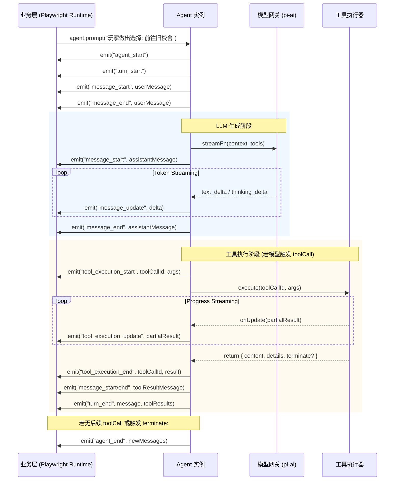

# Pi Agent (pi-mono / earendil-works) 深度调研报告：架构解构、嵌入能力与 Galgame 剧本家运行时可行性分析

> **⚠️ 勘误（260928 crosscheck 实证核查，以 0.87.1 tarball `.d.ts` 为准）**：
> 1. `shouldStopAfterTurn` 配置**不存在**于 0.87.1（§6.3 方案 2 失实）；现等价物为 `finishTurn`/`prepareNextTurn` 钩子。
> 2. 工具 Schema 实际依赖为 `typebox` 1.3.x（rebrand 后包名），**非** `@sinclair/typebox` + ajv。
> 3. 最新版本为 **0.87.1**（本文多处写 0.84.x 系当时快照）。
> 4. `terminate: true` 的批次语义：仅当**同批所有**工具结果都置 true 才生效（§3.3 未提及此陷阱）。
> 5. 利好补充：pi-agent-core 0.87.1 已内置 `harness/session`（JSONL 树 + `branch()` + compaction），§3.5 所述设计如今可直接复用模块。
> 核心结论（高度可行、Mode A 直引核心包）不受影响。


- **目标文件**: `docs/features/260928-stage-ai-mvp/260928-playwriter-runtime.research.md`
- **调研对象**: Mario Zechner / badlogic `pi-mono`（现 `earendil-works/pi`）
- **业务场景**: Stage-AI Galgame 引擎「剧本家（Playwright）」Agent 运行时（长上下文、三层记忆管理、工具调用、暂停等待玩家输入、本机 OpenAI 兼容网关、ARM64 Node.js 宿主环境）
- **调研日期**: 2026-09-28

---

## 1. 执行摘要与核心结论 (Executive Summary)

### 1.1 核心结论

**结论：高度可行（Strongly Recommended），推荐采用「剥离 Coding 外壳，以 `@earendil-works/pi-agent-core` + `@earendil-works/pi-ai` 为底层内核」的集成架构。**

1. **架构契合度极高**：
   - Pi 的核心设计理念是**“反黑盒、极致上下文工程、透明可控”**。其核心包 `@earendil-works/pi-agent-core` 仅约几千行精炼 TypeScript 代码，无庞大的第三方全家桶依赖，运行时内存极小，与 ARM64 移动端设备（8GB RAM）的苛刻资源要求完美契合。
   - Pi 原生提供了细粒度的**生命周期事件系统（`subscribe`）**、**TypeBox 强类型工具调用**、**面向模型与 UI 分离的双重工具返回（Split Tool Results）**、**可控中途干预（`steer` / `followUp`）**，以及通过工具返回 `terminate: true` 或 `shouldStopAfterTurn` 优雅挂起循环的能力，天然契合 Galgame 剧本家“生成一段剧情/对话后停下等待玩家交互输入”的 Turn-based 机制。

2. **多模型网关与本地推理兼容性最佳**：
   - `@earendil-works/pi-ai` 是目前 TypeScript 生态中对各类 OpenAI-compatible 端点、自建网关（如 Ollama、vLLM、LiteLLM、本地 CPA 代理）以及各家推理模型（DeepSeek、Qwen、Claude、Gemma）兼容性打磨最细致的库。其通过详尽的 `compat` 配置项，抹平了 `developer`/`system` 角色冲突、`max_tokens`/`max_completion_tokens` 差异、不同格式的思维链（Reasoning Traces）解析与回放，完全无需担心本地模型网关出现格式拒识。

3. **集成层级建议**：
   - **强烈建议直接基于 `@earendil-works/pi-agent-core` + `@earendil-works/pi-ai` 构建自定义 Runtime**，而不是直接引入全量 CLI 宿主包 `@earendil-works/pi-coding-agent`。
   - `pi-coding-agent` 绑定了大量的代码开发工具（`bash`, `read`, `edit`, `write`）、终端 TUI 以及 CLI 行为。虽然其提供了 `createAgentSession({ noTools: "all" })`，但其内部依然默认关联了 coding 相关的 prompt 重构和扩展链。剧本家是小说/剧本创作 Agent，直接引入 `pi-agent-core` 能彻底甩掉包袱，自主掌控系统的 Prompt、记忆管线和存档系统。
   - 如果需要原生的“分支时间旅行/读盘存档（Save/Load）”，可借鉴或复用 `pi-coding-agent` 内部极其优雅的 **JSONL Tree 存储设计（`id`/`parentId` 树状结构）**。

---

## 2. Pi 仓库结构与生态现状 (Repo & Packages Overview)

### 2.1 仓库迁移与包命名空间演进 (2026 重要事实)

在调研与引入 Pi 时，首先必须明确其包命名空间的历史变更：
- **项目创建者**: Mario Zechner（开源游戏引擎 libGDX 作者、知名极简主义开发者，GitHub: `badlogic`）。
- **重大迁移（2026年5月）**: 官方正式发布公告，仓库从个人主页 `badlogic/pi-mono` 迁移为组织维护 `earendil-works/pi`（官方主页：`pi.dev`）。
- **NPM Scope 变更**:
  - 原 `@mariozechner/*` 系列包已在 `v0.73.1` 冻结并标记 deprecated。
  - 新版本统一在 `@earendil-works/*` scope 下发布，从 `0.74.0` 开始，截至 2026 年秋季最新版本已迭代至 `v0.84.x`。
  - 核心源码完全一致，且向后兼容，但新特性（如最新 Auto-Compaction 优化、`terminate: true` 广播、`retainedTail` 会话快照、RPC 队列管理）仅在 `@earendil-works/*` 中提供。

### 2.2 Monorepo 包组成与分层关系

```
┌─────────────────────────────────────────────────────────────┐
│                    @earendil-works/pi-coding-agent           │  <-- 顶层 CLI & 完整 Harness
│  (SessionManager, TUI / RPC Modes, Extensions, Code Tools)  │
└──────────────┬───────────────────────────────┬──────────────┘
               │                               │
┌──────────────▼──────────────┐ ┌──────────────▼──────────────┐
│  @earendil-works/pi-tui     │ │ @earendil-works/pi-agent-core│  <-- 核心 Agent 状态机
│ (Differential ANSI Terminal)│ │ (Agent, Loop, Tools, Steer) │
└─────────────────────────────┘ └──────────────┬──────────────┘
                                               │
                                ┌──────────────▼──────────────┐
                                │    @earendil-works/pi-ai    │  <-- 统一多 Provider LLM 层
                                │ (OpenAI, Anthropic, Compat) │
                                └─────────────────────────────┘
```

| 包名 | 职责定位 | 对 Playwright 的适用性 |
| :--- | :--- | :--- |
| **`@earendil-works/pi-ai`** | 统一多模型 API 抽象。支持 OpenAI Completions、OpenAI Responses、Anthropic Messages、Google Generative AI 协议。内置 SSE 流式解析、TypeBox 工具协议转换、Reasoning / Thinking 提取、跨模型上下文平滑迁移。 | **必选核心依赖**。提供极其健壮的底层模型网关适配。 |
| **`@earendil-works/pi-agent-core`** | 纯净状态机与 Agent 运行时。提供 `Agent` 类、`agentLoop` / `agentLoopContinue`、生命周期事件流、工具执行与参数校验、`steer` / `followUp` 队列、`transformContext` 上下文拦截钩子。 | **必选核心依赖**。构筑剧本家运行时的基石。 |
| **`@earendil-works/pi-coding-agent`** | 面向代码编写的完整 Harness 与 CLI 工具。包含 JSONL 树状持久化 `SessionManager`、`ResourceLoader`（技能、提示词模板、扩展）、RPC 模式以及默认 Coding 工具（bash/edit/write 等）。 | **参考/可选复用**。无需直接引入整包，但其 `SessionManager` 的树状 JSONL 算法极具复用价值。 |
| **`@earendil-works/pi-tui`** | 基于 ANSI 差异化渲染（Differential Rendering）的极简终端 UI 框架。 | **不使用**。Playwright 是后端服务，通过 Web/WebSocket 驱动游戏前端。 |
| **`@earendil-works/pi-web-ui`** | 前端 Web Components 聊天组件。 | **不使用**。Stage-AI Galgame 具有专有的 Galgame 视听交互界面。 |
| **`@earendil-works/pi-telemetry`** | 供应商中立的 Telemetry 抽象。 | 可选监控。 |

---

## 3. 核心 API 与架构机制深入剖析

### 3.1 Provider 抽象与本地 OpenAI 兼容网关

#### 3.1.1 架构设计
Mario Zechner 在构建 `pi-ai` 时遵循“只需适配 4 类基础 API”的务实原则：
1. `openai-completions`（行业通用度最高）
2. `openai-responses`（OpenAI 新一代结构化 API）
3. `anthropic-messages`（Claude 系列原生协议）
4. `google-generative-ai`（Gemini 原生协议）

几乎所有的本地推断引擎（Ollama、vLLM、SGLang、llama.cpp）以及中转网关（LiteLLM、One-API、CPA 网关）均提供 `openai-completions` 兼容端点。

#### 3.1.2 强大的 `compat` 垫片能力（关键优势）
在许多通用框架（如早期的 Vercel AI SDK）中，调用自建或非标 OpenAI 兼容端点经常会因为服务端对特定字段（如 `developer` 角色、`store` 字段、`stream_options`）报错而崩溃。`pi-ai` 提供了业界最完备的 `compat` 配置字典：

```typescript
import { Model } from "@earendil-works/pi-ai";

const localGalgameModel: Model<"openai-completions"> = {
  id: "qwen-2.5-72b-instruct",
  name: "Qwen 2.5 Local Gateway",
  api: "openai-completions",
  provider: "local-gateway",
  baseUrl: "http://127.0.0.1:8080/v1",
  reasoning: true,
  input: ["text"],
  cost: { input: 0, output: 0, cacheRead: 0, cacheWrite: 0 },
  contextWindow: 128000,
  maxTokens: 16384,
  compat: {
    // 强制使用 system 角色而非 developer（很多本地模型不支持 developer）
    supportsDeveloperRole: false,
    // 参数使用 max_tokens 而非 max_completion_tokens
    maxTokensField: "max_tokens",
    // 允许在流式中接收 usage 统计
    supportsUsageInStreaming: true,
    // 针对 Qwen/DeepSeek 等国产思考模型的思考链格式支持
    thinkingFormat: "qwen", // 或 "deepseek" / "openai"
    // 工具返回结果必须带有 name 字段的端点垫片
    requiresToolResultName: true,
  }
};
```

#### 3.1.3 跨模型无损上下文迁移（Context Handoff）
`pi-ai` 原生支持在同一个会话中无缝切换底层模型。例如前几轮用轻量模型（如 Qwen 7B）快速规划大纲，关键戏剧高潮切换为大型旗舰模型（如 DeepSeek-V3 / Claude 3.5 Sonnet）。`pi-ai` 会自动将前序模型的 thinking 追踪和 provider 特有签名字段转化为规范的 `<thinking>` 文本块或标准 message，保证切换模型时不报错。

---

### 3.2 流式输出与生命周期事件系统

`pi-agent-core` 采用基于异步事件订阅的反应式设计（Reactive Pattern），所有交互均通过 `agent.subscribe()` 派发。

#### 3.2.1 完整事件序列



#### 3.2.2 事件类型列表与业务映射

| 事件名 | 核心载荷 | 在 Galgame 剧本家中的应用 |
| :--- | :--- | :--- |
| `agent_start` | - | 标记剧本家开始思考/推演下一幕剧情，前端显示等待指示器。 |
| `turn_start` | - | 一轮模型推理周期开启。 |
| `message_update` | `assistantMessageEvent.delta`（含 `text_delta`, `thinking_delta`） | **打字机流式推流**。直接通过 WebSocket 将剧情正文实时推送到游戏前端；将 thinking_delta 推送到调试面板。 |
| `tool_execution_start` | `toolName`, `args` | 感知剧本家发起的动作（如 `play_tts`, `change_background`, `query_memory`）。 |
| `tool_execution_update` | `partialResult` | 工具内部进度流（如 TTS 正在合成 30%、生图进度）。 |
| `tool_execution_end` | `result` (`content`, `details`), `isError` | 工具执行完成，拿到结果详情。 |
| `turn_end` | `message`, `toolResults` | 当前轮次结束。可在此检查是否需要持久化本轮状态。 |
| `agent_end` | `messages: AgentMessage[]` | 剧本家当前完整推理链路结算，完全进入待机闲置状态。 |

---

### 3.3 工具调用体系与结构化分离（Split Tool Results）

#### 3.3.1 TypeBox 强类型约束
Pi 采用 `@sinclair/typebox` + `ajv` 作为参数 Schema 定义与校验标准，而非 Zod。
- **优点**：TypeBox 纯 JSON Schema 导向，序列化开销极低，在 ARM64/V8 环境下性能优于较重的 Zod 解析；且原生支持与 OpenAI Function Schema 零转换映射。

#### 3.3.2 面向 LLM 与面向 UI 的内容分离（Split Tool Results）
这是 Pi 的一大架构特色：工具执行返回值可以清晰区分**“给模型看的信息”**与**“给前端/宿主处理的结构化数据”**：

```typescript
import { Type } from "@sinclair/typebox";
import { AgentTool } from "@earendil-works/pi-agent-core";

const PlayGalgameTtsTool: AgentTool = {
  name: "synthesize_speech",
  description: "为指定角色台词生成语音并在前端播放",
  parameters: Type.Object({
    character: Type.String({ description: "角色名称，如 'luna'" }),
    text: Type.String({ description: "需要配音的对白文本" }),
    emotion: Type.String({ description: "情感基调，如 'shy' / 'happy'" })
  }),
  execute: async (toolCallId, args, signal, onUpdate) => {
    onUpdate?.({ content: [{ type: "text", text: "正在调用二次元语音合成引擎..." }] });
    
    // 执行本地 TTS 服务 (例如通过本机 Fish Audio / GPT-SoVITS)
    const audioUrl = await callLocalTtsApi(args.character, args.text, args.emotion, signal);
    
    return {
      // 1. content: 喂回给 LLM 上下文的内容（精简即可）
      content: [{ type: "text", text: `[Voice synthesized successfully for ${args.character}]` }],
      
      // 2. details: 结构化数据，供前端/游戏引擎消费（不会污染 LLM context）
      details: {
        character: args.character,
        audioUrl,
        emotion: args.emotion,
        durationMs: 3450
      },
      
      // 3. terminate: 控制当前轮次是否在此结束
      terminate: false 
    };
  }
};
```

#### 3.3.3 并行/串行执行模式与生命周期拦截
- **并发模式**：支持 `parallel`（默认）与 `sequential`。可在 Tool 上显式声明 `executionMode: "sequential"`。
- **前置拦截（`beforeToolCall`）**：在工具正式执行前拦截。可做权限校验、沙箱检查，或者直接返回 `{ block: true, reason: "...", terminate: true }`。
- **后置拦截（`afterToolCall`）**：对工具执行结果进行审计、补充元数据，或动态覆写 `terminate` 标志。

---

### 3.4 Steering（中途干预）与 Follow-up 消息队列

在交互式叙事与 Galgame 场景中，经常存在玩家在剧情推进过程中按下“快进”、“打断发言”或“紧急选项”的情况。Pi 提供了精细的状态机队列支持。

#### 3.4.1 `steer(message)` vs `followUp(message)`

```
[Agent 正在执行 Turn N]
       │
       ├─► 收到 steer(msg) ────► 等待当前正在执行的工具批次收敛 ────► 立即将 msg 作为下一 Turn 的输入，打断原计划
       │
       └─► 收到 followUp(msg) ─► 等待 Agent 彻底结束所有工作（包括工具调用与自然完结） ────► 仅在 Agent 即将 Idle 时追加执行
```

- **`steer(message)`**：
  - **语义**：中途引导/插话。
  - **重要机制（经社区 Issue #2330 修复后的行为）**：老版本曾试图强行取消未执行的剩余工具，但这会导致 Anthropic 和 OpenAI 等后端抛出 `tool_use without tool_result` 的 400 校验异常。当前版本的标准行为是：**等待当前 Assistant 消息派发的同批工具全部正常返回后，立即打断后续自动 LLM 循环，将 steering message 注入上下文，并触发模型针对该新消息立即产生响应**。
- **`followUp(message)`**：
  - **语义**：后续跟进任务。
  - 只有在模型没有更多工具调用且没有 steering 消息、Agent 准备结算停机时，才从 followUp 队列出队并开启新的处理。
- **分发策略模式**：
  - `agent.steeringMode = "one-at-a-time" | "all"`
  - `agent.followUpMode = "one-at-a-time" | "all"`
  - 支持 `clearSteeringQueue()` / `clearFollowUpQueue()` / `clearAllQueues()` 随时清空积压。

---

### 3.5 会话管理与树状持久化（JSONL Tree Architecture）

在 Galgame 引擎中，“存档（Save）”、“读盘（Load）”、“选项分支（Branching）”与“跳回前置节点重选”是核心系统能力。Pi 在 `pi-coding-agent` 中实现的 `SessionManager` 堪称范本。

#### 3.5.1 JSONL 树状文件结构
Pi 会话采用单文件追加写（Append-only）的 `.jsonl` 格式。每行一个独立的 JSON 对象，核心结构如下：

```typescript
interface SessionEntryBase {
  type: string;
  id: string;              // 8位十六进制或 UUID
  parentId: string | null; // 父节点 ID（根节点为 null）
  timestamp: string;       // ISO 时间戳
}
```

常见 Entry 类型：
- `session`: 会话 Header（含全局 UUID、版本号、创建时间）。
- `message`: 包装标准的 `AgentMessage`（user / assistant / toolResult）。
- `model_change`: 记录中途切换模型的事件。
- `compaction`: 上下文压缩摘要记录（含压缩前 Token 消耗、摘要文本，新版含 `retainedTail` 自包含快照）。
- `branch_summary`: 分支摘要。
- `label`: 节点标记（如书签、存档点标签）。
- `custom`: 扩展自定义非上下文数据。
- `custom_message`: 参与 LLM 上下文的业务自定义消息。

#### 3.5.2 树状跳转与时间旅行（Time Travel）
当玩家在选项处后悔，想要回到 3 轮之前的某个对话节点重新选择时：
- 传统线性上下文必须截断（Truncate）历史，导致原有的探索历史丢失；
- **Pi 的 Tree 机制**：只需通过 `sessionManager.branch(entryId)` 将内部的 `leafId` 指针重新指向历史上的目标节点。接下来的新对话将把 targetId 作为 parentId 写入文件末尾。同一份 `.jsonl` 文件天然保存了完整的故事分支树，不仅完全无损，还能借由 `getTree()` 渲染游戏剧情流程图（Flowchart）！

#### 3.5.3 智能上下文压缩（Compaction）
Pi 的上下文压缩机制避免了滑动窗口导致的记忆丢失：
1. 计算当前分支历史 Token 数；当超过阈值时触发。
2. 自动划分：保留最近的 $N$ 个 Token（`keepRecentTokens`），将更早的历史序列化为结构化文本。
3. 调用辅助模型生成结构化压缩纪要（保留核心事实、人物好感、已发生事件）。
4. 向会话树追加 `compaction` 条目，并挂载 `retainedTail`。在后续 LLM 构建 context 时，直接读取 Compaction 摘要 + retainedTail，上下文占用骤降。

---

### 3.6 子代理（Subagent）机制的实现真相

在探讨 Pi 的子代理支持时，存在一个极其关键的认知点：
- **架构哲学**：Mario Zechner 在其官方博文与 GitHub 讨论（RFC Issue #552）中多次旗帜鲜明地指出：**Pi 的 Core Agent 绝对不内置隐式的“黑盒子代理（Subagent）”抽象**。他认为许多框架中由主 Agent 自动派生子 Agent 并做隐式上下文裁剪的做法极难调试、缺乏确定性，且容易造成上下文污染。
- **官方的实现方式**：
  1. **工具级派生（Tool-based Process / Instance Spawn）**：官方示例 `examples/extensions/subagent/index.ts` 将子代理实现为一个普通的 `AgentTool`。当主 Agent 认为需要委托（如执行代码审计、背景设定检索）时，调用 `subagent` 工具。该工具在后台拉起一个临时的隔离进程（或在内存中直接 `new Agent()`），注入独立的 Context 和专用 System Prompt，执行完毕后将其结构化结果作为普通的 `toolResult` 喂回主 Agent。
  2. **在 TypeScript 中编排**：因为 `Agent` 在 `pi-agent-core` 中只是一个纯粹的 TypeScript 类，宿主程序可以在同一 Node.js 进程中任意创建多个 `Agent` 实例（例如：`ScriptwriterAgent`、`CharacterLunaAgent`、`MemoryIndexerAgent`），通过常规的 Promise、异步队列进行串行、并行或链式调用，实现彻底白盒、可观测的 Multi-Agent 系统。

---

## 4. 作为可嵌入库构建自定义 Agent：方式与成熟度

### 4.1 两种嵌入层级对比

当我们在 TypeScript/Node.js 项目中集成 Pi 时，有两种方式：

```
┌─────────────────────────────────────────────────────────────────────────────┐
│ 模式 A：轻量核心直引（推荐方案）                                            │
│ npm install @earendil-works/pi-agent-core @earendil-works/pi-ai            │
│ 特点：纯净状态机、无 Coding 冗余工具、完全自主掌控上下文与持久化           │
└─────────────────────────────────────────────────────────────────────────────┘
                                      ▲
                                 架构决策点
                                      ▼
┌─────────────────────────────────────────────────────────────────────────────┐
│ 模式 B：全量 SDK Harness（有包袱）                                          │
│ npm install @earendil-works/pi-coding-agent                                 │
│ 特点：自带 SessionManager 与 ResourceLoader，但捆绑 Coding Tools & Prompt   │
└─────────────────────────────────────────────────────────────────────────────┘
```

#### 模式 A：纯核心层集成（最佳实践）

```typescript
import { Agent, AgentTool } from "@earendil-works/pi-agent-core";
import { Model, createModels } from "@earendil-works/pi-ai";
import { openAICompletionsProvider } from "@earendil-works/pi-ai/providers/openai-completions";

// 1. 注册本地网关模型
const models = createModels();
models.setProvider(openAICompletionsProvider());

const playwriterModel: Model<"openai-completions"> = {
  id: "deepseek-v3",
  name: "Local CPA DeepSeek-V3",
  api: "openai-completions",
  provider: "openai-completions",
  baseUrl: "http://127.0.0.1:8080/v1",
  reasoning: false,
  input: ["text"],
  cost: { input: 0, output: 0, cacheRead: 0, cacheWrite: 0 },
  contextWindow: 128000,
  maxTokens: 8192,
  compat: {
    supportsDeveloperRole: false,
    maxTokensField: "max_tokens",
    supportsUsageInStreaming: true,
  }
};

// 2. 初始化剧本家 Agent
export class PlaywrightRuntime {
  private agent: Agent;

  constructor(tools: AgentTool<any>[]) {
    this.agent = new Agent({
      initialState: {
        systemPrompt: "你是 Stage-AI Galgame 核心剧本家...",
        model: playwriterModel,
        thinkingLevel: "off",
        tools,
        messages: [],
      },
      // 核心：上下文转换与三层记忆注入管道
      transformContext: async (messages, signal) => {
        return this.injectGalgameMemoryContext(messages);
      },
      // 核心：在模型生成完剧情且无后续工具时，通知停机等待玩家输入
      shouldStopAfterTurn: async ({ message, toolResults }) => {
        // 如果当前助理回复已生成剧情，并且工具调用已收敛，停下等待玩家交互
        return true;
      },
      toolExecution: "parallel",
      streamFn: models.streamSimple.bind(models),
    });
  }

  private async injectGalgameMemoryContext(messages: any[]) {
    // 注入当前活跃世界状态、三层记忆索引等（见下文方案）
    return messages;
  }

  public subscribe(callback: (event: any) => void) {
    return this.agent.subscribe(callback);
  }

  public async pushPlayerAction(actionText: string) {
    await this.agent.prompt(actionText);
  }
}
```

#### 模式 B：全量 Harness 集成
如果必须使用 `createAgentSession`，必须显式压制所有默认代码编写工具并覆写 Prompt：
```typescript
const { session } = await createAgentSession({
  noTools: "all", // 彻底禁用 read, bash, edit, write 等
  customTools: myGalgameTools,
  resourceLoader: new DefaultResourceLoader({
    systemPromptOverride: () => "你是 Galgame 剧本家...",
  }),
  sessionManager: SessionManager.create(gameSaveDir),
});
```
**评价**：模式 B 容易受到 coding-agent 内部关于 git、cwd 以及特定代码文件感知逻辑的干扰，因此**强烈推荐模式 A**。

---

### 4.2 成熟度、社区现状与已知局限

#### 4.2.1 成熟度与稳定性
- **架构成熟度**：核心 API（`Agent`、`streamSimple`、`EventStream`）非常稳固，经过了多个生产级项目（如 Mario 本人的 Sitegeist 浏览器智能体、HuggingFace 工作流、开源社区各种 RPC 客户端）的考验。
- **TypeScript 体验**：全链路类型安全，事件定义清晰，类型推导优秀。
- **ARM64 / Node.js 兼容性**：
  - 代码全部使用纯 TypeScript/JavaScript 实现，核心包**没有任何原生 C++ Addon 依赖**（SQLite 被专门解耦至可选包 `@earendil-works/pi-session-backend-sqlite-node`）。
  - 在 Linux ARM64（包括 Android 移动端 Linux 容器）上可开箱即用，依赖安装（pnpm/npm）极快，内存驻留（RSS）仅几十 MB，非常适合 8GB 手机常驻。

#### 4.2.2 社区与开源治理风格
- **治理模型**：Mario Zechner 属于典型的“独断型实用主义维护者（Benevolent Dictator）”。
- **优势**：没有大厂复杂的委员会和包袱，代码极其精炼、易读，几乎没有“抽象过度”的代码坏味道；
- **劣势**：不追求通用的企业级“大而全”，对不符合他个人哲学的 PR（例如在 core 中加入复杂 subagent、内置 MCP 协议、过度包装的规划模式）会直接关闭并建议用户在应用层自行封装。

#### 4.2.3 已知局限与排坑指南
1. **历史上的 Error Weakening 缺陷（Issue #2226）**：
   - 在早期版本（0.58.x 时代），运行循环中的普通网络/服务端异常有时会被捕获并降级为一个内容为空的合成 `assistant` 错误消息，导致下游调用方无法及时抛出重试。
   - **排坑**：确保安装版本为 `v0.80.0+`（属于 `@earendil-works` 命名空间），该问题已在上游被彻底修复。
2. **Steering 延迟生效原则**：
   - 切记：调用 `agent.steer()` 不会粗暴地中途 abort 掉正在网络请求的模型流或正在执行的工具，而是在当前轮次的这一批工具全部结算完毕后，立刻拦截下一轮 LLM 调用并优先喂入 steering 消息。这保证了底层模型消息树（ToolCall/ToolResult 对应关系）的完整性。
3. **缺少开箱即用的向量检索与长文本检索机制**：
   - Pi 不包含 LangChain 式的 VectorStore / RAG 内置抽象。三层记忆系统必须由业务侧自行在工具或 `transformContext` 中接入。

---

## 5. 同定位 TypeScript Agent 运行时横向对比

为了评估以 Pi 作为剧本家运行时的决策合理性，我们选取了当前 TypeScript 生态中关注度最高的三种替代方案进行全方位对比：

1. **Vercel AI SDK Core (`ai`)**（现代 Web 领域的事实标准）
2. **Mastra (`@mastra/core`)**（Gatsby 团队打造的全栈 TypeScript Agent 框架，获 YC 投资）
3. **LangGraph.js (`@langchain/langgraph`)**（基于图的复杂多智能体与工作流引擎）
4. **自研极简 Loop（In-house Mini Agent）**

### 5.1 多维度对比矩阵

| 评估维度 | Pi (`@earendil-works/pi-agent-core`) | Vercel AI SDK Core (`ai`) | Mastra (`@mastra/core`) | LangGraph.js | 自研极简 Loop |
| :--- | :--- | :--- | :--- | :--- | :--- |
| **设计定位** | 极致可控、极简透明的 Agent 状态机 | 面向 Web/Next.js 的全功能模型与交互层 | 全功能、开箱即用的 Agent 应用平台 | 显式状态图、复杂工作流与时间旅行引擎 | 针对剧本家定制的最小几百行状态机 |
| **包大小与依赖** | **极轻**（核心几乎零外部重依赖，无 C++ addon） | **轻**（依赖较少，现代化模块设计） | **较重**（自带 Studio、工作流、丰富插件生态） | **重**（继承 LangChain 体系，模块繁多） | **零依赖**（仅需 OpenAI SDK） |
| **ARM64 移动端友好度** | **★★★★★**（低内存开销，冷启极快） | **★★★★☆**（表现良好） | **★★☆☆☆**（在手机 移动端 Linux 容器 下开销过大） | **★★☆☆☆**（依赖多，内存占用偏大） | **★★★★★**（极其轻量） |
| **OpenAI 兼容网关兼容性** | **★★★★★**（拥有最全面的 `compat` 垫片和思维链兼容） | **★★★★☆**（通用性好，但对某些非标国产端点需自行写 fetch 中间件） | **★★★☆☆**（自带模型路由，定制非标端点门槛稍高） | **★★★☆☆**（通过 ChatOpenAI 适配，定制较重） | **★★★★☆**（完全手写，想怎么调就怎么调） |
| **流式事件粒度** | **细粒度**（`message_update`, `tool_execution_*`, `turn_*`） | **细粒度**（`streamText`, `onStepFinish`, UI parts） | **中等**（围绕 Workflow / Agent 事件） | **粗/基于图流**（以 Node 状态流转和 checkpoint 为主） | **需手写**（需自行实现 SSE 解析和事件分发） |
| **工具返回分离 (LLM/UI)**| **原生原生原生**（Split Tool Result: content + details） | 需借助 `experimental_output` 或自定义消息 | 需通过 ClientJS 或状态管理器桥接 | 需自行维护 State 中的 UI 字段 | 需自行手写协议 |
| **暂停/等待输入控制** | **极简优雅**（Tool 返回 `terminate: true` 或 `shouldStopAfterTurn`） | 依赖 `stopWhen: [hasToolCall(...)]` 或手写 loop | 依赖 Workflow `suspend()` / `resume()` | 依赖图中断 `interrupt()` | 状态机自然中断 |
| **中途干预 (Steering)** | **原生支持**（`steer` 队列，边界明确） | 需手动结合 AbortController 与重新 prompt | 需通过工作流信号或外部触发 | 需通过更新 Checkpoint State 实现 | 需手写竞态和队列控制 |
| **分支与会话树存档** | **范本级**（JSONL Tree `id`/`parentId` 算法极度适合 Galgame） | 无内置树状持久化（仅平面 messages） | 自带 Postgres / LibSQL / 内存存储，非自然树 | **优秀**（Checkpointer 天然支持时间旅行分支） | 需从头手写树状结构与持久化 |
| **生态成熟度与维护风险**| 个人驱动（转向 Earendil Works），但内核极小易维护 | 大厂背书（Vercel），迭代极快，但偶有 breaking change | 商业化团队维护，商业许可（ee/ 目录有限制） | 企业级标准（LangChain），但抽象层过厚 | 无外部维护风险，但需自行承担测试与 bug 修复成本 |

### 5.2 对比结论细析

1. **对比 Mastra & LangGraph.js**：
   - 剧本家运行在**ARM64 移动端设备（ARM64 SoC，8GB 内存）**。Mastra 与 LangGraph.js 属于重型企业级框架，不仅安装包庞大、依赖繁杂，而且内存驻留与 CPU 开销显著过高。Mastra 自带的 Studio、RAG 向量库在移动端服务器上属于无谓浪费；LangGraph.js 复杂的图节点抽象大大增加了调试认知负荷，杀鸡用牛刀。
2. **对比 Vercel AI SDK Core (`ai`)**：
   - AI SDK 的 `streamText` 和 `ToolLoopAgent` 同样非常优秀，但它本质上是**请求驱动（Request-Response/Pipeline）**的无状态模型，缺乏面向持久长会话的 Agent 状态机实体；
   - 其对自建本地网关的异构响应（特别是 Reasoning/Thinking 的跨模型回放、不规则的 `developer` role 拒绝）不如 `pi-ai` 适配得深；
   - Pi 的 Split Tool Result（LLM 读纯文本，前端读 details 对象）比 AI SDK 处理视觉/音频工具更加顺手。
3. **对比从零纯手写**：
   - 手写虽然无依赖，但处理 SSE 流断线重连、Partial JSON ToolCall 流式解析、思考链标记剥离、并发工具安全执行、Steering 消息时序控制等细节极为繁琐，极易引入隐蔽 Bug。**Pi 恰好处于“避免手写底层搬砖，同时杜绝过度设计”的最佳平衡点。**

---

## 6. 剧本家（Playwright）场景落地可行性与集成方案设计

### 6.1 场景核心诉求与 Pi 能力映射

| Galgame 剧本家核心诉求 | Pi Agent 对应能力与机制 | 具体实现路径 |
| :--- | :--- | :--- |
| **1. 实时增量剧本创作与流式输出** | `agent.subscribe()` + `message_update` | 模型输出台词、旁白、心理活动时，实时向游戏前端推送打字机流。 |
| **2. 暂停机制（指定位置停下等待玩家输入）** | Tool 返回 `terminate: true` 或配置 `shouldStopAfterTurn` | 当剧本家创作至“剧情分支选项”或“轮到玩家发言”时，调用 `wait_for_player_input` 工具返回 `terminate: true`，循环优雅挂起，等待玩家。 |
| **3. 视听多媒体联动（TTS、生图、立绘表情）** | Split Tool Results (`content` + `details`) | 工具如 `show_character_expression`、`play_tts` 返回给 LLM 简洁确认信息，将立绘资源 ID、音频 URL 封装在 `details` 中直达前端渲染层。 |
| **4. 长上下文与三层记忆目录管理** | `transformContext` 钩子 + 专用记忆工具 | 见 6.2 节架构图：动态装配活跃状态层与索引层，提供归档检索工具。 |
| **5. 玩家中途打断/跳过/插话（Steering）** | `agent.steer(msg)` | 玩家跳过剧情或紧急操作时，在当前轮次收敛后立即注入转向。 |
| **6. Galgame 存档/读盘/多周目分支** | 复用 Pi 的 JSONL Tree（`id`/`parentId`）设计 | 天然支持游戏分支树、存读盘与时光倒流。 |
| **7. ARM64 手机服务器极低开销** | 纯 TypeScript，零原生编译扩展 | 内存占用低，CPU 负载极小，守护进程永不崩溃。 |

---

### 6.2 三层记忆目录在 Pi 架构中的落地设计

Playwright 剧本家需要处理长达几十万字的长篇故事，必须实施严格的分层记忆。在 Pi 架构下，依托 `transformContext` 与专用 Tool 组合，能实现清晰的无损管理：

```
                    ┌────────────────────────────────────────────────────────┐
                    │                   三层记忆管理系统                     │
                    └────────────────────────────────────────────────────────┘
                                                 │
          ┌──────────────────────────────────────┼──────────────────────────────────────┐
          ▼                                      ▼                                      ▼
┌───────────────────┐                  ┌───────────────────┐                  ┌───────────────────┐
│ 第一层：活跃状态层 │                  │ 第二层：索引摘要层 │                  │ 第三层：冷归档层   │
│  (Active State)   │                  │  (Index Catalog)  │                  │  (Archive Store)  │
├───────────────────┤                  ├───────────────────┤                  ├───────────────────┤
│ • 当前场景/地点    │                  │ • 过去章节事件目录│                  │ • 详细历史对话全文│
│ • 在场人物好感/心境│                  │ • 核心伏笔标题列表│                  │ • 完整世界观设定集│
│ • 近 3~5 轮即时对话│                  │ • 角色秘密索引清单│                  │ • 历史道具演变明细│
├───────────────────┤                  ├───────────────────┤                  ├───────────────────┤
│ 注入方式：        │                  │ 注入方式：        │                  │ 注入方式：        │
│ 始终强注入上下文  │                  │ 自动注入“标题列表”│                  │ 不主动注入，      │
│ (System/Active Msg│                  │ 剧本家按需调用工具│                  │ 剧本家通过工具    │
│  via transform)   │                  │ read_memory_detail│                  │ search_archive 搜 │
└───────────────────┘                  └───────────────────┘                  └───────────────────┘
```

#### 具体实现代码示范

```typescript
// 1. 在 transformContext 中构建前两层记忆
const agent = new Agent({
  // ...
  transformContext: async (messages: AgentMessage[]) => {
    // A. 从本地状态库读取第一层：当前活跃状态
    const activeState = await gameStateManager.getActiveState();
    
    // B. 从本地索引库读取第二层：所有记忆条目的索引标题与摘要
    const memoryHeaders = await memoryIndexManager.getHeadersCatalog();

    const memorySystemMessage: AgentMessage = {
      role: "user",
      content: [
        {
          type: "text",
          text: `[CURRENT GAME STATE]\n${JSON.stringify(activeState, null, 2)}\n\n` +
                `[MEMORY INDEX CATALOG (调用 read_memory_detail 查看详情)]\n${memoryHeaders.join("\n")}`
        }
      ],
      timestamp: Date.now()
    };

    // 动态将状态切片组合到 Prompt 管道最前部，后接近期对话历史
    return [memorySystemMessage, ...pruneRecentMessages(messages, 10)];
  }
});

// 2. 赋予剧本家按需查看第二层详情与检索第三层的工具
const ReadMemoryDetailTool: AgentTool = {
  name: "read_memory_detail",
  description: "根据记忆索引标题，读取该历史事件或设定的详细内容",
  parameters: Type.Object({
    memoryId: Type.String({ description: "记忆条目 ID，来自目录列表" })
  }),
  execute: async (_id, { memoryId }) => {
    const detail = await memoryStore.getDetail(memoryId);
    return {
      content: [{ type: "text", text: `[Detail of ${memoryId}]:\n${detail}` }]
    };
  }
};

const SearchArchiveTool: AgentTool = {
  name: "search_archive_memory",
  description: "在冷归档知识库与深层历史记录中进行关键词语义搜索",
  parameters: Type.Object({
    query: Type.String({ description: "搜索关键词或语义提问" }),
    limit: Type.Optional(Type.Number({ default: 3 }))
  }),
  execute: async (_id, { query, limit }) => {
    const matches = await memoryStore.searchArchive(query, limit);
    return {
      content: [{ type: "text", text: `[Search Results for "${query}"]:\n${JSON.stringify(matches)}` }]
    };
  }
};
```

---

### 6.3 交互等待机制：如何让剧本家在指定位置停下等待玩家输入

在很多初级 Agent 框架中，一旦调用 prompt，Agent 就会死循环直到模型不再输出工具；而在 Galgame 中，剧本家生成了分支选项后，**必须停下**交由玩家选择。

在 `pi-agent-core` 中，有两种优雅的停机控制机制：

#### 方案 1：专用 `wait_for_player_input` 工具 + `terminate: true`（推荐）
```typescript
const WaitForPlayerInputTool: AgentTool = {
  name: "wait_for_player_input",
  description: "当前剧情段落创作完毕，展示选项或停下等待玩家交互输入",
  parameters: Type.Object({
    promptToPlayer: Type.String({ description: "提示语或旁白提示" }),
    options: Type.Optional(Type.Array(Type.String(), { description: "给玩家的可选分支列表" }))
  }),
  execute: async (toolCallId, args) => {
    return {
      content: [{ type: "text", text: `[Waiting for player input on options: ${args.options?.join(" | ")}]` }],
      details: {
        type: "WAIT_INPUT",
        prompt: args.promptToPlayer,
        options: args.options
      },
      // 核心特性：告诉 Agent 循环在此彻底结束，跳过后续自动 LLM turn！
      terminate: true 
    };
  }
};
```
当剧本家调用此工具后，`pi-agent-core` 检测到 `terminate: true`，会立即触发 `agent_end` 并将控制权返回给宿主程序。游戏前端展示选项。当玩家点击选项后，宿主只需执行 `agent.prompt("玩家选择了: 选项A")`，下一轮剧情自然无缝衔接。

#### 方案 2：基于 `shouldStopAfterTurn` 判定
如果剧本家使用纯文本协议（未调用工具，直接输出了剧情段落），可以在 Agent 配置中利用 `shouldStopAfterTurn`：
```typescript
shouldStopAfterTurn: async ({ message, toolResults }) => {
  // 如果当前轮次的助手消息输出了合法的剧本结束标识符（例如包含了 [WAIT_PLAYER]）
  if (message.content.some(c => c.type === "text" && c.text.includes("[WAIT_PLAYER]"))) {
    return true; // 优雅退出循环，触发 agent_end
  }
  return false;
}
```

---

### 6.4 部署在 ARM64 本机环境（ARM64 移动端设备）的优化实践

在ARM64 SoC（8GB RAM）的 移动端 Linux 容器环境中部署该运行时，建议落实以下工程实践：

1. **依赖精简与摇树（Tree Shaking）**：
   - 严禁引入 `@earendil-works/pi-coding-agent` 全家桶及其 TUI 组件（`pi-tui`）；
   - 仅依赖 `@earendil-works/pi-agent-core` 与 `@earendil-works/pi-ai`，通过 `pnpm add` 安装，打包后 node_modules 仅十数兆，零 C++ Addon 编译负担。
2. **内存守护与 GC 保障**：
   - Node.js 启动参数配置 `--max-old-space-size=1024`（给宿主系统和其他服务留足内存）；
   - 在每幕故事结束后，调用 `agent.reset()` 清空易失内存，或持久化为 JSONL 后重新装载，防止长时间 RPG 导致 V8 堆内存碎片累积。
3. **本地网络通信优化**：
   - LLM 网关位于本机（如 `http://127.0.0.1:8080/v1`），确保 HTTP 请求走 `127.0.0.1` 直连，不经代理网卡（本机代理的 7890 端口需避开 localhost），以最大化 SSE 流式吞吐速度并消除延迟。

---

## 7. 最终建议与后续实施计划 (Next Steps)

1. **库选型确认**：
   - 确认采用 `@earendil-works/pi-agent-core`（当前稳定版 `^0.84.x`）作为 Playwright 剧本家的底层运行时引擎。
2. **第一阶段：剧本家运行时骨架搭建**：
   - 创建 `packages/playwright-runtime`（或对应工程目录）；
   - 封装基于 `pi-ai` 的 `OpenAICompletions` 模型定义，对接本机本地模型网关；
   - 实例化 `pi-agent-core` 的 `Agent` 类，绑定核心基础工具（`wait_for_player_input`, `synthesize_speech`, `update_character_state`）。
3. **第二阶段：三层记忆拦截器实施**：
   - 编写 `transformContext` 逻辑，对接项目已有的三层记忆存储；
   - 验证滑动窗口、主动记忆摘要提取与按需查阅功能。
4. **第三阶段：会话持久化与分支系统对接**：
   - 借鉴 Pi 的 JSONL Tree 格式，实现 Galgame 的剧情树存档与读盘（Save / Load / Branching）API。

---

## 8. 参考与来源索引 (References)

- **官方代码仓库**: [earendil-works/pi (GitHub)](https://github.com/earendil-works/pi) *(原 badlogic/pi-mono)*
- **官方主页与发布日志**: [pi.dev](https://pi.dev/) | [Pi Has a New Home at Earendil](https://pi.dev/changelog/2026/5/7/pi-has-a-new-home)
- **作者哲学深度博文**: [Mario Zechner: What I learned building an opinionated and minimal coding agent](https://mariozechner.at/posts/2025-11-30-pi-coding-agent/)
- **SDK 文档**: `packages/coding-agent/docs/sdk.md` (earendil-works/pi)
- **Agent Core 文档**: `packages/agent/README.md` (earendil-works/pi)
- **会话持久化规范**: `packages/coding-agent/docs/session-format.md` (earendil-works/pi)
- **多模型配置与兼容性规范**: `packages/coding-agent/docs/models.md` (earendil-works/pi)
- **中途干预行为修复与讨论**: [Issue #2330: docs: update steering message docs to match deferred execution behavior](https://github.com/badlogic/pi-mono/issues/2330)
- **错误捕获边界与排障记录**: [Issue #2226: pi-agent-core error propagation](https://github.com/badlogic/pi-mono/issues/2226)
- **子代理架构讨论**: [RFC Issue #552: extract subagent execution into library](https://github.com/badlogic/pi-mono/issues/552)
