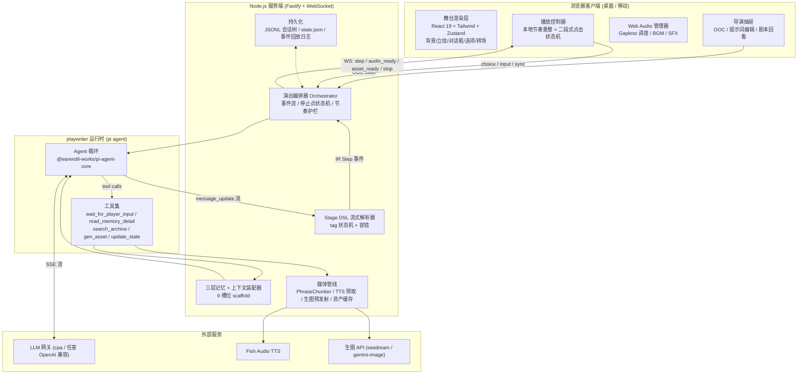
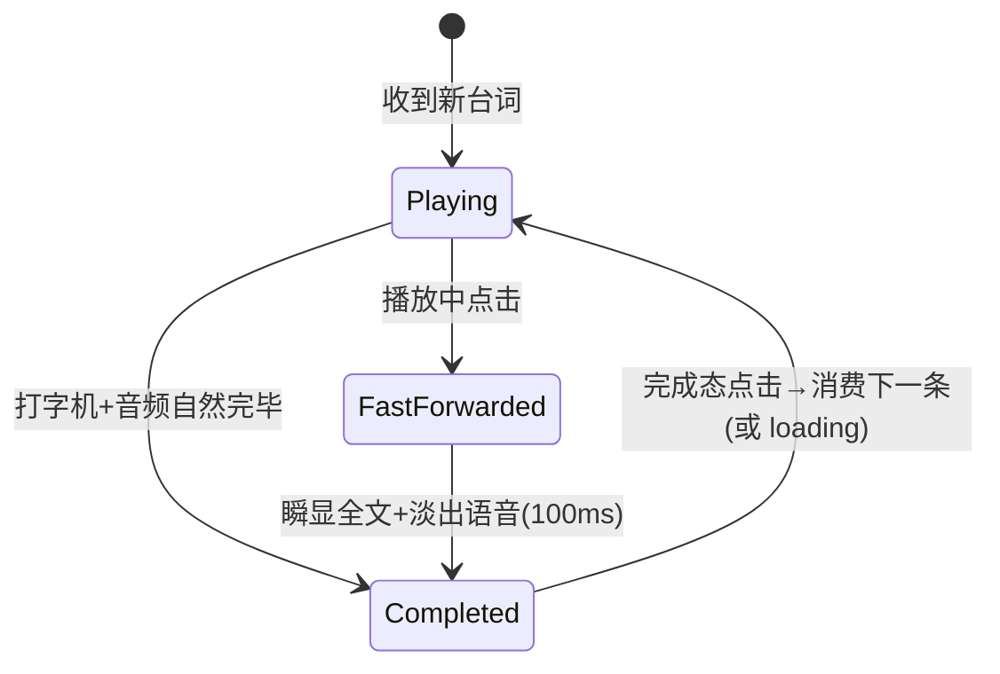

# Stage-AI MVP 计划：AI Galgame 流式演出引擎

> **状态**：待评审
> **日期**：2026-09-28
> **关联调研**：
> - [260928-gal-engine.research.md](./260928-gal-engine.research.md)（渲染层选型）
> - [260928-playwriter-runtime.research.md](./260928-playwriter-runtime.research.md)（pi agent 运行时）
> - [260928-llm-vn-prior-art.research.md](./260928-llm-vn-prior-art.research.md)（LLM 互动叙事先例与管线设计）

---

## 1. 愿景与定位

**一句话**：让玩家"亲自进入 galgame 参与表演"的 AI 引擎——LLM 剧作家（playwriter）流式创作增量剧本，前端像流式视频一样边生成边演出；玩家兼具**演员**（入戏说话/选择）与**导演**（场外指导创作、修改提示词）双重身份。

**产品定位**（已与用户对齐）：

| 决策点 | 结论 |
|---|---|
| 目标用户 | 自用为主 + 可分发（含 Windows exe release） |
| 美术资产 | 导入现成素材包（立绘差分/背景/BGM）为主，AI 生成为补充 |
| 交互形态 | 主舞台全屏沉浸 + 可唤出导演抽屉面板 |
| 剧本语言 | 提示词层配置项，不做架构约束 |

**MVP 核心命题**（本计划的一切设计服务于它）：

1. **流式演出是产品本体**：剧本不能"生成完再显示"，必须 token 级边生成边演出；用户读得快就出现 loading，读得慢自然衔接——像流式视频。
2. **停止点即交互点**：playwriter 输出到"该玩家表态的位置"即停，停止位置就是选择/自由输入的位置。停止点由 playwriter 的戏剧判断决定（节奏权在剧作家）。
3. **长会话胜任**：数十小时量级连续剧情不崩坏、不失忆、不剧透。

---

## 2. 核心概念与命名

| 术语 | 含义 |
|---|---|
| **playwriter** | LLM 剧作家 agent（用户命名，沿用此拼写）。输出 Stage DSL 增量剧本，管理三层记忆，调用工具 |
| **Stage DSL** | playwriter 的输出语言：轻量 XML 标签式剧本标记（`<say>`、`<scene>`…），流式友好 |
| **Stage Step (IR)** | 引擎内部规范化演出事件（typed），前端唯一消费物。DSL 与渲染完全解耦的中间表示 |
| **节拍 (beat)** | 两次停止点之间的一段完整演出（可能跨多条 assistant 消息与工具调用轮） |
| **三层记忆** | `always/`（每轮注入，playwriter 维护活跃状态）、`index/`（自动注入标题列表，按需读详情）、`archive/`（只能被搜索命中） |
| **剧目 (play)** | 一个可开演的完整配置包：世界观 + 角色卡 + 素材 + 记忆库 + 会话 |

---

## 3. 用户路径

### 3.1 首次配置（一次）
1. 启动服务（自用：进程托管常驻 + 局域网/隧道访问；分发：exe 双击启动）。
2. 设置页：填 LLM 网关（默认本机 cpa `127.0.0.1:9999`，OpenAI 兼容 + Bearer key；exe 用户填任意兼容端点）。
3. 可选开关：语音（fish-audio，多 Key 轮询）、生图（seedream / gemini-image，经 cpa）。

### 3.2 创建剧目（每个故事一次）
1. 新建剧目向导：标题 + 世界观前提（premise.md）。
2. 建角色卡：名字、人设、立绘素材映射（角色→素材目录）、音色（fish-audio voiceId，预置库可试听）。
3. 导入素材包：往约定目录放立绘/表情差分/背景/BGM，管理页自动扫描生成 manifest；缺失资产可一键 AI 生成补充。
4. 引擎参数：打字速度、自动模式间隔、语音默认开关、模型选择。

### 3.3 开演与演出循环（核心体验）
1. 选剧目 → "点击开始"遮罩（移动端 AudioContext 手势解锁）→ playwriter 生成开场。
2. 演出：场景/立绘就位 → 台词逐字打出（本地节奏重整）→ 语音句级预取跟进 → 点击推进。
3. **快进**：播放中点击 → 瞬显全文、淡出语音；再点击 → 消费下一条；下一条未生成 → loading 呼吸点。
4. **停止点**：选项面板（2–4 支）或自由输入框（"说点什么 / 做点什么"）。玩家表态 → 下一节拍无缝续演。
5. 随时唤出**导演抽屉**（见 3.4）。

### 3.4 导演身份（与演出并行）
1. **OOC 指令**：抽屉内输入"下一幕惊悚一点 / 让她傲娇吃醋"→ 作为 steer 消息注入 playwriter，不进入戏内对白。
2. **提示词与记忆编辑**：编辑 always 层文件（剧艺风格、活跃状态）、角色卡（index 层）；修改在下一节拍生效。
3. **剧本回看**：查看 playwriter 原始 DSL 流 + 事件日志（调试与欣赏双用途）。
4. 演出参数就地调整（打字速度/语音/自动模式）。

### 3.5 存档 / 读档 / 分支
1. 任意停止点存档（命名存档位）。
2. 读档回到该停止点重选——同一剧目文件内天然保留完整分支树。
3. 分支树可视化回看（剧情流程图，基于会话树渲染）。

### 3.6 续演
关闭后重开：会话树 + 引擎状态持久化在剧目目录内，选中存档（或最新叶子）继续。

---

## 4. 架构总览



**职责边界**：

- **playwriter**：只管"写"。产出 DSL 剧本 + 维护 always 层 + 调用工具。不知道渲染的存在。
- **解析器/编排器**：把 DSL 翻译成 IR 事件、守停止点、管节奏护栏、防抢戏软标记、持久化。**引擎拥有状态**（好感度、旗标由引擎校验落库，LLM 只能提议增量）。
- **客户端**：只消费 IR 事件。本地节奏重整（网络抖动被吸收，播放时钟在本地）；重连凭 seq 重放。
- **媒体管线**：纯后台工人，时延掩蔽（预取/预发射），绝不阻塞文本流。

**Monorepo 布局**（pnpm，TS strict）：

```
stage-ai/
├── apps/
│   ├── server/        # Fastify + WS 网关、编排器、媒体管线、持久化
│   └── web/           # 舞台客户端（React 19 + Vite）
├── packages/
│   ├── core/          # Stage DSL 文法 + 流式解析器 + IR 类型 + WS 协议（同构）
│   ├── playwriter/    # pi agent 运行时、系统提示词、三层记忆、工具集
│   └── media/         # fish-tts / 生图客户端、PhraseChunker、资产缓存
├── docs/
└── plays/             # 运行时剧目数据（见 §8.1）
```

---

## 5. 关键设计决策与论证

### D1 渲染层：自研轻量 Web 渲染层（弃用 Ren'Py）

**结论**：自研 React Web 渲染内核，**不基于任何现有 gal 引擎**。

| 候选 | 判决 | 依据（详见调研报告） |
|---|---|---|
| Ren'Py / RenpyWeb | ❌ 坚决弃用 | 启动期全量扫描生成静态 AST、运行时单线程步进的封闭架构（作者原话"meant to be a complete system, not a library"）；RenpyWeb WASM 包体 30–50MB+、移动端冷启动 15s+、Emscripten 虚拟 FS 无法高频 Blob 热加载；无头服务端需 Xvfb，8GB 容器不可承受 |
| TyranoScript | ❌ 弃用 | jQuery/ES5 历史债务；存读档强绑定 `.ks` 物理文件行号，与流式无文件剧本根本冲突 |
| Monogatari | ❌ 弃用 | 假定静态全量剧本固化于内存数组；Web Components 模版对导演抽屉等定制 UI 有封装壁垒 |
| WebGAL 改造 | 🟡 备选路径保留 | 视效顶级（Pixi 粒子/着色器/Live2D），但原生流程以场景文件全量预载为中心，需写 `StreamSceneAdapter` 绕过文件加载器直喂 `scriptExecutor`。**若后期要高级视效可回头走这条路，或只挂载透明 Pixi 层** |
| **自研 Web 渲染层** | ✅ **首选** | VN 核心 UI（背景层/立绘层/对话框/选项/Backlog）手写约 800–1500 行；100% 掌控流式消费、自由输入、导演面板零阻抗；首屏 < 300KB 秒开；与全栈 TS 同构 |

**自研层技术要点**：
- React 19 + TailwindCSS + Zustand(+Immer)。Step 历史即状态数组 → Backlog/存档/回退天然免费。
- 常规演出用 CSS3 硬件加速（transform/opacity）；后期需要粒子/着色器时挂载透明 Pixi.js 层（borrow WebGAL 理念：**权威状态与瞬态演出分离**，点击即卸载演出落定终态）。
- 吸收 WebGAL `-next`/`-concat` 语义的等价物进 IR（台词中途差分切换，见 §6.2 `say` 的 `mid` 能力）。

### D2 数据契约双层：DSL（LLM 端）→ IR（渲染端）

**LLM 输出用 XML 标签式 Stage DSL，不用 streaming JSON**：

- 台词正文是原生纯文本，零转义、token 膨胀率最低（JSON 转义膨胀 15–25%）；
- 标签闭合即触发事件，天然增量；结构符合 LLM 剧本预训练先验；
- 流式 JSON 有 $O(N^2)$ re-parse 与结构断裂问题（调研结论一致否定）。

**服务端解析成 typed IR Step 再下发**（WS），DSL 不出服务端（剧本回看视图除外）：

- 校验/规范化/防抢戏集中在服务端；
- TTS 分句、生图预发射必须在服务端发生；
- 前端消费物与 LLM 彻底解耦，换模型、换 DSL 方言都不动渲染层。

### D3 playwriter 运行时：pi agent（@earendil-works/pi-agent-core + pi-ai）

**结论**：采用 **Mode A——直接引核心包**（`@earendil-works/pi-agent-core` + `@earendil-works/pi-ai`，npm 已核实最新 0.87.x），不引入 `pi-coding-agent` 全家桶（捆绑 coding 工具与 TUI 包袱）。

选型理由（对比 Vercel AI SDK / Mastra / LangGraph.js / 纯手写，详见调研报告 §5）：极轻（零原生依赖、内存几十 MB，适配 8GB ARM64 容器）；OpenAI 兼容网关 `compat` 垫片最完善（cpa 直连）；事件粒度细；**Split Tool Results**（content 喂模型 / details 喂引擎）；steer 中途干预语义明确。

**机制映射表**（galgame 需求 → pi 能力）：

| 需求 | pi 机制 |
|---|---|
| 剧本流式输出 | `subscribe()` 的 `message_update`（text_delta）→ 喂 DSL 解析器 |
| 停止点停机 | `wait_for_player_input` 工具返回 `terminate: true`，循环优雅挂起 |
| 玩家续演 | 停止点表态后 `agent.prompt("玩家选择了…")` |
| 导演 OOC | `agent.steer(msg)`（当前工具批次收敛后注入，下一轮生效） |
| 三层记忆注入 | `transformContext` 钩子动态装配 9 槽位上下文 |
| 媒体工具不污染上下文 | Split Tool Results：`content` 简短确认，`details` 走引擎事件 |
| 存档/分支 | 复用 pi 的 JSONL Tree（`id`/`parentId`）设计，`branch(entryId)` 即读档 |
| 长会话压缩 | 借鉴 pi compaction 思路 + 自研滚动摘要（D7） |

**护栏规则**（鲁棒性，全部必做）：
1. playwriter 结束回合但**没有合法 stop 标签** → 编排器合成一个默认 `<stop type="free">`，绝不死锁玩家。
2. 单节拍步数软上限（默认 ~40 step）→ 引擎注入节奏提示，仍不停则强制 stop（防止剧作家刹不住车）。
3. DSL 语法错误 → 容错解析（丢弃残缺尾），错误摘要作为 tool result 回喂 playwriter 自我修正；连续失败 N 次降级为纯文本模式（无演出指令，只有台词）并提示导演。

### D4 流式播放与缓冲（"像流式视频"的实现）

**本地节奏重整（Playout Clock）**：服务端 text_delta 照推，客户端不直接上屏——台词进本地缓冲，打字机按**本地时钟**以配置速度重放（吸收网络/LLM 抖动）。这正是流式视频的 jitter buffer 模型。

**三态播放**：

| 节奏 | 状态 | 表现 |
|---|---|---|
| 慢读者 / 自动模式 | Playback > Gen | 缓冲渐满，后续台词+语音全就绪，0ms 换行 |
| 正常跟读 | 平衡 | 边生成边合成边播放，维持 1–2 句缓冲 |
| 快读者 / 疯狂点击 | Playback < Gen | 缓冲排空 → **loading 呼吸点**（打字脉冲），首个字符到达瞬间开始吐字；语音未就绪则静音先上文字（可配"等语音"档） |

**二段式点击状态机**（防打字机/语音/点击三者时序打架）：



**停止点渲染**：`stop` 事件到达且本节拍事件全部消费完毕 → 选项面板/输入框淡入。stop 事件本身可以早于文本流完到达（LLM 先写完选项标签才结束），编排器保证**演出事件先于交互 UI**。

### D5 语音管线（fish-audio）

- **PhraseChunker 提交策略**（语音不可逆，杜绝多音字畸变）：强终止标点（`。！？……\n`）绝对切分；长句次级标点（`，；、`）累计 25–35 汉字切分；**非终止点停顿超 700ms 强制冲刷**；TTS 前置文本正则化（数字/百分比/缩写）。
- **预取**：分句提交即并发调 fish-tts（实测单句 ~2.7s，读一句台词的时间窗足够掩蔽）；`audio_ready` 事件带 URL+时长，客户端按 stepId 关联。
- **Web Audio Gapless 调度**：单一 AudioContext（"点击开始"遮罩手势 `resume()`，移动端铁律），连续时间戳 `scheduleChunk(nextPlayTime)`，250ms 自适应缓冲垫，段间线性 crossfade 消爆音。
- **音色映射**：角色卡 voiceId（预置二次元音色库可试听）；旁白默认不配音（可开）。
- **跳过策略**：快进即淡出当前句；后续已合成切片直接丢弃（音频文件留在缓存，重听 Backlog 时可用）。

### D6 生图管线（时延掩蔽）

- `<preload_asset>` 标签在**场景前 3–5 句**预发射生图（seedream-5.0-lite 2048² 约 15–25s / gemini-3.1-flash-image 20–30s，经 cpa 网关）。
- 剧情推进到引用该资产的事件：已就绪 → 直接淡入；未就绪 → **骨架/高斯模糊占位 + 台词照常演出**，资产到达后 crossfade 替换（文字永远先行，绝不为图卡住）。
- 生成资产落 `media-cache/` 并注册 manifest，复用不重生成。
- MVP 范围：背景/CG 补充生成。立绘差分仍以导入素材为主（生图一致性不足以做表情差分套图）。

### D7 三层记忆与上下文装配（长会话胜任的根基）

**目录即记忆**（playwriter 的"书房"，剧目内 `memory/`）：

```
memory/
├── always/            # 第一层：每轮全量注入（playwriter 可写）
│   ├── craft.md       #   剧艺守则（节奏、视角、防抢戏铁律）
│   ├── premise.md     #   世界观前提与主线（导演可编辑）
│   └── state/         #   活跃状态（playwriter 用工具维护）
│       ├── scene.md   #     当前场景/在场人物/时间
│       └── threads.md #     当前活跃的剧情线与悬念
├── index/             # 第二层：自动注入「标题+一句话摘要」列表
│   ├── characters/    #   角色卡（人设详情按需 read_memory_detail）
│   ├── locations/     #   地点卡
│   ├── lore/          #   世界设定条目
│   └── arcs/          #   已落幕章节的摘要（滚动摘要产物）
└── archive/           # 第三层：不注入，只能被 search_archive 命中
    └── events.jsonl   #   逐节拍事件切片（含 turn_id 时间戳元数据）
```

**注入策略——9 槽位 scaffold**（`transformContext` 每轮装配；顺序固定，静态前/动态后，KV Cache 友好）：

| 槽位 | 内容 | 预算 tok | 更新 |
|---|---|---|---|
| 0 System Core | playwriter 身份 + DSL 语法契约 + 铁律 | ~1.2K | 冻结 |
| 1 Plot Essentials | always/premise.md | ~0.8K | 幕间 |
| 2 Active State | always/state/* | ~0.3K | 每轮 |
| 3 Memory Index | index/ 标题列表（提示可用 read_memory_detail） | ~1.5K | 变更时 |
| 4 Rolling Summary | arcs/ 章节摘要 | ~2K | 每 ~15 轮后台压缩 |
| 5 Episodic Recall | search_archive 命中的 Top-3 切片（$lte 当前轮防剧透） | ~1.2K | 按需 |
| 6 Recent History | 最近 8–12 轮原始剧本（DSL 原文） | ~4K | FIFO |
| 7 Director Note | 导演 OOC（1–2 轮后衰减清除） | ~0.5K | 即时 |
| 8 Player Action | 当前玩家表态 | — | 即时 |

**滚动摘要**：后台任务（可用廉价模型）每 ~15 轮把 Recent History 尾部压缩成章节摘要写入 `arcs/`，原文降级进 archive。
**检索**：archive 搜索 MVP 用 BM25（minisearch，CJK bigram 分词，纯 JS 零依赖）；向量召回为可选升级（接 embedding API 时混合 RRF 融合）。
**防剧透铁律**：所有事件切片带递增 turn_id，检索强制 `turn_id ≤ 当前轮`——第一章查案不许召回第三章真相。
**引擎拥有状态**：好感度/旗标存 `state.json` 由引擎校验落库（增量 ±上限校验），LLM 只能通过 `update_state` 工具提议——模型永不持有真值。

### D8 停止点与防抢戏

**停止点协议**（见 §6.2 `stop` 标签）：`choice`（选项）/ `free`（自由输入）/ `pause`（幕间点击继续）。playwriter 被指示在"主角必须表态/行动/回应"的瞬间停下。

**防抢戏（AI 代写玩家台词）**：
- 第一道：提示词铁律（"你只控制主角之外的一切。涉及主角台词/心理/决定性动作的瞬间必须 stop"）。
- 第二道：服务端流式软标记——检测第二人称决定性动作模式（"你决定/你笑道/你转身…"）时**不自动切断**（旁白用"你"描写主角处境是 galgame 正常文风，自动切会误伤），而是在导演抽屉亮警示，导演可选择"重写这一段"（steer 注入重写指令）。
- 自由输入的**戏剧性软着陆**：提示词规则——顺从玩家输入的大方向，但按好感度/物理合理性安排后果（"Say Yes, but Create Plausible Drama"）。

### D9 导演通道

- **OOC 指令** → `agent.steer()`：不进戏内对白，进 Director Note 槽位，1–2 轮后自动衰减（防长效污染）。
- **提示词/记忆编辑**：抽屉内文件编辑器（always 层 + index 层角色卡），保存即热更新（下一轮装配生效）。这是用户需求"更新 playwriter 的提示词"的落点。
- **剧本回看**：原始 DSL 流 + 事件日志 + 引擎状态面板（好感度等），调试欣赏两用。

### D10 存档与分支

- 会话 = JSONL 树（pi 设计范式：每 entry 带 `id`/`parentId`，追加写）。
- 存档 = `{会话树叶子 id, state.json 快照, 资产 manifest 版本}`。
- 读档 = 叶子指针重指 + 状态恢复 + 客户端事件重放（服务端有 per-session 事件日志）。
- 分支树可视化 = 直接渲染会话树。

### D11 持久化：文件即数据库

单机单用户场景，零原生依赖：会话树/事件日志 JSONL、引擎状态与 manifest JSON（原子写）、检索索引内存重建。SQLite（Node 内置或 better-sqlite3）为数据量上来后的升级路径，不做前置。

### D12 交付形态

- **自用**：进程托管 `apps/server`（内存目标 < 200MB），Web 静态产物同源分发；局域网直连 + named tunnel 公网访问；注册进服务导航索引。
- **可分发 exe**：Electron 打包——server 核心跑主进程，窗口加载 Web 端（同一套代码）。**从第一天遵守可移植性规则**：无硬编码本机路径（cpa/fish-tts 地址全部走配置文件与设置 UI）、用户数据进 `%APPDATA%` 等价目录、密钥不进 git。ARM64 Linux 交叉打包 Windows exe 用 electron-builder（必要时 GitHub Actions 代打）。

---

## 6. Stage DSL v1 规范（草案）

### 6.1 语法规则

1. 标签式：`<tag attr="...">正文</tag>` 或自闭合 `<tag attr="..."/>`。
2. **指令先于台词**：场景/立绘/音乐标签必须在对应台词前输出（保证吐字时画面已就位）。
3. 台词正文为原生文本（可含换行），零转义。
4. **容错**：流中断/回合结束时停留未闭合标签 → 丢弃残缺尾，不崩溃。
5. 每条 assistant 消息独立解析（跨消息不续标签）；工具调用轮次对播放透明（除媒体预发射）。

### 6.2 标签集（v1 冻结为 9 个）

| 标签 | 形式 | 语义 → IR |
|---|---|---|
| `<scene bg bgm ambient transition/>` | 自闭合 | 换幕：背景/BGM/环境音/转场方式 |
| `<actor id pos expression action/>` | 自闭合 | 立绘调度：登场/退场/移动/差分 |
| `<say id mood>` | 包裹 | 角色台词（流式正文 → say step + 语音管线） |
| `<narrate>` | 包裹 | 旁白（不配音默认） |
| `<thought id>` | 包裹 | 角色内心（斜体样式，画外音） |
| `<sfx src volume/>` | 自闭合 | 音效一次性触发 |
| `<preload_asset type prompt id/>` | 自闭合 | 后台预发射生图（不占播放） |
| `<cg id caption/>` | 自闭合 | 全屏 CG 演出（引用 preload id 或资产） |
| `<stop type>` | 包裹 | 停止点：`choice`（含 `<option>` 子标签）/ `free`（placeholder）/ `pause` |

### 6.3 示例

```xml
<scene bg="school_hallway" bgm="melancholy_piano" transition="fade"/>
<actor id="mio" pos="center" expression="pout" action="enter"/>
<narrate>放学后的走廊空无一人，夕阳把课桌的影子拉得很长。</narrate>
<say id="mio" mood="annoyed">……太慢了！不是约好立刻集合的吗？</say>
<preload_asset type="cg" prompt="two students on rooftop at sunset, anime style" id="cg_rooftop_01"/>
<say id="mio" mood="softening">算了……上来吧，天台的风很舒服。</say>
<cg id="cg_rooftop_01" caption="黄昏的天台"/>
<stop type="choice">
  <option>道歉：路上被班主任叫住了</option>
  <option>逗她：因为澪生气的样子很可爱</option>
  <option>【自由输入】</option>
</stop>
```

---

## 7. 端到端时序（正常节拍）

```
玩家表态 ──► 编排器组装上下文(9槽位) ──► pi agent.prompt()
                                              │ SSE token 流
                                              ▼
     ┌── message_update(text_delta) ──► DSL流式解析器 ──► IR事件 ──► WS ──► 客户端队列
     │                                          │
     │                                          ├── 分句提交 ──► fish-tts ──► audio_ready ──► WS
     │                                          └── preload_asset ──► 生图API(后台) ──► asset_ready ──► WS
     │
     └── 工具调用（read_memory_detail / search_archive / update_state）
                                              │
                                              ▼
                            wait_for_player_input(terminate:true)
                                              │
                                              ▼
                            编排器：等本节拍事件消费完 ──► stop UI 淡入
```

客户端重连：携带 `lastSeq` → 服务端从会话事件日志重放。

---

## 8. 工程规范

### 8.1 剧目数据目录（运行时）

```
plays/<play-id>/
├── play.json          # 元数据、角色表（含音色/立绘映射）、引擎参数
├── assets/            # 导入素材：sprites/<char>/<expression>.png、backgrounds/、bgm/、sfx/、cg/
├── memory/            # 三层记忆（§D7）
├── sessions/*.jsonl   # 会话树 + 事件日志
├── state.json         # 引擎状态
└── media-cache/       # AI 生成资产 + manifest
```

### 8.2 技术栈清单

| 层 | 选型 |
|---|---|
| 服务端 | Node 22 + Fastify + WebSocket（`ws`） |
| Web 客户端 | React 19 + Vite + Tailwind + Zustand(+Immer) |
| agent 运行时 | @earendil-works/pi-agent-core + @earendil-works/pi-ai（^0.87） |
| LLM | cpa 网关（OpenAI 兼容），模型 id 可配置 |
| TTS | fish-audio（s2.1-pro-free，多 Key 轮询，本机 CLI 协议封装为 HTTP 调用） |
| 生图 | cpa → seedream-5.0-lite / gemini-3.1-flash-image |
| 检索 | minisearch（BM25，CJK bigram） |
| 测试 | vitest（parser/协议/状态机 golden 用例 + 端到端回放脚本） |

### 8.3 测试策略

- **core 包单测**（重点）：流式解析器——完整流/残缺流/跨消息/恶意输入的 golden 用例；PhraseChunker 切分规则；二段式状态机。
- **回放测试**：录制的真实 DSL 流 → 断言 IR 事件序列（防回归）。
- **冒烟**：mock LLM 的端到端脚本（CI 可跑）；真模型冒烟手动执行。

---

## 9. 实施阶段

| 阶段 | 目标 | 交付 | 验收 |
|---|---|---|---|
| **P0 地基** | 语言与契约 | git 仓库 + monorepo 脚手架；core 包：DSL v1 规范 + 流式解析器 + IR + WS 协议 | 解析器 golden 用例全绿（含残缺流容错） |
| **P1 核心闭环** | "文字直播"可玩 | playwriter 包（pi 接入 + 系统提示词 v1 + 基础工具）+ 编排器（事件流/停止点/护栏）+ Web 最小舞台（对话框/选项/自由输入/loading 态） | 端到端：真模型开演→演出→选择→续演；首字 < 2s；无 stop 时有合成 stop 兜底 |
| **P2 演出层** | 有画面 | 舞台渲染（背景/立绘/站位/差分/转场/打字机/二段式点击/自动模式）+ 素材导入与管理页 | 导入素材包后完整视觉演出；快进/自动模式手感达标 |
| **P3 语音** | 有声音 | PhraseChunker + fish-tts 预取 + Web Audio gapless + 音色映射 + AudioContext 解锁遮罩 | 句间 gap < 300ms 无爆音；快进淡出正确 |
| **P4 记忆与导演** | 长会话 + 双身份 | 三层记忆全量（index 工具/archive 搜索/滚动摘要）+ update_state 校验 + 导演抽屉（OOC/文件编辑/剧本回看）+ 防抢戏软标记 | 模拟 30+ 轮会话上下文装配正确；导演编辑下一轮生效 |
| **P5 生图** | 视觉补充 | preload_asset 管线 + 渐进过渡 + media-cache | CG 从预发射到淡入全流程；未就绪时文字不被卡 |
| **P6 存档与打磨** | 完整产品 | 存/读/档分支树 UI + 设置页 + 移动端适配（100dvh/软键盘/安全区） | 存读档往返一致；手机浏览器全流程可用 |
| **P7 分发** | exe release | Electron 打包（win x64）+ 首启向导（网关/TTS 配置 UI） | 干净 Windows 机器双击可用 |

依赖关系：P1 依赖 P0；P2/P3 可并行；P4 依赖 P1（P2/P3 不阻塞 P4）；P5 依赖 P2；P6 依赖 P2–P4；P7 最后。

---

## 10. MVP 验收标准（DoD）

1. **连续 2 小时+ 真机会话**：无重启、无卡死、无失忆（记忆装配抽查正确）、无剧透穿透。
2. **流式体验**：cpa 正常时首字 < 2s；点击推进响应 < 300ms；缓冲排空时 loading 态正确、首字即续。
3. **完整用户路径**：建剧目 → 导素材 → 开演 → 演出循环（选择/自由输入/快进/自动）→ 导演双通道（OOC + 提示词编辑）→ 存读档 → 续演。
4. **语音**：角色台词有声、句间无爆音、快进正确淡出、音色按角色卡生效。
5. **exe**：Windows x64 包在干净机器上跑通完整路径。
6. **质量**：core 包单测覆盖解析器全部分支；真实 DSL 流回放测试通过。

---

## 11. 风险与对策

| # | 风险 | 对策 |
|---|---|---|
| 1 | LLM 不守 DSL 语法 | 提示词契约 + 容错解析 + 错误回喂自修正 + 连续失败降级纯文本模式（D3 护栏） |
| 2 | cpa 模型质量波动 | 模型 id 全配置化；设置页即时切换（pi-ai 支持跨模型上下文迁移） |
| 3 | TTS 延迟尖峰 | 分句预取 + "文字先行"铁律 + 跳语音档位；音频失败不阻塞演出 |
| 4 | 8GB 容器内存 | 服务端零重型渲染（浏览器承担）；Node 内存上限守护；pi 核心轻量 |
| 5 | steer/播放竞态 | pi steer 语义（批次收敛后注入）+ MVP 不 abort 进行中节拍，导演干预下一轮生效 |
| 6 | 防抢戏误伤 | 软标记 + 人工决策（D8），不自动切断 |
| 7 | KV Cache 失效 | 槽位顺序固定、静态前动态后、块状滚动更新（D7） |
| 8 | 移动端音频/键盘坑 | 手势解锁遮罩、100dvh、单一 AudioContext（调研避坑清单） |
| 9 | exe 交叉打包 | electron-builder + 必要时 CI 代打；可移植性规则从 P0 起遵守 |

---

## 12. 非目标（MVP 明确排除）

- **角色自主性**（Director-Actor 多 agent）——见 §13 演化路线，MVP 坚持单剧作家中心制（延迟、主线推动力、复杂度三胜）。
- Live2D / 唇形同步。
- 多用户并发 / 账号系统 / 云端部署。
- 原生移动 App（响应式 Web 覆盖）。
- Ren'Py / 其他引擎导出（调研已否决）。
- 立绘表情差分的 AI 套图生成（一致性不足，导入为主）。

---

## 13. 高阶演化路线（非 MVP）：角色自主性

MVP 架构为此预留两个 seam，届时无需推翻：

1. **DSL 保留字**：`<improv char="mio" goal="..." mood="..."/>`——剧本中标记"此段台词由角色自主发挥"。
2. **playwriter 工具位**：`delegate_to_character(char, direction)`——剧作家把一段反应委托给该角色的独立 agent。

落地形态（调研结论：Director-Actor 混合分层架构，IBSEN/CoDi/Alt-Mirage 范式）：

- 核心角色各自拥有**私有心智**（Belief/Desire/Intention + 私有记忆）与**内心独白 scratchpad**（`<thought>` 对外不可见，仅角色与导演可见）。
- **效用优先级倒置**：Actor 的 System Prompt 明示"剧作家指令与人设信念冲突时，有权且必须拒绝顺从"——反抗通过曲解、言不由衷、讽刺、逃避表达。
- **冲突反馈环**：角色反抗被编排器捕获为"意外事件"回报剧作家，剧作家重估剧情张力（如安排危机迫使破冰）。
- **动静混合调度**：日常行进 = 单剧作家流式直写（毫秒级低延迟）；高潮抉择/人际冲突 = 唤醒 Actor 深度博弈——工程上就是 pi 的多 Agent 实例编排（白盒、同进程、Promise 编排，pi 作者哲学正是如此）。

---

## 14. 计划之外的备忘

- 部署自用实例时：进程托管、注册服务导航索引（skill `update-service-index`）、如需公网走 named tunnel（skill `named-cf-tunnel`）。
- 密钥管理：cpa key / fish-audio keys 走配置文件（`.gitignore`），文档示例一律占位符（安全铁律）。
