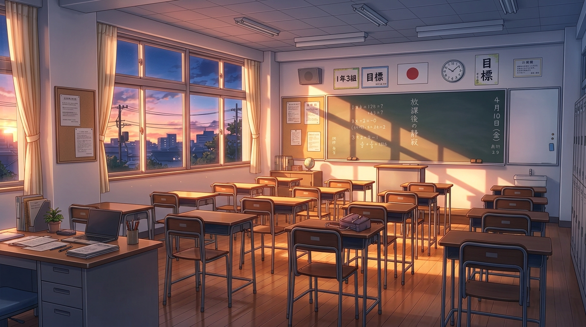
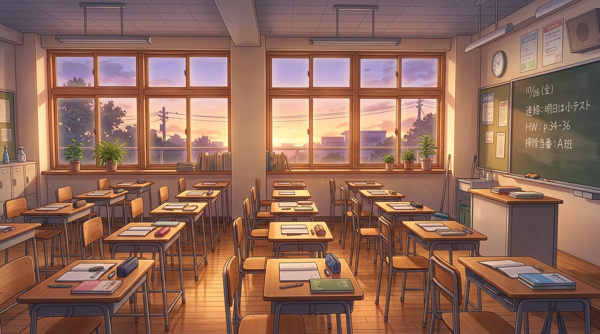

# 出图速度与分辨率：实测与可选档位

日期：2026-10-01　机器：ARM64 设备（ARM64 SoC / 8GB）　网关：本机 flow2api `127.0.0.1:38000`

起因：用户问「更低分辨率、更快的生成速度可以怎么选择」。下面每个数字都是本机真跑 flow2api
（Gemini 原生端点，响应体与 `apps/server/src/flowImage.ts` 走的一样）测出来的，一条一次，
提示词固定、串行执行。

## 一、结果

| 模型 | imageSize | 画幅 | 垫图 | 耗时 | 成图像素 |
| --- | --- | --- | --- | --- | --- |
| `gemini-3.1-flash-image` | `1K` | 16:9 | — | **73.2s** | 1376x768 |
| `gemini-3.1-flash-image` | `2K` | 16:9 | — | **115.1s** | 1376x768 |
| `gemini-3.1-flash-image` | `1K` | 9:16 | — | **69.2s** | 768x1376 |
| `gemini-3.1-flash-image` | `1K` | 9:16 | 有 | **138.2s** | 768x1376 |
| `gemini-3.1-flash-image` | `2K` | 9:16 | 有 | **215.8s** | 768x1376 |
| `gemini-3.0-pro-image` | `1K` | 16:9 | — | 89.3s | 1376x768 |
| `gemini-3.1-flash-image` | `4K` | 16:9 | — | — | 网关 503：`当前模型需要 Ult 账号，但没有可用的 Ult 账号` |
| `imagen-4.0-generate-preview` | `1K` | 16:9 | — | — | 网关 500：`Flow frontend RPC rejected: rpc=ogiZ0b, code=[5]` |

> 表里的 `1K`/`2K`/`4K` 是**事后按官方写法补记的**——测的时候发的是小写 `1k`/`2k`/`4k`，flow2api
> 两种都认，所以数字不受影响（`2K` 复测仍是 1376x768，见 `261001-image-interface-specs.research.md`）。

## 二、三条能直接用的结论

1. **`2K` 在这条路上是纯开销。** 同画幅下 `2K` 与 `1K` 拿到的**像素完全一样**
   （16:9 都是 1376x768，9:16 都是 768x1376），却要多花 42s（文生图）到 78s（垫图）。
   `model_resolver.py` 把 `2K`/`4K` 翻成模型名后缀 `…-landscape-2k`，`generation_handler.py`
   据此多走一步 `/flow/upsampleImage` 上游放大——本机账号这一步没换来更大的图（放大失败时
   它会**静默退回原图**，非流式请求根本看不出来）。实测：`2K` 的响应里仍然只有一个
   `inlineData`，尺寸与 `1K` 逐像素相等。
   **这是 flow2api 的行为，不是接口的**：cpa 走真 Gemini 时 `2K` 就是 2752x1536，与官方表一致。
2. **`1K` 已经够用。** 1376x768 对 16:9 背景、768x1376 对立绘，铺满手机舞台（CSS 宽度 ~400px、
   DPR 2–3）绰绰有余；抠底（sharp）在 2K 上也就 1.8–2.1s，本来就不是瓶颈。
3. **真正贵的是垫图。** 立绘差分靠垫图保角色一致性，垫图把耗时从 ~70s 抬到 ~138s
   （1k 档），比换模型贵得多。所以「提速」的第一杠杆是**少画立绘差分**与**提前几轮排产**
   （剧作家的 `generate_image` 是 queued 模式，图在台词演出期间后台出，玩家基本感觉不到等待）。

## 三、能调的旋钮（按收益排序）

| 旋钮 | 位置 | 怎么影响 |
| --- | --- | --- |
| `STAGE_IMAGE_SIZE=1K` | `.env` / `configApi` | **这条路上最有效的一刀**：背景 115s→73s、立绘 216s→138s，像素不变 |
| 提前几轮发 `generate_image` | 剧作家提示词与工具描述（已改成「提前 3–5 句」「约一分多钟」） | 排队窗口，决定玩家感不感觉得到等 |
| `STAGE_IMAGE_CONCURRENCY` | `.env`，代码默认 6 | 只压**批量**的墙钟（实测两张 2k 并发 123s ≈ max 而非 sum），不改善单张时延 |
| `STAGE_IMAGE_MODEL` | `.env` | `gemini-3.1-flash-image` 比 `gemini-3.0-pro-image` 快 ~16s/张；`imagen-*` 本机不可用 |
| 换账号/网关 | — | 想要真正的高分辨率（本机 4k 被 Ult 账号卡死），只能换账号或换后端 |

> 画幅那条 2026-09-29 的旧结论（`3:4`/`4:3` 会被静默改成 1200x896 横图）当时归错了因：1200x896 就是
> 官方 `4:3` 的 1K 输出。画幅钉死在**别名模型名**里的是 flow2api，cpa 走真 Gemini 时 4:3 / 3:4 / 21:9
> 都按官方表正确出图。见 `261001-image-interface-specs.research.md`。

## 四、样本图

同提示词、同流程的两次生成（`1k` 与 `2k`，画面内容各不相同，只是用来肉眼扫一眼画风，
不构成同源对比）：

立绘（垫图保角色，耗时差最大的那一档）：

