# Stage-AI Galgame 资产生成与工程化管线全景指南

> **角色定位**：游戏美术与音频管线工程师 (Art & Audio Pipeline Engineer)  
> **所属项目**：Stage-AI 视觉小说引擎 (`feat/galgame-assets`)  
> **资产目标**：多表情高一致性立绘、16:9 电影级场景/事件 CG、6 大类标准配乐与无缝循环 BGM  

---

## 1. 架构总览与设计哲学

在现代 AI Galgame（如 Stage-AI）体系中，剧本演化由 LLM 剧作家（Playwriter）根据玩家动作即时流式驱动。传统的“手工逐张约稿画图、固定录制配乐”模式无法适应动态剧情分支与无限交互。然而，单纯依赖通用生图与生乐 API 往往面临三大致命工程痛点：
1. **立绘不一致性与跳跃感**：AI 换表情时发型、服饰甚至骨骼体态剧烈位移，换表情犹如“瞬间换人”；
2. **边缘杂色瑕疵（Color Fringing）**：半透明发丝与白色衣领在抠图时残留白边或绿边，置于暗色场景中呈现廉价的白芒光晕；
3. **音频无缝循环缺失**：AI 生成音乐首尾无法自然衔接，游戏内循环时产生爆音（Click/Pop）或突兀停顿。

为此，本方案在工作树 `./.worktrees/galgame-assets` 中搭建了**工业级、端到端闭环的资产生成与后处理流水线**：

```mermaid
flowchart TD
    subgraph 立绘管线 Character Sprites
        A1[范式 A: 2x3 Sheet 单图出图] --> B1[自动网格切片 Cell Slicing]
        A2[范式 B: 首图基底 + 垫图迭代] --> B2[多模态特征锁死 Reference Condition]
        B1 --> C1[自适应连通域抠图 make_transparent.py]
        B2 --> C1
        C1 --> D1[抗锯齿羽化 + Despill 去杂色边]
        D1 --> E1[1080x1920 底部锚点标准透明 PNG]
    end

    subgraph 场景与CG管线 Backgrounds & CG
        F[10 大经典场景提示词体系] --> G[16:9 电影级构图 / 新海诚·京阿尼光影]
        G --> H[FHD 1920x1080 智能裁剪重采样 gen_cg.py]
        H --> I[scene_presets.json 场景清单]
    end

    subgraph 音频配乐管线 BGM & Audio
        J[6 大类情感配乐风格定义] --> K[Suno / MiniMax / Stable Audio 提示词]
        K --> L[audio_loop_helper.py]
        L --> M[-16 LUFS 广播级响度归一化]
        L --> N[Equal-Power 尾音 Crossfade 无缝循环]
        N --> O[OGG / FLAC 引擎即用资产]
    end
```



---

## 2. 多表情立绘管线（Character Sprites）

### 2.1 Galgame 立绘工业标准与核心指标

| 参数项 | 标准规格 | 设计原因与工程约束 |
|---|---|---|
| **格式与通道** | 32-bit RGBA PNG | 具备 8-bit Alpha 透明通道，支持半透明渐变（如发丝、轻纱） |
| **画布分辨率** | `1080 x 1920` (9:16) | 适配移动端竖屏与桌面端 16:9 横屏中角色的等比显示（半身/大半身立绘） |
| **锚点（Pivot）** | `[0.5, 1.0]` (底部中心) | 确保角色缩放、晃动、轻跳动效以脚底/腰部为基准，换表情时绝对不晃动 |
| **标准表情集 (7+1)** | normal, smile, shy, angry, sad, surprised, thinking | 覆盖 Galgame 核心情感分支，契合 Stage-AI 状态机 |

### 2.2 两套出图范式深度对比

本管线深入探索并实现了两套截然不同的生图范式：

#### 范式 A：单图多表情 Sheet 裁切法 (`--mode sheet`)
- **生成原理**：在单次 Prompt 中要求模型渲染 $2 \times 3$ 的矩阵表情面板（Character Expression Sheet），包含同角色的 6 种不同表情（普通、微笑、害羞、生气、悲伤、惊讶）。
- **切片与组装**：脚本根据生成图像的宽高自动计算单个单元格尺寸（`cell_w = sw // cols`, `cell_h = sh // rows`），批量切片裁切，再由参考图迭代法补全第 7 种“闭眼沉思（thinking）”。
- **优势**：
  1. **角色画风与配色绝对一致**：同一批次推理，发色、瞳色、服装材质与光照方向 100% 相同；
  2. **成本与耗时极低**：单次生图请求（~15s）即可获得全套 6 个表情，大幅节约 API 配额与时间。
- **局限与适用场景**：
  - 局限：单格分辨率受总图限制（单张切片约 470x384 像素，放大需要超分辨率算法）；要求模型对网格布局有良好的理解。
  - 适用：快速出原型、中近景胸像立绘、批量辅助配角。

#### 范式 B：首图为基底 + 垫图迭代法 (`--mode iterative`)
- **生成原理**：
  1. **Base 阶段**：以高分辨率生成角色正面立姿的 `normal` 基础图，锁定发型（粉长发+双丝带）、瞳色（祖母绿）、服装（水手服）与姿势。
  2. **Iteration 阶段**：将 Base 图压缩为 512px 缩略图（控制网络传输体积），作为 Multi-modal Image Reference 注入大模型上下文，固定所有外貌修饰词，**仅修改面部表情描述词**（如 `shy blushing red cheeks, embarrassed cute expression`）。
- **优势**：
  1. **极高分辨率与细节**：单张全幅生成，细节丰富，支持全身立绘；
  2. **表情张力极强**：由于独占提示词权重，哭腔泪目、傲娇鼓腮、羞涩视线偏移的表情表现力远超网格图。
- **局限与适用场景**：
  - 局限：需消耗多轮生图调用；依赖模型的多模态参考控制能力（如 Gemini Imagegen / Qwen-Image-Edit）。
  - 适用：核心女主角（Heroine）、高精立绘展示。

### 2.3 背景透明化与去杂色边算法（Edge Matting & Despill）

通用二值化抠图对 Galgame 立绘存在两大硬伤：
1. **误抠角色本体**：水手服的白色衬衫、校服白色领结、角色牙齿与眼白如果直接按白底色彩阈值过滤，会被挖成透明空洞；
2. **边缘白芒（White Fringing）**：半透明抗锯齿像素中掺杂了白底颜色，放在夜晚或暗调场景下呈现严重光晕。

本管线在 `scripts/make_transparent.py` 中实现了**纯数学抗白边与连通域保护算法**：

#### 算法步骤：
1. **外围边界泛洪填充（Boundary Flood Fill）**：
   - 仅从图像的外边缘（顶边、左边、右边，以及底边向内过渡的背景角）发起种子填充；
   - 位于角色轮廓内部的白色衬衫、领结与高光由于被封闭线条阻隔，**绝对不被填充为背景**。
2. **双阈值软渐变（Soft Alpha Falloff）**：
   - 计算像素与背景色 $\mathbf{C}_{bg}$ 的欧氏距离 $d = \|\mathbf{C} - \mathbf{C}_{bg}\|$；
   - 当 $d \le \text{tol}_{low}$ 时，$\alpha = 0$（纯背景）；
   - 当 $d \ge \text{tol}_{high}$ 时，$\alpha = 255$（纯前景）；
   - 当 $\text{tol}_{low} < d < \text{tol}_{high}$ 时，线性羽化插值：
     $$\alpha = 255 \times \frac{d - \text{tol}_{low}}{\text{tol}_{high} - \text{tol}_{low}}$$
3. **颜色去杂色溢出（Color Despill / Decontamination）**：
   - 观测像素色彩满足物理混合模型：$\mathbf{C}_{obs} = \alpha_{norm} \cdot \mathbf{C}_{fg} + (1 - \alpha_{norm}) \cdot \mathbf{C}_{bg}$；
   - 在边缘半透明区域（$0 < \alpha < 255$），逆向推导恢复纯粹的前景真实色彩：
     $$\mathbf{C}_{fg} = \operatorname{clip}\left(\frac{\mathbf{C}_{obs} - (1 - \alpha_{norm}) \cdot \mathbf{C}_{bg}}{\max(\alpha_{norm}, 0.05)}, 0, 255\right)$$
   - 彻底消除了发丝尖端和衣袖边缘的白底渗色，让立绘在全黑背景下亦能完美融合。
4. **标准画布规范化（Canvas Alignment）**：
   - 自动裁切多余透明边缘（Trim + Padding），将角色按比例缩放并对齐至 `1080x1920` 画布的底部水平居中，生成标准化立绘。

---

## 3. 16:9 场景背景与事件 CG 管线

### 3.1 视听语言与画风对齐规范

- **画幅与分辨率**：统一为 16:9 标准宽屏，输出基准 `1920 x 1080` (FHD)。
- **电影级构图准则**：
  - **导引线（Leading Lines）**：利用课桌排列、铁轨延伸、坡道斜度拉伸纵深感；
  - **前景景深（Depth of Field & Bokeh）**：前景虚化的落樱花瓣、雨滴折射或落地窗反光；
  - **体积光影（Volumetric Lighting）**：新海诚式的丁达尔光柱、夕阳斜照拉出的长投影。
- **三大风格锚点（Style Anchors）**：
  - `shinkai`（新海诚风）：厚重层积云、高饱和青橙调、电影级逆光轮廓与耀斑；
  - `kyoani`（京阿尼风）：柔和漫射光、淡雅温润的马卡龙与大地色调、微观细腻的物品质感；
  - `lightnovel`（轻小说官方风）：清晰锐利的高对比度线条、动漫赛璐珞高饱和质感。

### 3.2 十大经典 Galgame 场景与事件 CG 提示词体系

| 标识符 ID | 中文名称 | 类型 | 核心构成与情感氛围 |
|---|---|---|---|
| `bg_classroom_sunset` | 黄昏放学后的高中教室 | 场景背景 | 5:15放学时分、斜射暖橙夕阳长投影、轻拂的米白窗帘、黑板微弱粉笔痕 |
| `bg_school_gate_sakura` | 飘落樱花的学校坡道校门 | 场景背景 | 春日清晨、沥青斜坡两旁盛开的巨大樱花树、漫天飘落的花瓣、新学期期待 |
| `bg_rooftop_breeze` | 午后微风徐徐的学校天台 | 场景背景 | 俯瞰海滨小镇与蔚蓝海平线、铁丝安全网、水塔与通风管、夏日巨大积雨云 |
| `bg_starry_breakwater` | 夜晚繁星点点的海边防波堤 | 场景背景 | 璀璨银河与流星划痕、消波块混凝土巨石、月光波光粼粼、远方灯塔光柱 |
| `bg_library_sunlight` | 阳光穿透落地窗的图书馆角落 | 场景背景 | 拱形高窗穿透的光柱、漂浮的光尘、深色橡木高耸书架、复古绿色银行台灯 |
| `bg_shrine_steps` | 夏日蝉鸣的传统神社鸟居与石阶 | 场景背景 | 参天雪松遮蔽的青苔石阶、鲜艳朱红鸟居、斑驳树影、宁静肃穆神道氛围 |
| `bg_rainy_station` | 细雨霏霏的电车站台 | 场景背景 | 淅淅沥沥的微雨、湿漉地面与黄色盲道倒影、雨棚滴水、云雾缭绕的青山 |
| `bg_heroine_bedroom` | 暖色灯光的温馨女主角卧室 | 场景背景 | 傍晚暖黄色小串灯、整齐床铺与毛绒玩偶、轻小说书架、少女私密生活感 |
| `cg_rooftop_confession` | 天台递告白信的决定性瞬间 | 事件 CG | 夕阳逆光轮廓、女主角小春深红脸颊、双手递出心形火漆信封、心跳决断瞬间 |
| `cg_rain_umbrella` | 雨夜共撑一把伞避雨 | 事件 CG | 雨夜昏黄路灯、紧紧依靠在透明伞下、呼吸凝结的白汽、近在咫尺的害羞视线 |

所有场景均已通过 `scripts/gen_cg.py` 生成实体资产，存放于 `assets/backgrounds/` 与 `assets/cg/` 中。

---

## 4. Galgame BGM 配乐体系与无缝循环工程

### 4.1 六大类配乐体系定义

```
┌─────────────────┬──────────────────────┬─────────────┬───────────┬────────────────────────────────────────┐
│ 分类 ID         │ 体系分类             │ 节奏 BPM    │ 常用调性  │ 核心乐器编成                           │
├─────────────────┼──────────────────────┼─────────────┼───────────┼────────────────────────────────────────┤
│ bgm_cheerful    │ 日常欢快 (Cheerful)  │ 120-138 BPM │ G / C 大调│ 拨弦小提琴、马林巴木琴、明亮钢琴、沙锤 │
│ bgm_warm_daily  │ 温馨日常 (Warm Cozy) │ 82-96 BPM   │ F / Bb大调│ 毛毡立式钢琴、尼龙指弹吉他、单簧管/双簧管│
│ bgm_romance     │ 抒情浪漫 (Romance)   │ 68-80 BPM   │ D / A 大调│ 施坦威大钢琴独奏、厚重连奏弦乐组、八音盒│
│ bgm_sad_melan   │ 悲伤感动 (Tearjerker)│ 58-72 BPM   │ D / A 小调│ 凄美大提琴独奏、孤寂钢琴断奏、远方圆号 │
│ bgm_suspense    │ 悬疑紧张 (Suspense)  │ 100-116 BPM │ D小调/减七│ 机械时钟滴答、颤音不协和弦乐、40Hz低频 │
│ bgm_climax      │ 高潮燃曲 (Epic Battle│ 140-165 BPM │ E / F#小调│ 重度失真电吉他、双踩架子鼓、交响弦乐铜管│
└─────────────────┴──────────────────────┴─────────────┴───────────┴────────────────────────────────────────┘
```

### 4.2 AI Music 生成提示词标准模板

#### 1. 日常欢快模板 (Suno / MiniMax):
```text
[Style: Upbeat Anime OST, Playful Lighthearted J-Pop Instrumental, Cute School Comedy BGM, 128 BPM, Key G Major]
[Instruments: Pizzicato Strings, Marimba, Bright Piano, Acoustic Guitar, Woodwinds, Triangle, Light Percussion]
[Structure: [Instrumental] [Intro: Bouncy Marimba] [A-Section: Pizzicato Melody] [B-Section: Piano & Flute Harmony] [Catchy Melodic Hook] [Seamless Loop Ending]]
```

#### 2. 温馨日常模板:
```text
[Style: Gentle Acoustic Anime BGM, Slice of Life Visual Novel OST, Heartwarming Piano & Guitar, 88 BPM, Key F Major]
[Instruments: Warm Upright Piano, Fingerpicked Nylon Guitar, Solo Oboe, Soft String Quartet, Glockenspiel]
[Structure: [Instrumental] [Intro: Delicate Piano Arpeggio] [Main Theme: Guitar & Oboe Duet] [Warm String Swell] [Gentle Cadence]]
```

#### 3. 抒情浪漫（女主角心动主题曲）:
```text
[Style: Romantic Anime Piano Ballad, Emotional Visual Novel Love Theme, Tender Orchestral Strings, 72 BPM, Key D Major]
[Instruments: Grand Piano Solo, Lush Legato Violins, Cello Countermelody, Celesta, Music Box, Ambient Pad]
[Structure: [Instrumental] [Intro: Rubato Piano Solo] [Tender String Entrance] [Emotional Swell Climax] [Soft Music Box Ending]]
```

#### 4. 悲伤感动（Key社催泪名场面）:
```text
[Style: Melancholic Anime Sad OST, Key-style Tearjerker Instrumental, Heartbreaking Piano & Cello, 64 BPM, Key D Minor]
[Instruments: Solo Cello, Lonely Felt Piano, Weeping Violin, French Horn, Rain Ambience Pad, Sub Drone]
[Structure: [Instrumental] [Intro: Sparse Broken Piano Chords] [Theme A: Aching Cello Solo] [Dramatic Tearful Climax] [Fading Distant Notes]]
```

#### 5. 悬疑紧张（搜查/黑化）:
```text
[Style: Psychological Thriller Anime OST, Dark Mystery Instrumental, Tension & Suspense BGM, 108 BPM, D Minor]
[Instruments: Ticking Clock, Dissonant String Tremolo, Low Synth Drone, Prepared Piano, Sub Bass, Metallic Percussion]
[Structure: [Instrumental] [Intro: Fast Ticking Clock & Drone] [Irregular Piano Stabs] [Rising Dissonant Tremolo Strings] [Sudden Drop Out]]
```

#### 6. 高潮燃曲（拯救/决意）:
```text
[Style: Epic Anime Battle OST, Symphonic Rock Instrumental, Emotional Climax Anthem, 150 BPM, Key E Minor]
[Instruments: Heavy Distorted Guitar, Driving Double-Kick Drums, Cinematic Orchestral Strings, Powerful Brass, Fast Synth Arp]
[Structure: [Instrumental] [Explosive Drum Intro] [Blazing Guitar Riff] [Soaring Symphonic Strings Climax] [Epic Outro]]
```

### 4.3 云端商用 API 与本地轻量化开源方案调研

| 方案类别 | 方案名称 | 生成品质 | 循环支持 | 成本与部署难度 | 推荐场景 |
|---|---|---|---|---|---|
| **云端商用** | **Suno v3.5 / v4** | ★★★★★ (SOTA整曲编曲) | 需后处理切片 | 商业订阅 / 社区 API | 完整长篇主题曲、主题歌 OP/ED |
| **云端商用** | **MiniMax Music-01** | ★★★★★ (声场优异、东方和弦理解强) | 纯乐器伴奏极稳 | 官方开放平台 REST API | 核心 BGM 批量定制、即时场景伴奏 |
| **云端商用** | **Stable Audio 2.0** | ★★★★☆ (44.1kHz纯净立体声) | 强结构控制 | 按秒计费 API | 电影级纯净环境垫音、无歌词干扰 |
| **本地开源** | **AudioCraft (MusicGen-small)** | ★★★☆☆ (32kHz) | 需重采样 | 4GB 显存，离线运行 | 离线开发沙盒、局域网自动化流水线 |
| **程序化极速** | **FluidSynth + MIDI 规则库** | ★★★★☆ (取决于 SoundFont 采样) | **天然 100% 绝对循环** | **0 显存，10ms 极速** | 动态根据剧情和弦即时渲染无缝 BGM |

### 4.4 音频工程与无缝循环实现原理（Audio Engineering）

1. **响度控制标准（Loudness Standard）**：
   - 游戏行业标准：BGM 统一归一化为 **$-16.0 \text{ LUFS}$**（True Peak 限制在 $-1.5 \text{ dB}$）；
   - 台词语音（TTS）：保持在 **$-12 \sim -14 \text{ LUFS}$**，并在有台词播放时对 BGM 施加 $-6 \text{ dB}$ 的 **自动避让侧链压缩（Sidechain Ducking）**。
2. **等功率尾音交叉淡化（Equal-Power Tail Crossfade）**：
   - 将音轨末尾包含混响残响的 $2.0 \sim 3.0$ 秒尾音切下；
   - 采用三角/等功率平滑曲线叠加到音轨头部，让声波的相位与混响在接缝处平滑闭合；
   - 彻底解决由于起始零点不吻合导致的“爆音（Pop）”与乐器突然中断。

---

## 5. 命令行工具与使用手册

### 5.1 环境初始化
```bash
./scripts/init-worktree.sh
```

### 5.2 多表情立绘生成器 (`scripts/gen_sprite.py`)
```bash
# 范式 A：单图 2x3 网格 Sheet 裁切法 (一键输出 6+1 表情透明 PNG 与 manifest)
./scripts/gen_sprite.py --character koharu --mode sheet

# 范式 B：首图基底 + 垫图参考迭代法
./scripts/gen_sprite.py --character koharu --mode iterative --expressions "normal,smile,shy,angry,sad,surprised,thinking"
```

### 5.3 智能去底与去白边工具 (`scripts/make_transparent.py`)
```bash
# 单图去底，指定色差容差 35，羽化 22，去杂色 Despill 强度 1.0，自动去留白 Trim
./scripts/make_transparent.py input_image.jpg -o output.png --tolerance 35.0 --feather 22.0 --despill 1.0 --trim

# 批量转为 1080x1920 底部居中标准画布
./scripts/make_transparent.py assets/raw_sprites/ -o assets/sprites/ --target-canvas 1080x1920
```

### 5.4 场景与事件 CG 生成器 (`scripts/gen_cg.py`)
```bash
# 列出 10 大经典预设
./scripts/gen_cg.py --list

# 生成指定黄昏教室背景 (自动 16:9 FHD 裁剪重采样)
./scripts/gen_cg.py --id bg_classroom_sunset --style shinkai

# 生成天台递告白信事件 CG
./scripts/gen_cg.py --id cg_rooftop_confession --style shinkai
```

### 5.5 BGM 无缝循环与音频工具 (`scripts/audio_loop_helper.py`)
```bash
# 音频无缝循环处理 + -16 LUFS 响度标准化
./scripts/audio_loop_helper.py loop raw_track.mp3 -o bgm_loop.ogg --crossfade 3.0 --lufs -16.0

# 纯音乐测试音轨合成
./scripts/audio_loop_helper.py demo -o test.ogg --type warm_daily
```

### 5.6 启动交互式资产画廊与体验服务器 (`scripts/dev-worktree.sh`)
```bash
./scripts/dev-worktree.sh
```
通过 `acquire-port --wait` 动态分配端口，提供网页端多表情切换、黑白/棋盘透明底质检、场景画廊与 BGM 试听。

---

## 6. 与 Stage-AI 引擎 Stage DSL 规范对接

在 Stage-AI 引擎剧作家编排中，生成的资产可直接无缝嵌入 Stage DSL：

```xml
<!-- 1. 换幕：指定场景背景与背景音乐 -->
<scene bg="bg_classroom_sunset" bgm="bgm_warm_daily" transition="fade"/>

<!-- 2. 角色立绘入场与表情切换 -->
<char name="koharu" expr="shy" position="center"/>
小春：那个……明天放学后，你有时间吗？

<char name="koharu" expr="smile" position="center"/>
小春：太好了！那我们在校门口见！

<!-- 3. 决定性事件 CG 触发全屏演出 -->
<preload_asset type="cg" id="cg_rooftop_confession"/>
<cg id="cg_rooftop_confession" caption="夕阳天台的秘密心意"/>
```

---

## 7. 交付资产资产清单汇总

- `scripts/`:
  - `init-worktree.sh`：依赖环境与接口连通性自检
  - `dev-worktree.sh`：基于动态端口的 Web 预览服务启动脚本
  - `make_transparent.py`：连通域保护去底与抗白边去杂色工具
  - `gen_sprite.py`：双范式多表情立绘生成与切片流水线
  - `gen_cg.py`：16:9 场景与事件 CG 生成器（含 10 大经典预设与双引擎容灾）
  - `audio_loop_helper.py`：-16 LUFS 标准化与 Crossfade 无缝循环工具
  - `preview_server.py`：可视化交互工作台 Web 服务器
- `assets/sprites/koharu/`:
  - `normal.png`, `smile.png`, `shy.png`, `angry.png`, `sad.png`, `surprised.png`, `thinking.png`（7 种 1080x1920 透明通道立绘）
  - `sheet_raw.jpg`（原始复合面板）
  - `sprite_manifest.json`（立绘锚点与元数据契约）
- `assets/backgrounds/`:
  - 8 大经典场景背景（黄昏教室、落樱校门、天台微风、繁星防波堤、阳光图书馆、夏日神社、雨中站台、少女卧室）
- `assets/cg/`:
  - 2 大经典事件 CG（天台递告白信、雨夜共撑一把伞）
- `assets/scene_presets.json`: 场景预设索引配置
- `assets/audio/`:
  - `bgm_spec.json`: 6 大类配乐参数体系与全套提示词模板
  - `tracks/`: 真实合成的 -16 LUFS 无缝循环音轨与测试样本
