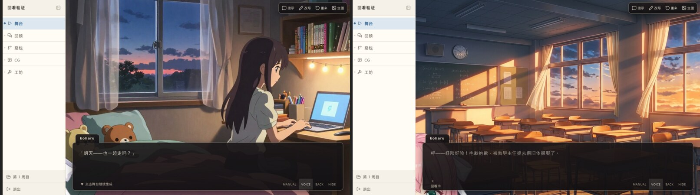

# 回看时舞台画面跟着回退 用户验证

## 验证说明

- 验证对象：滚轮（以及 ↑↓ / 左右滑 / 回顾面板点一句）回看历史台词时，舞台画面是否跟着
  回到那一刻——背景、CG、立绘（站位、表情、在场与否）。
- 环境/前置条件：一个**已经演过几轮、且中途换过景、有立绘进出场**的剧目。工坊/演出席里
  随便挑一个有存量的剧目即可；只想看效果的话，本 worktree 里备了一个 `plays/rewind`
  （mock 谱系 + demo 素材，2 个周目），进它的舞台直接滚轮就能看出来。
- 截图（左＝演出现场，右＝滚轮回看 5 格后）：

## 验证项

| 验证步骤 | 预期结果 | 实际结果 | 状态 | 备注/证据 |
| --- | --- | --- | --- | --- |
| 在舞台里向下滚轮 4~6 格 | 台词往回翻的同时，背景/CG/立绘一起回到那一刻：换过景就回到旧景，立绘回到当时的站位 | | 待验证 | 实机：`bg_heroine_bedroom` → `bg_classroom_sunset`，立绘 `pos-left` → `pos-center` |
| 往回滚过某支角色的入场那一句 | 翻到入场之前时，台上**没有**她；再往前滚一格她又回来 | | 待验证 | |
| 往回滚过某支角色的退场那一句 | 退场之后的那几句里，台上没有她——不是留一个半透明幽灵 | | 待验证 | |
| 回看过程中听音乐 | BGM/环境音**不跟着回退**（回看是画面回到那一刻，氛围仍是当下那条） | | 待验证 | 设计决定：音频不回退 |
| 回看中盯住画面 | 换景没有淡入、立绘没有登场闪烁、行为词不重演——直接切，不闪 | | 待验证 | 计算样式：回看中立绘 `animation-name: none` / `transition-duration: 0s` |
| 往回滚到底再一路滚回播放头 | 画面无缝回到现场（没有多余的过渡动画），之后的演出照常 | | 待验证 | |
| 用 ↑↓、左右滑、回顾面板点某一句 | 与滚轮同一套行为（同一个回看游标） | | 待验证 | |
| 回看后刷新页面 | 阅读位置仍停在**播放头**读到的那一句（回看不该被存成「读到哪儿了」） | | 待验证 | |
| 正常演出（不回看）时换景/立绘进出场 | 过渡动画与之前完全一样，没有被这次的 CSS 误伤 | | 待验证 | |

## 验证结论

待验证。

## 待跟进

- 回看中音频保持现场是本次拍板的行为；若之后想「连音乐一起回到那一刻」，加个防抖即可
  （滚动中途不切、停下 250ms 才切）。
