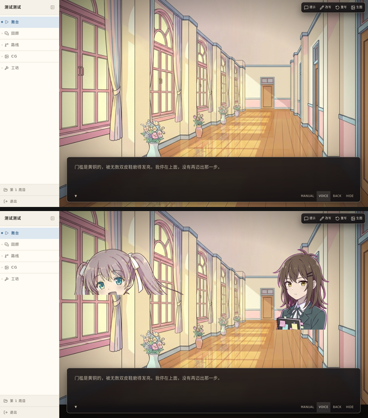
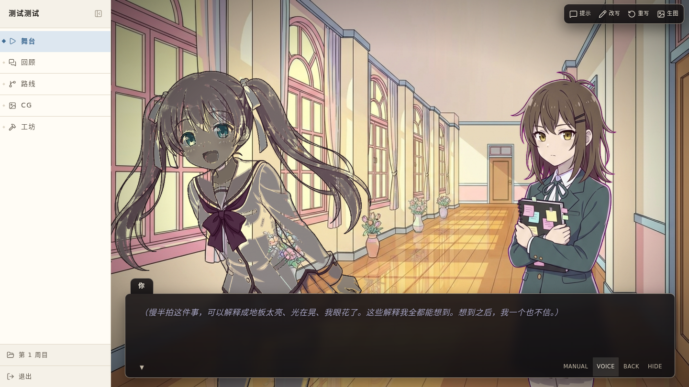

# 舞台上角色立绘不显示 修复验证

## 验证说明

- 验证对象：舞台上的角色立绘是否正常显示在背景之上；以及修复过程中一并调整的
  换层转场纯色场（`fade` / `fade-white` 的整屏过色）是否仍然盖得住立绘与 CG。
- 环境/前置条件：本 worktree 起的实例（server 直接挂 `apps/web/dist`）。
  库里备了一个专测这个问题的剧目 **`mock-layers`**（`scripts/mockSpriteLayers.mjs` 生成）：
  四种转场各一场、每场都带两个立绘，最后再补一场 CG。进它的舞台一路点下去即可看全。
  另一条更贴近用户报的场景：**`testtest`**（圣玛利亚庭园）——它有存量周目，进去就是立绘在台上的画面。
- 修复前后对比（上＝改前，立绘被背景盖住；下＝改后）：

  

- 修复后（经公网入口打开的 `testtest`，用户报的那个剧目）：

  

## 验证项

| 验证步骤 | 预期结果 | 实际结果 | 状态 | 备注/证据 |
| --- | --- | --- | --- | --- |
| 打开 `testtest` 的舞台（用户报的那个剧目），演到有立绘的那一句 | 两个角色立绘完整显示在背景之上 | | 待验证 | 见上方对比图下 |
| 在 `mock-layers` 里演过第一场换底（`cut`） | 换底之后立绘照常显示——**这是本 bug 的复现点**，此前只在「还没换过底」时能看到立绘 | | 待验证 | `evidence/10-cut.png` |
| 同上走到第二场（`dissolve`） | 背景交叉溶解时，立绘始终在背景之上 | | 待验证 | `evidence/09-dissolve-crossfade.png` |
| 同上走到第三场（`fade`） | 换底途中画面**整屏**转黑（立绘与 CG 一起被盖住），黑场落下后立绘正常显示 | | 待验证 | 过色中途：`evidence/08-fade-midwash.png`；峰值：`evidence/06-fade-veil-peak-live.png` |
| 同上走到第四场（`fade-white`） | 同上，只是过的是白场 | | 待验证 | `evidence/07-fade-white-midwash.png` |
| 演到有立绘+CG 同时在场的那一场 | 观察 CG 与立绘同时在场时的层序（**现状实测为 CG 压住立绘**，见下方待跟进） | | 待验证 | 本次未动 CG 层，层序与改前一致 |
| 换过底之后滚轮回看几句再回现场 | 立绘照常显示；回看中不重放转场（不闪） | | 待验证 | 计算样式：回看中纯色场不入 DOM、旧背景层 `display:none` |
| 台上说话的角色 | 说话者浮在同台其他人之上；整层仍压在台词条之下 | | 待验证 | 未改动，回归确认 |

## 验证结论

待验证。

## 待跟进

- **CG 与立绘的层序可能反了（本次未改，待确认）**：`.theater-cg` 没有 `z-index`，与
  `.theater-sprites`（`z-index: 0`）同处一个绘制档、按树序绘制，而 CG 在 DOM 里靠后
  （`StageTheater.tsx:791` vs `:761`），因此**并排时是 CG 压住立绘**。浏览器实测确认
  （同一点打点命中 `.theater-cg-in`）。这是 `a0967d6f` 之前就有的行为，本次没动 CG 层。
  检视意见认为画面文档自述「CG 是整屏画面、立绘压在其上」，现状与之相反；若不是有意为之，
  应另立 issue 处理，不并入本次修复。
- `fade` / `fade-white` 的纯色场这次从「背景栈内」提到了「屏幕级」（压在立绘与 CG 之上）。
  这是为了让「整屏过色」名副其实——关在背景栈里它只能盖背景，人物会浮在黑场里不动。
  观感与改前一致（改前它 z-index 5，同样盖住立绘），只是位置从栈内挪到了镜头容器下。
